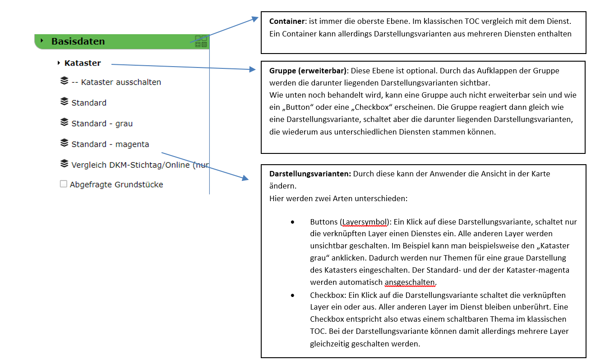
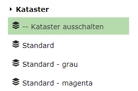
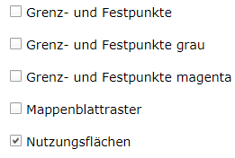
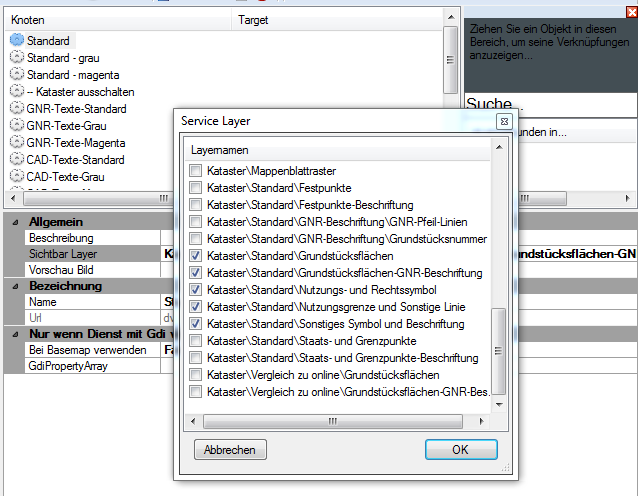
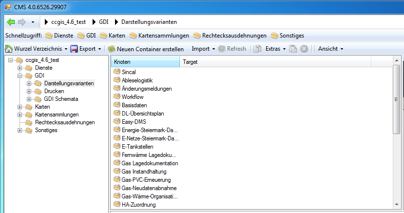
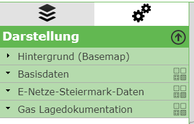
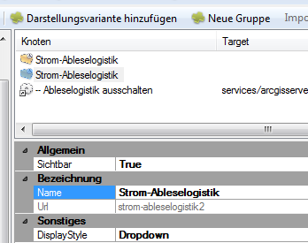
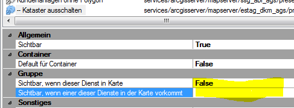
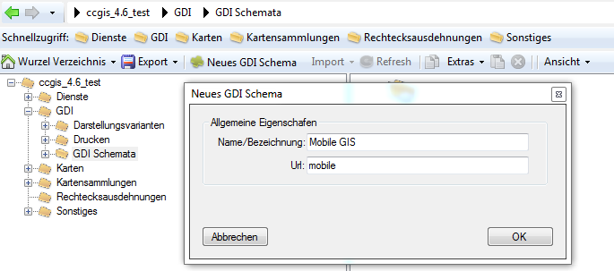
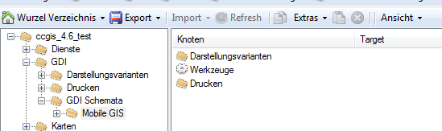

Parametrierung von Darstellungsvariaten
=======================================

Darstellungsvarianten erscheinen im Viewer ähnlich wie ein Inhaltsverzeichnis. Die Anzahl der ebenen ist allerdings begrenz. Da man durch richtige Parametrierung die Anzahl der Darstellungsvarianten aber klein halten kann, ist eine tiefere Verschachtelung auch nicht notwendig.

Es gibt insgesamt drei Ebenen:

Wie hier gezeigt unterscheiden sich Darstellungsvarianten von normalen schaltbaren Layern darin, dass sie mehre Layer auf einmal schalten können. Aufgrund der Vielfalt der Themen die entstehen kann, wenn sich Karten aus mehreren Diensten zusammensetzten, wird es für den Anwender manchmal sehr schwer, sich in einem klassischen TOC mit Gruppen und verschachtelten Untergruppen zurecht zu finden. In den meisten Fällen reichen in der Karte wenige Standardschaltungen (und deren Kombination). Bei diesen Standardschaltungen sprechen wir von Darstellungsvarianten. Der Anwender will beispielsweise nicht, um den Kataster einzuschalten, mehre Themen anklicken (Grundstücksgrenzen, Grundstücksnummer, Nutzungsgrenzen, Nutzungssymbole, Sonstige Linien, S-Klammer, Z-Klammern, …) sondern es ist eine Standardschaltung „Kataster ein/aus“ ausreichend. 

Spezielle Themen (beispielswiese die Grenzpunkte) könnte dann zusätzlich noch über eine Darstellungsvariante mit Checkbox aus- oder eingeschalten werden.

Um Darstellungsvarianten zu parametrieren, sollte man daher auch wissen, was die Anwender brauchen. Das stellt natürlich einen gewissen aufwand dar, der sich allerdings lohnt, da man damit einfache und auf die Anforderungen angepasste Lösungen erstellen kann.

Dienst Darstellungsvarianten
----------------------------

Die Parametrierung der Darstellungsvarianten beginnt im CMS bei den Diensten. Für jeden Dienst gibt es den Ordner Darstellungsvarianten. Hier kann man beliebig viele Darstellungsvarianten anlegen, jede entspricht dabei einer bestimmten Layerschaltung. Über die Eigenschaften einer Darstellungsvariante kommt man über den Punkt „Sichtbare Layer“ zu einer Auswahl der Layer (Button „…“ ganz rechts im Eingabefeld). Hier kann man angeben, welche Layer von einer Darstellungsvariante betroffen sind: 

Eine Darstellungsvariante kann mehre Layer beeinflussen. So kann eine Darstellungsvariante beispielsweise den gesamten Kataster schalten. Dem Anwender kann dabei egal sein aus wie vielen Layern der Kataster besteht.

Wie die Darstellungsvariante später in der Karte geschalten wird (zB nur diese Layer einschalten oder diese Layer optional dazuschalten), wird später festgelegt (siehe nächster Abschnitt).

Der Bereich „Nur wenn Dienst mit Gdi verwendet wird“ ist nicht mehr relevant, sondern kann jetzt über den GDI Knoten im CMS abgebildet werden (siehe nächster Abschnitt). 

*Vereinfachte Variante:*

Die einfachste Variante einer Darstellungsvariante ist eine, die auch nur einen Layer beeinflusst. Stellt man diese dann später in der Karte auch noch als Checkbox dar, würde das einem einfach schaltbaren Layer im klassischen TOC gleich kommen. Da dieser Fall immer wieder vorkommt (gerade am Anfang, wenn nicht ganz klar ist, welche Darstellungsvarianten sinnvoll sind), gibt es zum Anlegen diese Darstellungsvarianten eine Abkürzung (ohne diese Abkürzung müsste man für jeden Layer einzeln eine Darstellungsvariante anlegen und mit den entsprechend Layer verknüpfen). Die Vorgehensweise ist hier folgende:

1.	Im CMS beim entsprechenden Dienst in den Knoten „Darstellungsvarianten“ wechseln. 

2.	Im Menü erscheint neben „Neue Darstellungsvariante“ auch der Punkt „Mehrere Darstellungsvarianten anlegen“: 

    .. image:: img/image5.png

3.	Ein Klick auf den Button öffnet einen Dialog der alle Themen des Dienstes anzeigt: 

    .. image:: img/image6.png

4.	Alle auswählen und mit OK bestätigen

5.	Für jeden Layer wird genau ein Darstellungsvariante angelegt, die diesen Layer beeinflusst:

    .. image:: img/image7.png

Die Url (eindeutige ID) für diese Darstellungsvariante wird automatisch aus dem Layernamen ermittelt. Ebenso wird der Name der Darstellungsvariante aus dem Layernamen übernommen (ohne Gruppenbezeichnung).

**Achtung:** Man kann diese Methode öfter Verwenden. Besteht eine Darstellungsvariante mit der aus dem Namen ermittelten Url (eindeutige ID) bereits, wir sich überschrieben!

**Hinweis:** Die hier gezeigte vereinfachte Variante sollte nur bei sehr einfachen Diensten verwendet werden, da ansonsten der Darstellungsvarianten Baum schnell sehr unübersichtlich wird. Ebenso kann diese Variante verwendet werden um mit dem Parametrieren von Darstellungsvarianten zu beginnen und Idee der Möglichkeiten von Darstellungsvarianten zu bekommen. 

Container – Gruppen – Darstellungsvarianten
-------------------------------------------

Darstellungsvarianten werden jetzt nicht mehr bei den Karten definiert, sondern im CMS unter dem Knoten GDI:

Direkt unter Darstellungsvarianten können Container angelegt werden. Container sind wie oben schon erwählt, die oberste Ebene im Darstellungsvarianten-Baum. 

Der Container „Hintergrund (Basemap)" wird automatisch vom KartenViewer angelegt, wenn sich Tiling Dienste in der Karte befinden.

Zum Erstellen klickt man im Knoten GDI/Darstellungsvariaten auf den Button „Neuen Container erstellen“. Danach muss man einen Namen und eine Url-Id für den Container vergeben. 
 
Innerhalb eines Containers lassen sich Darstellungsvarianten hinzufügen oder eine Gruppe anlegen:

Wählt man *Darstellungsvariante hinzufügen* kann man auf eine (mehrere) Darstellungsvariante(n) aus den Diensten zugreifen und diese einfügen. Die Darstellungsvarianten für die einzelnen Dienste müssen vorher wie oben gezeigt angelegt werden. Eine Darstellungsvariante eines Dienstes gibt an, welche Layer von dieser Darstellungsvariante betroffen sind (siehe oben).

Erst nach dem Einfügen einer Darstellungsvariante in einen Container kann man entscheiden, wie diese Darstellungsvariante in Erscheinung tritt. Entscheidend ist der *DisplayStyle*, der folgende Werte annehmen kann:

*	*Button:* die Darstellungsvariante erscheint als Button. Der Anwender kann auf diesen Button klicken und schaltet vom entsprechenden Dienst nur die Layer ein, die angegeben sind. Alle anderen Layer für diesen Dienst werden ausgeblendet. Buttons erscheinen in folgender Form: 
 
    .. image:: img/image11.png

    Hier gibt es beispielsweise auch eine Darstellungsvariante, die den gesamten Kataster Dienst ausschaltet. Beim Dienst ist das eine Darstellungsvariante bei der keine Layer angeben werden. Da diese dann im Container als Button eingefügt wurde, werden alle nicht betroffen Layer (in diesem Falle alle Layer) dieses Dienstes ausgeschalten, danach alle betroffenen Layer (in diesem Fall keiner) sichtbar geschalten.

*	*Checkbox:* Die Darstellungsvariante erscheint mit einer Checkbox. Der Anwender kann auf diese Checkbox klicken und die betroffenen Layer aus dem Dienst werden sichtbar bzw. unsichtbar geschalten:

    .. image:: img/image12.png

    Bei Checkboxes wird die Sichtbarkeit aller nicht betroffen Layer in einem Dienst nicht verändert. Checkboxes dienen also dazu, Themen optional durch den Anwender hinzuschalten bzw. wegzuschalten.

*   *Dropdown:* Diese Option gibt es nur für Gruppen innerhalb eines Containers. Eine Gruppe kann mehrere Darstellungsvarianten aus einem oder mehreren Diensten enthalten. Ist die Gruppe ein Dropdown, kann man diese Gruppe im Viewer aufklappen und auf die darunter liegenden Darstellungsvarianten zugreifen. Diese können dann wieder Buttons oder Checkboxes sein:

    .. image:: img/image13.png

Gruppen enthalten wir erwähnt mehre Darstellungsvarianten aus einem oder mehreren Diensten. Eine Gruppe kann außer als Dropdown aber auch wie eine einfache Darstellungsvariante als Button oder Checkbox erscheinen. Das Verhalten ist dann gleich als wäre die Gruppe eine einfache Darstellungsvariante:

*	*Gruppe als Button:* Alle Layer aus betroffenen Diensten werden ausgeblendet und nur die betroffenen Layer aus den Dienst-Darstellungsvarianten eingeschalten.

*	*Gruppe als Checkbox:* Die Layer aus den betroffenen Dienst-Darstellungsvarianten werden ein oder ausgeschalten. Die Sichtbarkeit aller anderen Layer bleibt erhalten.

*Vereinfachte Variante:*

Möchte man zum Beginnen die oben erwähnte vereinfachte Variante (Eine Darstellungsvariante pro Layer) umsetzen, ist die Vorgehensweise folgende:

1.	Einen Container anlegen

2.	Eine Gruppe anlegen (optional). Nach den anlegen kann man in den Eigenschaften der Gruppen festlegen, das diese erweiterbar (Dropdown) ist:

    .. image:: img/image14.png

3.	Unterhalb der Gruppe (oder des Conatiners) auf Darstellungsvariante hinzufügen klicken

4.	Im Dialog zum entsprechend Dienst gehen und mehrere oder alle Darstellungsvarianten des Dienstes auswählen. Danach den Dialog mit „OK“ bestätigen.

5.	In der Liste erscheinen die ausgewählten Darstellungsvarianten. Über die Eigenschaften kann überprüft werden, ob der DisplayStyle „Checkbox“ entspricht. Damit ist die Darstellungsvariante wie ein einfacher Layer schaltbar:

    .. image:: img/image15.png

Sichtbarkeit von Container und Gruppen
--------------------------------------

Da Container und Gruppen Darstellungsvarianten aus mehreren Diensten enthalten können, wird die Sichtbarkeit dieser Elemente ein Thema. Unter Sichtbarkeit verstehen wir hier, ob der Container oder die Gruppe im TOC angezeigt wird, also für den Anwender sichtbar sind. Standardmäßig wird ein Container und eine Gruppe dargestellt, wenn ein betroffener Dienst in der Karte vorkommt. Das ist aber nicht immer wünschenswert. Man kann sich etwa folgendes Szenario vorstellen:

Es gibt einen Container mit Themen aus der Geologie. Darin gibt es auch einen Gruppe, die als Button dargestellt wird und mit der die Standardansicht für die Geologie anzeigen werden soll. Über diesen Button werden unterschiedliche Themen aus dem Geologie Dienst eingeschalten, aus einem Basis Dienst die Hektarnetzmarken eingeschalten und alle Themen aus dem Katasterdienst ausgeblendet (weil der Geologe im Standard nicht mehr sehen will). Das heißt, dass die Standard-Geologie Darstellungsgruppe (Button), drei Dienste beeinflusst (Geologie, Basisdaten, Kataster).

Jetzt ergibt sich allerdings folgendes Problem: Ein Container oder eine Gruppe wird in der Karte im Darstellungsvarianten-Baum angezeigt, wenn ein Dienst in der Karte ist, der von einer Gruppe beeinflusst wird. Da die Geologie Darstellungsvariante jetzt einen Basisdaten Dienst und den Kataster Dienst beeinflusst, wird dieser Container auch immer angezeigt, wenn einer dieser Dienste in einer Karte eingebunden ist. Das wird dann störend, wenn man eine Karte mit einem dieser Dienste baut, in der der Dienst Geologie nicht vorkommt, weil dann der Container trotzdem angezeigt wird. Das WebGIS hat ja keine Ahnung, dass diese Darstellungsvariante nur einen Sinn macht, wenn auch der Geologie Dienst in der Karte ist.

Um dieses Problem zu lösen, kann bei jeder Darstellungsvariante innerhalb einer Gruppe angeben werden, wann diese sichtbar ist. Eine Gruppe wird im Baum dann nur sichtbar, wenn sie mindestens eine sichtbare Darstellungsvariante enthält. 

Die Sichtbarkeit für eine Darstellungsvariante ist abhängig, ob ein Dienst in der Karte eingebunden ist. Im CMS hat man bei jeder Darstellungsvariante in der Gruppe folgende Sichtbarkeitsmöglichkeiten:

•	*Sichtbar, wenn dieser Dienst in Karte:* Die Darstellungsvariante ist nur sichtbar, wenn der Dienst, in dem sie parametriert wurde, in der Karte vorkommt. In diesem Beispiel ist diese Darstellungsvariante (bzw. der dazugehörige Dienst) nicht für die Sichtbarkeit der Gruppe in der sie sich befindet verantwortlich. Wenn also nur dieser Dienst in der Karte eingebunden wäre, wäre diese Darstellungsvariante nicht im TOC sichtbar, was beim obigen Beispiel mit der Geologie wünschenswert ist. In dieser Gruppe würde man nur bei jenen Darstellungsvarianten diesen Wert auf „true“ setzen, die auch zum Geologie Dienst gehören. Eine Generelle Regel für die Parametrierung lautet: Handelt es sich bei einer Gruppe um einen Button, Checkbox oder Dropdown (also immer) dann sollte dieser Wert für alle Darstellungsvarianten, die nicht zum eigentlichen Thema gehören (also beispielsweise Kataster gehört nicht zu Geologie) auf „false“ gesetzt werden. Ist nur der betreffende Dienst in der Karte, ist diese Variante nicht sichtbar. Hat die Gruppe keine sichtbaren Darstellungsvarianten unter sich wird sie im Baum auch nicht angezeigt. Ein Container ohne sichtbare Gruppen wird auch nicht angezeigt. Fügt man dann allerdings einen Dienst hinzu, der eine Darstellungsvariante mit dem Wert „true“ für eine Darstellungsvariante in dieser Gruppe besitzt, wird sowohl die Gruppe als auch der Container sichtbar. Die darunterliegenden Darstellungsvarianten werden ab dem Zeitpunkt mit dieser Gruppe mitgeschalten, wenn diese für den Anwender sichtbar ist, egal ob dieser Wert auf „true“ oder „false“ gesetzt ist.

•	*Sichtbar, wenn einer dieser Dienste in der Karte vorkommt:* Sollte diese Darstellungsvariante sichtbar sein, wenn ein anderen Dienst in der Karte vorkommt, muss dieser hier eingetragen werden. Einzutragen ist die Url-Id des Dienstes. Es können auch mehrere Dienste mit Beistrich getrennt angeführt werden. Diese Option sollte normalerwiese nur sehr selten und in Spezialfällen notwendig sein. 

GDI Schemes Parametrieren
-------------------------

Ein GDI Scheme ist eine eigene Variante von Darstellungsvarianten für speziellere Zwecke. Ein möglicher Anwendungsfall ist beispielsweise, dass in einer mobilen Anwendung nicht alle Darstellungsvarianten angezeigt werden sollten, sondern nur eine abgespeckte Untermenge, um Scrollen am Handy zu vermeiden. Weiters könnte man für eine Spezialanwendung ein eigenes Schema mit Darstellungsvarianten basteln, weil weder die Standard noch die mobilen Darstellungsvarianten optimal für diese Anwendung sind. Bei WebGIS 4 hätte man zu diesem Zweck eine eigene Karte gebaut und dort die Darstellungsvarianten nur für diese Applikation angepasst. Für WebGIS 5 erledigt man das über ein GDI Schema. Dieses Schema kann man dem Kartenviewer dann über einen Url-Parameter mitgeben. Es ist auch möglich, dass das verwendet Schema abhängig von der Bildschirmgröße ist, die dem Anwender zur Verfügung stehen.

Best Practice  
^^^^^^^^^^^^^

Als gute Praxis hat sich gezeigt, dass man in einem ersten Schritt einmal wie oben beschreiben, die Darstellungsvarianten parametriert. Diese Darstellungsvarianten sollten dem Standard entsprechen, wie er am Desktop (WebGIS 4 und 5) angezeigt wird. Da WebGIS 4 nicht auf die GDI Schemes zugreift und WebGIS 4 hauptsächlich am Desktop verwendet wird, sollten die Darstellungsvarianten hier dem Standard für Desktop entsprechen!

In einem nächsten Schritt sollte man ein neues Schema für die mobilen Anwendungen angelegen. Dazu gibt es im GDI Konten im CMS den Ordner „GDI Schemata“. Unter diesem lässt sich ein neues Schema anlegen:

Dieses Schema erscheint dann als Ordner, in dem sich wieder die gleiche Struktur von Verzeichnissen befindet wie im GDI Konten (natürlich sind noch alle Ordner leer).

Unter „Darstellungsvarianten“ kann man jetzt wieder beginnen die Darstellungsvarianten für die mobilen Anwendungen nachzubauen. Diese Arbeit macht man jetzt natürlich zum Teil doppelt, allerdings vervielfacht sich durch die mobilen Geräte natürlich auch der Anwenderkreis, was den Aufwand wieder gerechtfertigt. Es hilft auch, wenn man das CMS ein zweites Mal öffnet, um die vereinfachten Darstellungsvarianten nachzubauen. Versierte Anwender können sich die notwendigen Darstellungsvarianten auch im Filesystem des CMS Verzeichnisses kopieren. Das erfolgt allerdings auf eigene Gefahr. Ein kopieren direkt im CMS ist zZ noch nicht vorgesehen.

