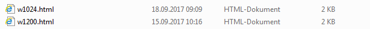

GDI Schemes verwenden
=====================

GDI Schemes können nur im WebGIS 5 verwendet werden. Verwendet man WebGIS 5 auch am Handy und hat man eigene Darstellungsvarianten für mobile Anwendungen entwickelt, kann man in der api5/_config/api.config Datei einstellen, dass die mobile Variante bevorzugt verwendet werden sollten. Dazu ist folgender Config-Key zuständig:

.. code-block ::

    <add key="cmsgdischema_default" value="mobile" />
     
Der Value „mobile“ entspricht der Url-Id, die für dieses Schema im CMS vergeben wurde (siehe oben).

Ruft ein Anwender jetzt die Karte aus dem Portal auf, erscheinen die Darstellungsvarianten aus dem „mobile“ Schema. Zum Testen kann man hier über den Url Parameter *gdischeme (scheme nicht schema!!)* steuern, welches Schema genommen wird (ohne diesen Parameter greift der Wert aus der api.config Datei).

Für den *gdischeme* Parameter können folgende Werte übergeben werden:

=======================     ================================================================================================================================
~, _root                    Da die Default Einstellung im CMS ja eigentlich kein Schema ist, und somit keine Id hat, kann hier ~ oder _root angeben werden.
Url_Id des Schemas          Die im CMS vergebene Url-Id des gewünschten Schemas
=======================     ================================================================================================================================

Die Darstellungsvarianten für unsre Basisdaten schauen dann unterschiedlich aus, je nachdem, mit welchen Parameter ich die Karte aufrufe. 

*   **Kein Schema übergeben oder &gdischeme=mobile**

    .. image:: img/image19.png

*   **&gdischeme=~ oder &gdischeme=_root**

    .. image:: img/image20.png

Da das Übergeben von Url-Parametern nicht vorgesehen ist, wenn man die Karte über die Portalseite aufruft, gibt es noch andere Mechanismen, um das Schema zu steuern. So wäre es wünschenswert, wenn ein Anwender das „mobile“ Schema angezeigt bekommt, wenn er mit einem Handy oder Tablet den Viewer aufruft und die volle Darstellung, wenn der Viewer über den Desktop aufgerufen wird.  

Voraussetzung ist hier, dass man für die unterschiedlichen Bildschirmauflösungen unterschiedliche Layouts definiert hat. Im Ordner portal5/ViewerLayouts/eni (eni=url unserer Portalseite) liegen bei uns Layouts für die Bildschirmbreiten >=1024 (Tablet) und >=1200 (Desktop) Pixel. 

Um nun beispielsweise im Layout für >1200 Pixel die Desktop Darstellungsvarianten anzuzeigen, kann dies im Layout über einen ``

Hier wird, falls die Variable noch nicht gesetzt wurde, die Tilde zugewiesen (man könnte theoretisch auch ‚_root‘ zuweisen). Das entspricht, wie oben schon gezeigt, der CMS Default Einstellung oder dem Desktop Schema. Man könnte hier natürlich auch wieder jedes beliebige Schema über die Url-Id angeben, beispielsweise wenn man eigene Darstellungsvarianten für Tablets parametriert hat, könnte der Eintrage in der w1024.html wie folgt aussehen:

.. code-block :: html

    

**Achtung:** gibt man Schema an, das nicht existiert, werden gar keine Darstellungsvarianten angezeigt!

Die Abfrage im Beispiel, ob die Variable bereits gesetzt wurde, gewährleistet, dass ein Schema, das beispielsweise über einen Url-Parameter übergeben wurde nicht überschrieben wird. Man könnte natürlich auch folgendes schreiben:

.. code-block :: html

    

Dann ist der Url-Parameter nutzlos, weil immer der CMS Standard verwendet wird.

Die ``webgis.gdiScheme`` Variable kann natürlich auch in Templates oder anderen API Anwendungen angegeben werden, um ein spezielles GDI-Schema zu erzwingen.

