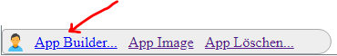

App bearbeiten
==============

Müssen die Parameter für eine App angepasst, ist dies für den Kartenautor auch nachträglich möglich.
Dazu muss der Kartenautor die App öffnen. Unten Links erscheint ein Symbol über den sich der AppBuilder für diese App öffnen lässt:

Der AppBuilder wird dem entsprechenden Template geöffnet und die Parameter können angepasst werden. Danach kann die App wieder
mit ``App veröffentlichen`` aktualisiert werden.