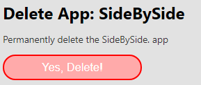

App bearbeiten / löschen
========================

Müssen die Parameter für eine App angepasst, ist dies für den Kartenautor auch nachträglich möglich.
Dazu muss der Kartenautor die App öffnen. Unten Links erscheint ein Symbol über den sich der AppBuilder für diese App öffnen lässt:

.. image:: img/appbuilder6.png

Der AppBuilder wird dem entsprechenden Template geöffnet und die Parameter können angepasst werden. Danach kann die App wieder
mit ``App veröffentlichen`` aktualisiert werden.

Das Menü bietet weiters die Möglichkeit ein Bild hochzuladen (160x160 Pixel). Diese Bild wird dann in der Portalseite als Hintergrundbild angezeigt.

Mit dem dritten Punkt ``App Löschen...`` kann eine App wieder gelöscht werden. Klickt man auf den Menüpunkt wird auf Seite zur Bestätigung angezeigt:

Klickt man auf ``Yes, Delete!`` Wird die App unwiderruflich gelöscht.