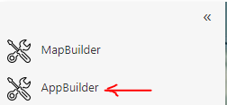
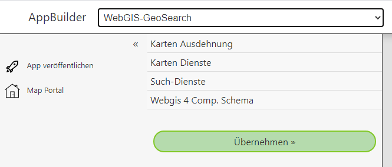

App Builder
===========

Mit dem *AppBuilder* können ähnlich wie mit dem *MapBuilder* WebGIS Anwendungen erstellt werden. Hier muss sich allerdings nicht zwingenden um Karten handeln.
Vielmehr werden über den *AppBuilder* spezielle Vorlagen für Anwendungen angeboten. Diese Vorlagen können über den den *AppBuilder* mit benutzerdefinierten 
Parametern angepasst werden (z.B. Kartendienste). Die angepassten Vorlagen können dann wie Karten im *MapBuilder* veröffentlicht werden und erscheinen dann
auf der Portalseite und eine beliebigen Kategorie.

Der *AppBuilder* wird über die *Sidebar* der Portalseite aufgerufen:

Nach dem Öffnen erscheint der *AppBuilder* in folgender Form:

In der Titelzeile kann die gewünschte Vorlage gewählt werden. Je nach Vorlage erscheinen in der *Sidebar* die entsprchenden Parameter die angepasst werden. 
Durch einen Klick auf einen Parameter klappt der entsprechtende Bereich auf. Wenn alle notwendigen Parameter angegeben wurden, kann die App mit dem Button
``Übernehmen`` im Vorschaubereich erstellt werden.

Ist eine App erstellt und erscheint korrekt im Vorschaubereich, kann sie über den Button ``App Veröffentlichen`` als Kachel in die Portalseite übernommen.
Gleich wie beim *MapBuilder* muss auch hier eine Name und eine Kategorie vergeben werden.

In dieser Beschreibung werden einige diese Vorlagen kurz vorgestellt.

.. toctree::
   :maxdepth: 2

   redirect/index
   service-side-by-side/index