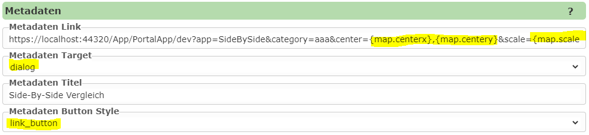
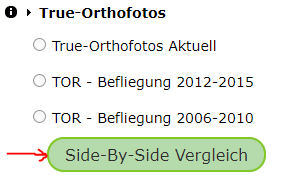

App Aufrufen/Öffnen
===================

Die einfachst Methode ein veröffentlichte App zu öffnen ist es, die entsprechende Kachel auf der Portalseite anzuklicken. Die Kachel für die App sollte nach dem
veröffentlichten unter der gewählten Kategorie erscheinen. Dies allerdings nur möglich, wenn beim veröffentlichten unter Sichtbarkeit ``sichtbar`` gewählt wurde.
Ansonsten kann wird die App nur für den Kartenautor angezeigt (transparente Kachel) oder kann direkt über den Link aufgerufen werden.

Aufruf über Link
----------------

Der Link für wird ersichtlich wenn die App über die Portalseite aufgerufen wird. Dies sollte für den Kartenautor immer Möglich sein. Der Link 
hab beispielsweise folgende Form:

``https://myserver.com/App/PortalApp/{portal-page-id}?app={name-der-app}&category={kategorie-der-app}``

Neben den zwingenden Url Parametern ``app`` und ``category`` können noch weitere optionale Parameter übergeben, um in der App beispielsweise auf eine bestimmten Kartenausschnitt zu springen:

* ``bbox``: die Boundingbox auf die gesprungen werden sollte. Es kann dafür ebenfalls noch der Parameter ``srs`` übergeben werden, um den EPSG Code für die Boundingbox anzugeben (default: 4326)

* ``center`` und ``scale``: Kartenmittelpunkt (Longitude, Latitude) und Maßstab

.. note::
   Wird die App beispielsweise aus dem Kartenviewer aufgerufen, empfiehlt es sich meistens ``center`` und ``scale`` anstelle von ``bbox`` zu verwenden. Da die Größe der Kartenfenster nicht immer gleich
   ist, wird die Anwendung mit ``bbox`` nicht mit dem gleichen Maßstab geöffnet.
   
.. note::
   Ruf man die App aus dem Kartenviewer auf können im Link die entsprechenden Platzhalter für den aktuellen Ausschitt angegeben werden, z.B ``...&center={map.centerx},{map.centery}&scale={map.scale}``

Aufruf aus über benutzerdefiniertes Werkzeug
--------------------------------------------

Wie schon beschrieben kann man eine App auch Link mit Übergabe von des aktuellen Kartenausschnittes aufrufen. Dadurch kann eine App seher einfach als *benutzerdefiniertes Werkzeug* in den
Kartenviewer eingebunden werden. 

Benutzerdefinierte Werkzeug werden in der ``custom.js`` Datei definiert (`siehe  <./../KartenViewer/CustomJS/benutzerdefmarker.html#benutzerdefinierte-werkzeuge>`__).

Die Definition des Werkzeuges sieht etwa folgendermaßen aus:

.. code::

    webgis.custom.tools.add({
        name: 'TOR Befliegungen',
        command: 'https://myserver.com/App/PortalApp/dev?app=SideBySide&category=Allgemein&center={map.centerx},{map.centery}&scale={map.scale}',
        command_target: 'dialog',
        image: 'https://myserver.com/openwin.png'
    });

Hier wird ein Werkzeug definiert, die die App ``SideBySide`` aus der Kategorie ``Allgemein`` mit dem gleichen Maßstab wie die Karte in einem Dialogfenster öffnet.

Aufruf über einen "Metadaten" Button
------------------------------------

Im CMS kann für jede Darstellungsvariante ein *Metadaten* Button definiert werden. Dieser wird in der Regel im TOC vor der Darstellungsvariante als (i) Button angezeigt.
Dies dient vor allem, um einen Link zu Metadaten für ein Thema anzuzeigen. 

Da man dem hier hinterlegten Link auch die oben gezeigen Platzhalter für den aktuelle Kartenausschnitt angeben kann und der Button auch in anderer Form dargestellt werden kann,
bietet der "Metadaten" Button eine weiter Option die zum Aufrufen eine App.

.. note::
   Vorteil ist auch, dass der Aufruf einer App immer/nur möglich ist, wenn ein bestimmtes Thema in der Karte vorhanden ist. 

Als Beispiel dient her der Vergleich von Luftbild Befliegungen. In einen Dienst, der in einer Karte eingebunden ist, gibt es Darstellungsvarianten für die 
unterschiedlichen Befliegungen. Der Anwender kann diese einzeln sichtbar schalten. An dieser Stelle im TOC sollte es auch Möglich sein, die App mit dem *Side-by-Side* 
Vergleich der einzelnen Befliegungen in einem Dialog aufzurufen.

Im CMS muss dazu in der Darstellungvariante unter der der Button erscheinen sollte folgende Einstellungen treffen:

Für den Anwender sieht dieser Button im TOC folgendermaßen aus:

