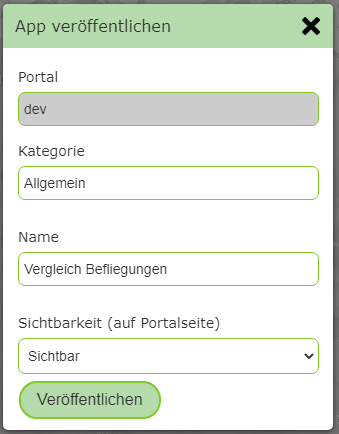

App Veröffentlichen
===================

Wurden für ein App-Template alle Parameter eingetragen und entspricht die Darstellung in der Vorschau den Vorstellungen, kann die App mit dem 
*Sidebar* Button ``App Veröffentlichen`` veröffentlicht werden.

Mit Veröffentlichen wird diese App dann auf der Portalseite angezeigt (falls nicht als unsichtbar definiert) bzw. kann über die entsprechende Url 
aufgerufen werden.

Klickt man auf den Button ``App Veröffentlichen`` erscheint analog zum *MapBuilder* folgender Dialog:

Hier kann eine Kategorie und eine Name für diese App angefügt werden. Über *Sichtbarkeit* wird angegeben werden, ob die App auf der Portalseite als Kachel dargestellt 
wird. Wenn hier ``versteckt`` angegeben wird, ist sie für einen Anwender nicht sichtbar und kann nur über einen Link aufgerufen werden. Das macht Sinn, wenn die App
beispielsweise aus dem Kartenviewer über ein benutzerdefiniertes Werkzeug oder einen Hotlink aufgerufen wird.

