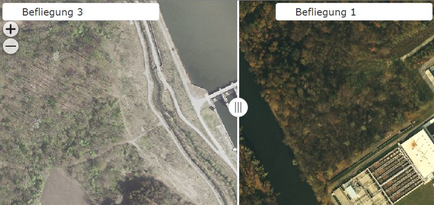
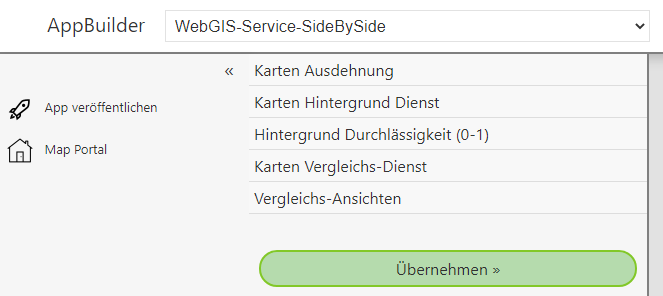

Service Side-by-Side
====================

Mit dieser Vorlage gesteht die Möglichkeit einen Kartendienst in unterschiedlichen Darstellungen nebeneinander darzustellen.
Die Trennlinie zwischen den beiden Darstellungen ist dabei frei verschiebar, damit besserer Eindruck der Unterschiede erkennbar wird.
Die Vorlage kann beispielsweise dazu benutzt werden, um unterschiedliche Befliegungsstände von Luftbildern zu vergleichen:

Wähle man die Vorlauge aus, können folgende Parameter angegeben werden:

