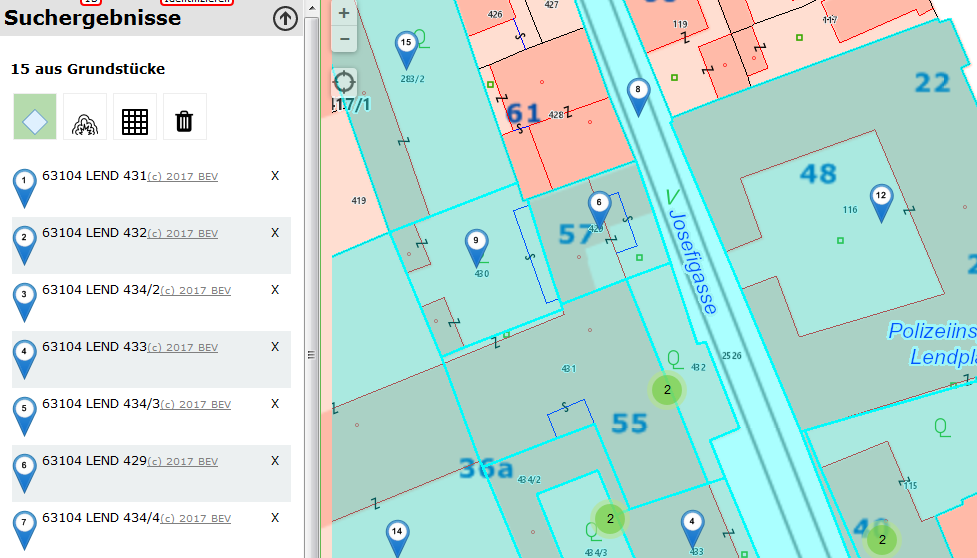
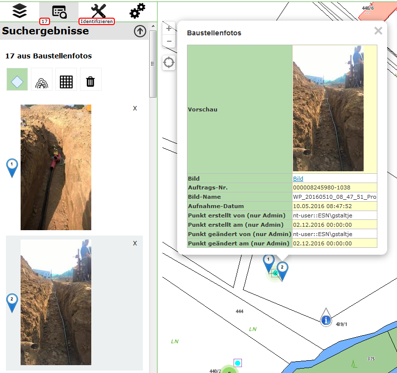

Benutzerdefinierte Marker
=========================

Findet der Anwender im Kartenviewer Ergebnisse, werden diese standardmäßig mit einem blauen Marker markiert. Mit einem Klick auf den Marker werden dann die Attribute dieses Objektes angezeigt. In gewissen Fällen ist es jedoch wünschenswert, ein anderes Symbol für den Marker zu verwenden. Wie das bewerkstelligt wird, soll dieses Beschreibung zeigen.

Allgemeine Vorgehensweise
-------------------------

Die Art, wie Marker dargestellt werden, erfolgt in den Javascripts der API innerhalb des *webgis-Objekts* über ein Array mit dem Namen ``markerIcons``. Die Keys für dieses Array entsprechen Konstanten, die beim Entwickeln vergeben wurden. So ist beispielsweise der rote Marker für die aktuelle Position wie folgt definiert worden:

.. code-block :: Javascript

    this.markerIcons["currentpos_red"] = {
        url: function () { 
            return webgis.css.imgResource('position_red.png', 'markers') 
        },
        size: [38, 38], 
        anchor: [19, 19], 
        popupAnchor: [0, -20]
    }; 

Jedes Objekt, das einen Marker beschreibt hat folgende Eigenschaften:

*   ``url``

    Ein Funktion, die die Url des Marker Bildes zurückgibt. Hier wird noch mit der Funktion ``webgis.css.imgResource()`` gearbeitet. Diese kann verwendet werden, wenn die Marker im api5/content/api/img Verzeichnis liegen. Der erste Parameter gibt den Namen der Datei an, der zweite den Unterordner.
    Wenn sich ein Marker Icon nicht in diesem Verzeichnis befindet, kann hier auch eine absolute Url angegeben werden: http://.....

*   ``size``

    Die Größe des Markerbildes in Pixel

*   ``anchor``

    Die Bildkoordinaten des Einfügepunktes des Markers (von links, oben) in Pixel

*   ``popupAnchor``

    Der Einfügepunkt der Info-Blase relative zum Einfügepunkt des Markers in Pixel 

Die Marker für die Abfrageergebnisse sind folgendermaßen definiert:

.. code-block :: Javascript

    this.markerIcons["query_result"]["default"] = {
        url: function (index, feature) { 
            return webgis.css.imgResource('marker_blue.png', 'markers'); 
        },
        size: function (index, feature) { return [25, 41]; },
        anchor: function (index, feature) { return [12, 42]; },
        popupAnchor: function (index, feature) { return [0, -42]; }
    };

Der Key für das markerIcons-Object ist hier „query_result“. Das ist wieder ein Array dem als Key die Url-Id einer Abfrage zugewiesen werden kann. Hier wird „default“ verwendet, weil die Definition für alle Abfragen (für die nichts anderes definiert wurde) verwendet werden soll.

Der Unterschied zu zum ersten Beispiel ist außerdem, das hier auch die Größe und der Einfügepunkt Funktionen sind. Als Parameter wird dieser Funktion folgendes übergeben:

*   ``index``: 
    Eine fortlaufende Nummer. Gibt ein Index des Suchergebnisses an, für den der Marker abgeholt wird.

*   ``features``:
    Das eigentliche Feature als Javascript Object (in GeoJSON-Notation) für das der Marker abgeholt wird.

Die beiden Parameter dieser Funktion werden innerhalb des Funktionsrumpfes nicht berücksichtigt. Der Grund ist, dass standardmäßig immer der gleich Marker für alle Ergebnisse zurück geliefert wird.

Wenn man nun eine Seite, die auf die WebGIS API zugreift, programmiert, können diese Werte nach den Laden der Datei api.min.js überschreiben werden. Die Syntax entspricht der oben gezeigten, allerdings kann hier natürlich nicht mit „this“ auf das markerIcons-Array zugegriffen werden, das geht nur innerhalb des webgis-Objekts. Anstelle von „this“ kann man direkt mit „webgis“ auf die Definitionen zugreifen:

.. code-block :: Javascript

    webgis.markerIcons["currentpos_red"] = {
        url: function () { 
            return "http://myserver.com/markers/mein_super_marker_symbol.png" 
        },
        size: [20, 20], 
        anchor: [9, 9], 
        popupAnchor: [0, -10]
    }; 

Marker in der custom.js
-----------------------

Der erste Wert, der in der Beispieldatei überschrieben wird, ist der default-QueryResult-Marker:

.. code-block :: Javascript

    webgis.markerIcons["query_result"]["default"] = {
        url: function (i, f) {
            return webgis.css.imgResource('marker_blue_' + (i + 1) + '.png', 'markers'); 
        },
        size: function (i, f) { return [25, 41]; },
        anchor: function (i, f) { return [12, 42]; },
        popupAnchor: function (i, f) { return [0, -42]; }
    };

Hier wird jetzt anstelle des blauen Markers ein blauer Marker mit einer Zahl darin angezeigt. Die Zahl gibt den Index des Abfrageergebnisses an. Wenn man ins portal5/content/api/img/markers Verzeichnis geht, erkennt man, dass es dort Dateien mit dem Namen marker_blue_1.png, marker_blue_2.png, …, marker_blue_1000.png gibt. Diese werden hier mit dem Index nachgebildet:

.. code-block :: Javascript

    'marker_blue_' + (i + 1) + '.png', 'markers'

**Achtung:** Der Index, der der Funktion übergeben wird beginnt mit 0. Daher (i+1).

Das Ergebnis dieser Änderung sieht wie folgt aus:

Die Marker bekommen so eine fortlaufende Nummer, was auch für den Anwender sehr praktisch ist, weil so gleich optisch eine Zuordnung zwischen Liste und Karte möglich ist.

Das nächste Beispiel bezieht sich nur auf die Abfrage „gemeinden“:

.. code-block :: Javascript

    webgis.markerIcons["query_result"]["gemeinden"] = {
        url: function (i, f) {
            if (f.properties.Gemeinde == "Graz")
                return webgis.css.imgResource('marker_circle_sketch_vertex_99.png', 'markers');
            return webgis.css.imgResource('marker_circle_sketch_vertex_' + (i + 1) + '.png', 'markers');
        },
        size: function (i, f) { return [21, 21]; },
        anchor: function (i, f) { return [11, 11]; },
        popupAnchor: function (i, f) { return [0, -11]; }
    };

Hier wird ebenfalls ein „runder“ Marker mit fortlaufender Nummer verwendet. Allerdings wird hier direkt auf die Attribute des abgefragten Features zugriffen. Im Beispiel wird einem Feature, bei dem das Attribut „Gemeinde“ gleich „Graz“ ist, ein fixer Marker mit der Nummer 99 zugewiesen (Eishockey Fans wissen warum).

Alle anderen Funktionen sind nicht vom Index oder vom Feature abhängig, weil alle Marker gleich groß sind und den gleichen Einfügepunkt haben. Ist das nicht so, könnte man auch in diesen Funktionen das Feature abfragen und gegebenenfalls unterschiedliche Werte zurückgeben. 

Ein Beispiel für eine Zuordnung aufgrund von Feature-Eigenschaften könnte beispielsweise ein Thema „medizinische Einrichtungen“ sein. Man könnte so unterschiedliche Marker für Arzte, Krankenhäuser, Apotheken, usw. darstellen.

Das Ergebnis aus diesem Beispiel würde etwa so aussehen:

.. image:: img/image2.png

Die weitern Beispiele die her angeführt sind, betreffen nicht mehr die Marker, sondern die Darstellung der Ergebnisliste. In dieser Liste wird immer nur eine Vorschau (wenige Attribute) angezeigt. Diese angezeigten Attribute entsprechend den ersten drei Attributen nach denen für dieses Thema gesucht werden kann (WebGIS nimmt einmal an, dass diese Attribute aussagekräftig für eine Vorschau sind). Wenn man hier eine andere Darstellung möchte, kann das mit folgenden Beispielen bewerkstelligt werden:

.. code-block :: Javascript

    webgis.hooks["query_result_feature"]["grundstuecke"] = function (map, $parent, feature, base) {
        base(map, $parent, feature);
        $("<a style='color:gray;font-size:.9em' href='http://bev.gv.at' target='_blank'>(c) 2017 BEV</a>").appendTo($parent);
    };

Der „Hook“ wird aufgerufen, wenn ein Ergebnis für die Vorschau gerendert wird. Es wird die Karte, das Parent-HTML-Element, das Feature und die Ursprungs- oder Default-Funktion übergeben. 

Im Beispiel wird erst einmal die Ursprungsfunktion aufgerufen, damit alles wieder so gerendert wird wie immer: base(map, $parent, feature). Dieser Funktion übergibt man die gleichen Werte außer base selbst!!

Dahinter wird hier einfach ein Link zum BEV mit einem Copyright Meldung angefügt. Das Ergebnis entspricht dem Screenshot von oben mit den blauen Marken. In der Liste ist hinter jedem Ergebnis der Link in grauer Farbe erkennbar (könnte man natürlich auch in einer neuen Zeile machen).

Interessanter ist diese Methode, wenn es für eine Abfrage keine aussagekräftigen Attribute für eine Vorschau gibt. Bei uns gibt es ein Thema mit Baustellenfotos, dass man mit Identify in der Karte abfragen kann. Ein einem Feld „Vorschau“ wird im CMS ein Imageexpression auf das Bild erzeugt. Um dieses Bild in der Vorschau anzuzeigen, dient folgender Code:

.. code-block :: Javascript

    webgis.hooks["query_result_feature"]["enetze_fotos"] = function (map, $parent, feature, base) {
        $(feature.properties.Vorschau).appendTo($parent);
    };

Hier wird die base-Funktion nicht mehr aufgerufen, sondern gleich das Bild eingefügt. Das Ergebnis ist folgendes:

Die Bilder werden hier gleich in der Vorschau bei den Suchergebnissen angezeigt. Klickt man auf ein Foto wird in der Karte der entsprechend Marker Popup sichtbar.

Dynamische Marker
-----------------

Die oben gezeigten Beispiele verweisen auf statische Marker Icons. Zusätzlich gibt es noch die Möglichkeit die Marker dynamisch erzeugen zu lassen. Dabei kann die Größe und die Farben übergeben werden.
Um für die Abfrageergebnisse dynamische Marker zu verwenden, würde der Eintrag in der custom.js folgendermaßen lauten:   

.. code-block :: Javascript

   webgis.markerIcons["query_result"]["default"] = {
       url: function (i, f) {
           return webgis.baseUrl + '/rest/numbermarker/' + (i + 1);
       },
       size: function (i, f) { return [33, 41]; },
       anchor: function (i, f) { return [16, 42]; },
       popupAnchor: function (i, f) { return [0, -42]; }
    };

Die Url zu dynamischen Markern lautet `{ webgis-api-url }/rest/numbermarker` also beispielsweise https://api.webgiscloud.com/rest/numbermarker

Hier ein paar Beispiele für den Aufruf mit Übergabe von diversen Eigenschaften:

Marker mit Number:

https://api.webgiscloud.com/rest/numbermarker/42

Marker mit bestimmter Größe (default 33/41):

https://api.webgiscloud.com/rest/numbermarker/42?w=100&h=120

**Achtung:** Der Wert für die Höhe muss immer größer sein als die Breite

Marker Farben übergeben (Füllfarbe, Umrandungsfarbe, Textfarbe als RGB Hex-Code, 3- oder 6-stellig):

https://api.webgiscloud.com/rest/numbermarker/42?w=100&h=120&c=fff,f88,fcc

Benutzerdefinierte Werkzeuge
----------------------------

Benutzerdefinierte Werkzeuge, sind Werkzeuge, die in der Werkzeugleiste des Viewers aufscheinen, die aber nicht zu den Standardwerkzeugen von WebGIS gehören.

Diese Werkzeuge können ein einfacher Button sein (Anzeige zu erweiterten Metadaten einer Karte). Benutzerdefinierte Werkzeuge können allerdings auf Interaktion mit der Karte reagieren (Klick in die Karte oder Rechteck aufziehen). In allen Fällen wird nach einer Benutzeraktion (Klick auf Button, Klick in die Karte, Rechteck aufziehen) ein Link aufgerufen, an den entsprechende Werte übergeben werden können.

Die benutzerdefinierten Werkzeuge werden in der custom.js mit folgendem Befehl dem Viewer hinzugefügt:

.. code-block :: Javascript

    webgis.custom.tools.add({
        name: 'Super Tool',
        command: 'https://www.google.com/maps/@{y},{x},19z',
    });

Fügt man ein benutzerdefiniertes Werkzeug in die custom.js ein, wird es in allen Karten dieser Portalseite hinzugefügt. Soll das Werkzeug nur einer bestimmten Karte oder bestimmten Karten auftauchen, kann dies über entsprechende Bedingen gelöst werden. So steht beispielsweise in der Variable mapUrlName der Name der aktuell aufgerufenen Karte:

.. code-block :: Javascript

    if (mapUrlName === "Geoland") {
        webgis.custom.tools.add({
            name: 'Super Tool',
            command: 'https://www.google.com/maps/@{y},{x},19z'
        });
    }

**Tipp:** Diese Methode kann natürlich auf alle hier beschriebenen Methoden angewandt werden (Marker, Usability usw.)

Der Übergabeparameter ist ein Objekt, welches das Werkzeug beschreibt. Das Objekt muss mindestens die Eigenschaften ``name`` und ``command`` aufweisen. 

Die folgende Liste beschreibt die möglichen Eigenschaften:

*   ``name``

    Ein Name für den Button

*   ``command``

    Ein Link, der aufgerufen wird, sobald die entsprechende Useraktion ausgeführt wurde. Diesem Link können über Platzhalter Werte über den aktuellen Kartenauschnitt oder der geklickten Position übergeben werden (siehe unten) 

*   ``command_target``

    Gibt an, wie der Link aufgerufen werden soll:

    *	``command_target: 'self'``

        Der Link wird im aktuellen Browser-Tab geöffnet

    *	``command_target: 'dialog'``

        Der Link wird in einem Dialog innerhalb des Viewers ausgeführt.

        **Achtung:** Das funktioniert oft nicht mit Drittseiten (zB Google Maps). Diese Seiten lassen sich nicht innerhalb eines IFrames anzeigen, um nicht die allgemeinen Regeln ihrer API zu umgehen.

    *	``command_target: '_blank' (Defaultwert)``

        Der Link wird in einem neuen Browser-Tab geöffnet

*   ``tooltype``

    *	Keine Angabe (Defaultwert)

        Das Werkzeut ist ein einfacher Button. Ein Klick auf diesen Button ruft den Command-Link auf

    *	``tooltype: 'click'``

        Nach dem auswählen des Werkzeuges, muss der Anwender in die Karte klicken, um den Command-Link aufzurufen.

    *	``tooltype: 'box'``

        Nach dem auswählen des Werkzeuges, muss der Anwender in der Karte ein Rechteck aufziehen, um den Command-Link aufzurufen.
        
        **Hinweis zur Usability:** Das Ziehen der Maus bei gedrückter Maustaste ist eigentlich für das Verschieden des Kartenausschnittes reserviert. Das Aufziehen eines Rechtecks ist hier die Ausnahme. Da der Anwender in den meisten Fällen ersteres möchte, funktioniert das Rechteck aufziehen immer nur einmal, nachdem ein entsprechendes Werkzeug ausgewählt wurde. So werden beispielsweise beim Auswählen von Geoobjekte mittels Rechteck nach dem Aufziehen die Ergebnisse angezeigt. Im Hintergrund schaltet sich das Rechteckaufziehen wieder ab und der Anwender kann normal in der Karte navigieren. Will er weitere Geoobjekte selektieren muss er zum Identify-Werkzeug zurückkehren und wieder Rechteck auswählen.
        
        Bei den benutzerdefinierten Werkzeugen bedeutet das, dass nach dem Aufziehen des Rechtecks die Aktion ausgeführt wird. Der Viewer schaltet danach allerdings automatisch zum Default-Werkzeug zurück, damit in der Karte wieder normal navigiert werden kann. Möchte der Anwender erneut ein Fenster aufziehen, muss er das Werkzeug wieder aktiv auswählen.

*   ``container``

    Gibt an, wo in der Werkzeugleiste das Werkzeug angezeigt wird. Der Defaultwert ist hier „Werkzeuge“:

    *	``container:'Navigation'``

    *	``container:'Auswahl'``

    *	``container:'Werkzeuge'``

    *	``container:'Darstellung'``

*   ``image``

    Ein Link zu einem Icon (26x26 Pixel), für den Werkzeug Button.
    Dieser Link kann ein absolute Link sein:
    ``image:'https://www....../icon.png'``

    Befindet sich das Icon bei der API im content/api/img/tools Verzeichnis, recht es auch aus nur den Namen des Bildes anzugeben:
    ``image: 'cursor-plus-26-b.png'``

*   ``tooltip``	

    Ein Tooltip, der angezeigt wird, wenn man den Mauszeiger über den Button bewegt.

*   ``description``

    Damit kann eine Beschreibung für das Werkzeug angegeben werden. Wenn ein Werkzeug eine Benutzeraktion erfordert (zB in die Karte klicken) wird dieser Text im Werkzeug Dialog angezeigt. Für länge Beschreibungen könne einzelne Absätze im String mit ``|`` getrennt werden.

Für die Eigenschaft ``command`` können verschiede Platzhalter in dir Url eingefügt werden, um Parameter aus der Karte in einen andere Web-Seite zu übergeben. Abhängig vom *tooltype* können unterschiedle Platzhalter verwenden werden, bzw. hab diese unterschiedliche Bedeutungen:

*   ``{map.minx}, {map.miny}, {map.maxx}, {map.maxy}``

    *   *ToolTypes:* kein, click, box

    *   Die Ausdehnung des aktuellen Kartenausschnittes in geographischen Koordinaten. X entspricht hier dem Rechtswert (geographische Länge) und Y dem Hochwert (geographische Breite)  

*   ``{map.bbox}``

    *   *ToolTypes:* kein, click, box

    *   Die Boundingbox des aktuellen Kartenausschnittes in geographischen Koordinaten. 

        Entspricht: ``{map.minx}, {map.miny}, {map.maxx}, {map.maxy}``

*   ``{map.centerx}, {map.centery}``

    *   *ToolTypes:* kein, click, box

    *   Der Mittelpunkt des aktuellen Kartenausschnittes in geographischen Koordinaten

*  ``{map.scale}``

    *   *ToolTypes:* kein, click, box

    *   Der aktuelle Kartenmaßstab

*   ``{map.MINX}, {map.MINY}, {map.MAXX}, {map.MAXY}, {map.BBOX}, {map.CENTERX}, {map.CENTERY}``

    *   *ToolTypes:* kein, click, box

    *   Wie oben, nur werden hier geographischen Koordinaten übergeben, sondern Koordinaten im Karten Koordinatensystem (z.B. GK-M34)
    
        X entspricht hier dem Rechtswert und Y dem Hochwert

*   ``{x}, {y}``

    *   *ToolTypes:* click, box

    *   Der Punkt auf den der Anwender geklickt hat in geographischen Koordinaten.

        Zieht der Anwender ein Fenster auf, entspricht dieser Wert dem Mittelpunkt des Fensters 

*   ``{X}, {Y}``

    *   *ToolTypes:* click, box

    *   Wie oben, nur für Koordinaten im Karten Koordinatensystem.

*   ``{minx}, {miny}, {maxx}, {maxy}``

    *   *ToolTypes:* box

    *   Das Rechteck, das der Anwender aufgezogen hat in geographischen Koordinaten

*   ``{bbox}``

    *   *ToolTypes:* box

    *   BoundingBox des Rechteckes, das der Anwender aufgezogen hat.

        Entspricht: ``{minx}, {miny}, {maxx}, {maxy}``

*   ``{MINX}, {MINY}, {MAXX}, {MAXY}, {BBOX}``

    *   *ToolTypes:* box

    *   Wie oben, nur für Koordinaten im Karten Koordinatensystem.

