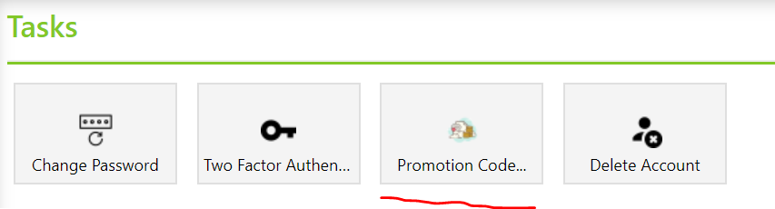
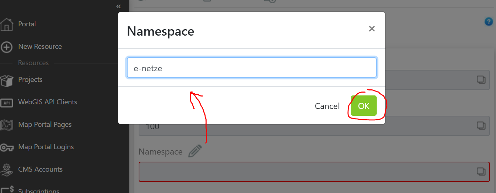
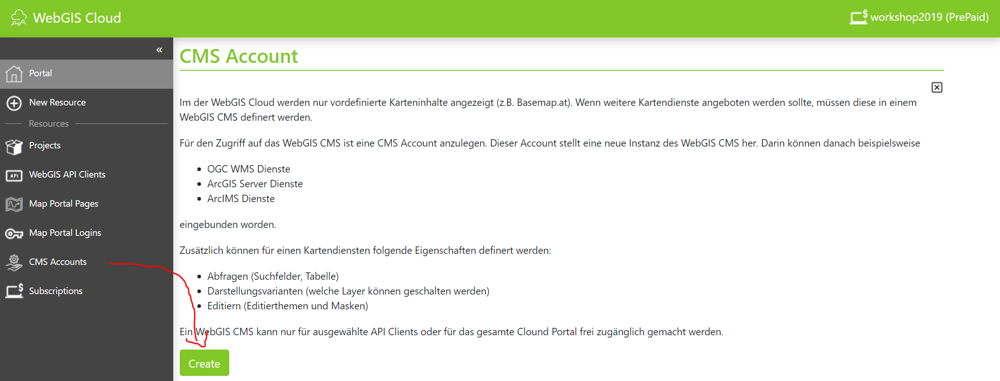
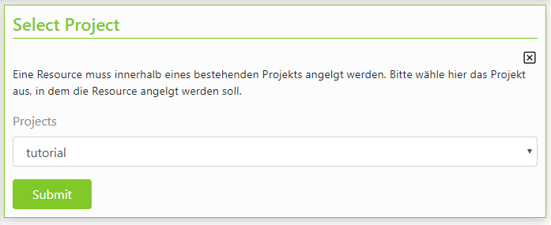
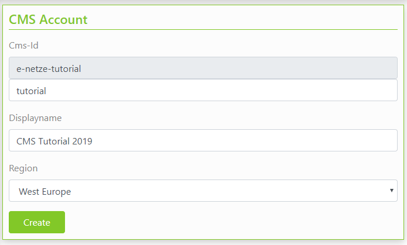
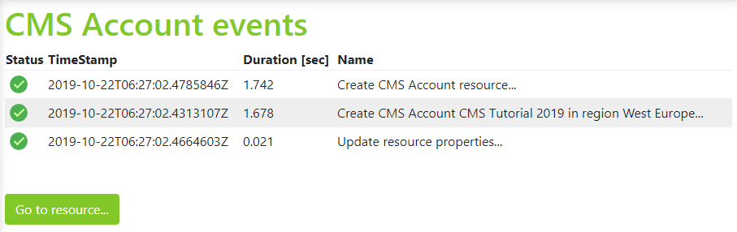
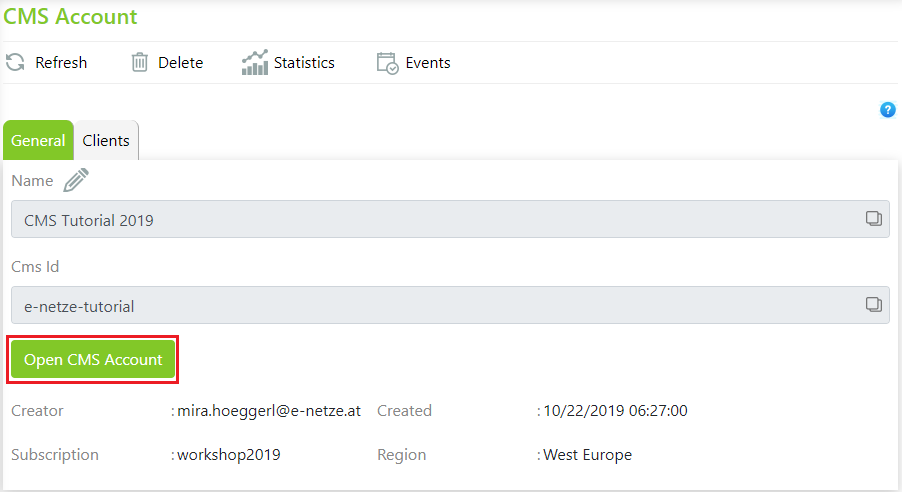

CMS Account
===========

Zum Anlegen eines CMS Accounts ist eine „bezahlte“ Subscription notwendig.
Dazu muss man in der Sidebar (links) auf ``Account`` klicken. Dort findet sich bei den ``Tasks`` ein Punkt ``Promotion Code``:

Nachdem der Promotion Code erfolgreich eingegeben wurde, sind in der Sidebar nun alle Menüpunkte auswählbar. Bei einem Klick auf ``CMS Account`` kommt allerdings noch folgende Meldung:
 

Grund: Manche Resources (wie ein CMS) brauchen einen eindeutigen Namen. Damit es nicht zu Konflikten mit anderen Kunden kommt, muss für eine Subscription ein Namespace angeben werden. Dafür verwendet man idealerweise ein Kürzel, von dem man auf die Organisation zurückschließen kann. z.B. kagis, sagis, noegis, vogis, gis-stmk, e-netze, …  (nur kleinbuchstaben und Bindestrich, keine Umlaute).

Danach kann ein CMS Account angelegt werden:

Zuerst muss noch das Projekt ausgewählt werden, in dem der CMS Account angelegt werden soll:

Im nächsten Schritt sind eine Id und ein Name für das CMS zu vergeben. Die Id muss später eindeutig sein. Gibt es schon ein CMS mit dieser Id, kommt bei der Erstellung eine Fehlermeldung und mit dem Erstellen muss von vorne begonnen werden.

Der Displayname sollte ein sprechender Name sein (muss nicht eindeutig sein) und wird später im CMS als Überschrift angezeigt. 

Außerdem muss noch die Region ausgewählt werden, in der das CMS bereitgestellt wird (zur Zeit nur West Europe).

Ist das Erstellen erfolgreich, wird in etwa folgendes angezeigt:

Tritt ein Fehler auf, muss mit dem Erstellen wieder von Vorne begonnen werden. Mit ``Go to resource…`` kommt man zur Eigenschaften-Seite des neu erstellen CMS Accounts:

.. note ::
    Die bis hier gezeigten Schritte beziehen sich nur auf das Erstellen eines CMS Accounts in der WebGIS Cloud. 
    Bei einer WebGIS Installation bei einem Kunden erfolgt das Anlegen eines neuen CMS über die Datei _config/cms.config im CMS Installationsverzeichnis. 
    Dabei handelt es sich um eine JSON Datei. Dort muss das Wurzelverzeichnis eines neuen CMS und weitere Parameter für das Veröffentlichen des CMS zu einer cms.xml Datei angeführt werden. 
    Die genaue Struktur kann man der CMS-Installationsdokumentation entnehmen. 
    Die weiteren Schritte zur Parametrierung im CMS sollte sich gleich wie in der WebGIS Cloud verhalten. 