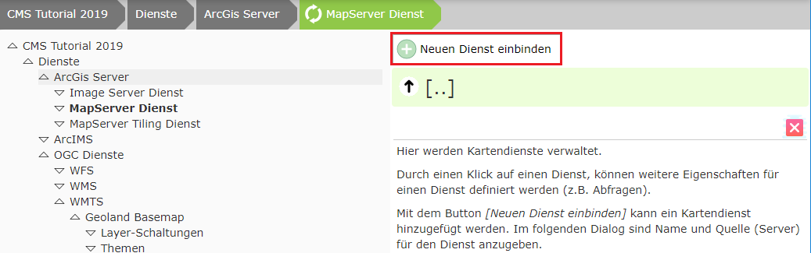
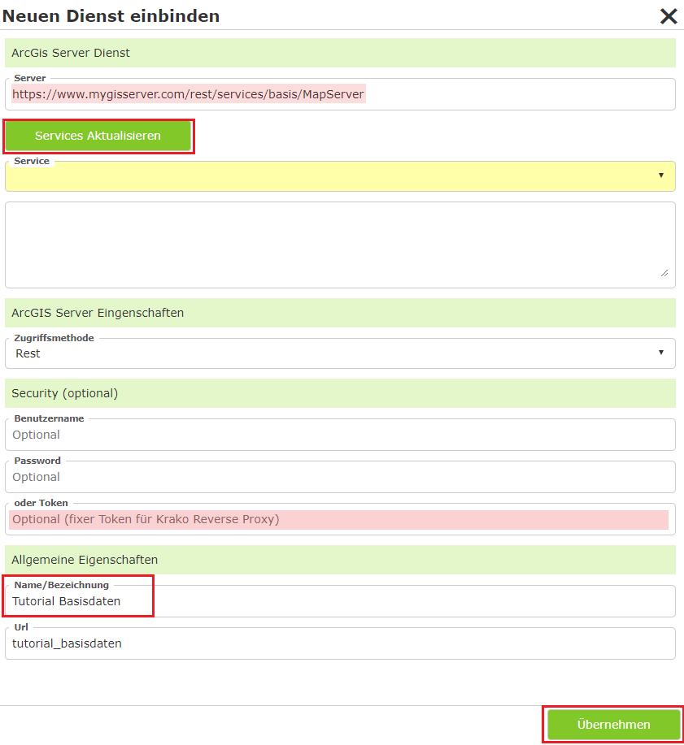
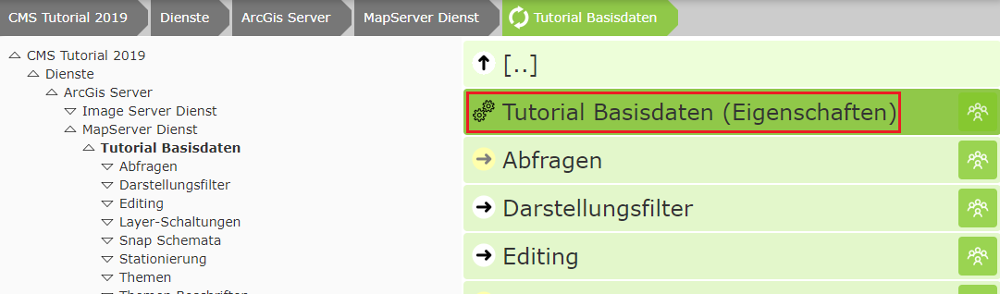
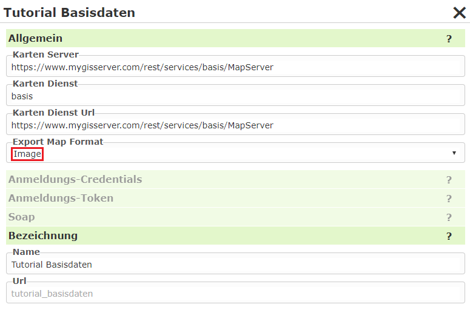
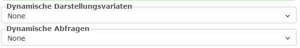

ArcGIS Server Dienst einbinden
==============================

Dazu im CMS Baum auf ``Dienste/ArcGIS Server/MapServer Dienst`` wechseln:

Auf ``Neuen Dienst einbinden`` klicken:

Danach auf ``Services Aktualisieren`` klicken, einen Namen vergeben und auf ``Übernehmen`` klicken.

.. note::
   Wird der Name im Falle von AGS in der MXD gepflegt, wir auch dieser schon automatisch übernommen. Wird dieser nicht gepflegt, steht als Name im Dienst Layer oder Layers => wird nicht ins CMS übernommen => zu Allgemein.

Das Übernehmen kann einige Sekunden dauern. Danach kann man in der Ansicht auf den Dienst klicken und so noch weitere Eigenschaften des Dienstes bearbeiten:

Erscheint der Dienst in der Liste, können weiter Eigenschaften des Dienstes bearbeitet werden:

* **Export Map Format:**
  Im Normalfall liefert der AGS das Ergebnis eines Kartenrequest im JSON Format zurück. Darin steht dann die Url zum eigentlichen Bild im Output-Verzeichnis. In unserem Fall wird das Bild im Output-Verzeichnis hinter unserer Firewall abgelegt und ist NICHT über das Internet erreichbar. Das Kartenbild würde somit zwar erstellt werden, ist aber für den Browser nicht erreichbar.
  Abhilfe für dieses Problem schafft der Wert „Image“. Dabei kommt das Ergebnis vom AGS nicht als JSON sondern als Bild (Bytes). Dieses nimmt WebGIS direkt in Empfang und legt es ins „Cloud“ – Output-Verzeichnis ab, das über das Internet verfügbar ist.
  Diese Methode hat in der Cloud auch den Vorteil, dass über das Internet nicht nachvollzogen werden kann, woher der Kartendienst kommt. 
  Client (Browser) <-> WebGIS <-> ArcGIS Server

.. note::
   Für eine beim Kunden installierte WebGIS Instanz sollte dieser Werte in der Regel leer bzw. auf JSON gestellt werden, weil ein Client meistens Zugriff auf das Output Verzeichnis hat. So folgt in der Regel weniger Trafik:
   
   1. Client (Browser) <-> WebGIS <-> ArcGIS Server (ImageRequest/JSON)
   2. Client (Browser)            <->           Output Verzeichnis

Dynamische Dienste
------------------

Eine Vereinfachung bei der Parametrierung bieten folgende Einstellungen:

In der Regel müssen im CMS für einen Dienst sowohl Darstellungsvarianten als auch Abfragen 
extra parametriert werden. Dadurch ist man als Administrator flexibel und kann bestimmen,
welche Themen in welcher Art sichtbar geschalten bzw. abgefragt werden können. Oft ist jedoch
schon im Dienst eine Gruppierung der Themen definiert. Um nicht an mehreren Stellen das 
gleiche zu parametrieren, kann diese Einstellung herangezogen werden. Damit werden die 
Darstellungsvarianten *dynamisch* aus dem Dienst erstellt.

.. note::
   Unterhalb des Dienstes gibt es die Bereiche ``Abfragen`` und ``Layerschaltungen``, wo diese
   Eigenschaften individuell parametriert werden können. Stellt man in den hier gezeigten Optionen 
   einen anderen Wert als ``None`` ein, verschwinden diese Bereiche. Es gibt nur die 
   Möglichkeit die Inhalte entweder *dynamisch* oder *individuell parametriert* zur 
   Verfügung zu stellen.

Dynamische Darstellungsvarianten
++++++++++++++++++++++++++++++++

* **None:** Die Darstellungsvarianten müssen individuell parametriert werden. Zuerst 
  müssen dafür die einzelnen Schaltungen im Abschnitt ``Layerschaltungen`` des Dienstes definiert 
  werden. Diese können dann im CMS-Knoten ``Karten Viewer`` in einen Darstellungs-Container
  hinzugefügt werden. Dieser Vorgang wird in den nächsten Abschnitten beschrieben.

* **Auto:** Der Themenbaum wird aus dem Dienst übernommen. Für jedes Thema wird in der 
  entsprechenden Gruppe eine *Checkbox*-Schaltfläche angeboten. Im Karten Viewer wird im 
  Darstellungsvarianten-TOC ein extra Container für diesen Dienst angelegt.

* **AutoMaxLevel(1,2,3):** Die Themen werden auch hier aus dem Dienst übernommen. Allerdings werden
  nicht alle Hierarchie-Ebenen übernommen. Die maximale Anzahl der Ebenen entspricht dem hier 
  angeführten Wert. Themen, die in einer tieferen Ebene liegen, werden zu einem Thema (Gruppe)
  zusammengefasst, dass über eine *Checkbox* geschalten werden kann.

  Beispiel: es gibt folgende Themen in einem Dienst:

    * Basisdaten/Kataster/Grundstücke
    * Basisdaten/Kataster/Nutzungssymbole
    * Basisdaten/Kataster/Beschriftung

  Bei ``Auto`` wird der Baum folgendermaßen dargestellt:

  .. code::

        [[  Dienst Container ]]
        -----------------------
        + Basisdaten
          + Kataster
            [x] Grundstücke
            [x] Nutzungssymbole
            [x] Nutzungssymbole

  
  ``AutoMaxLevel2`` würde den Baum auf zwei Ebene beschränken. Die unterste Gruppe würde als 
  *Checkbox* erscheinen und alle darunter liegenden Themen schalten:

  .. code::

        [[  Dienst Container ]]
        -----------------------
        + Basisdaten
          [x] Kataster
        
    
  ``AutoMaxLevel1`` lässt schließlich nur noch eine Ebene innerhalb des Darstellungsvarianten 
  Containers zu:

  .. code::

        [[  Dienst Container ]]
        -----------------------
        [x] Basisdaten

.. note::
   Bei dynamischen Darstellungsvarianten erfolgt die Schaltung der einzelnen Layer immer über 
   *Checkboxen*. Möchte man weitere Möglichkeiten ausschöpfen (Buttons, Optionbox, Marker), 
   muss der komplette Baum im CMS über Layer-Schaltungen/Darstellungsvarianten parametriert 
   werden.

Dynamische Abfragen 
+++++++++++++++++++

* **None:** Die Abfrage müssen für den Dienst im Abschnitt ``Abfragen`` parametriert werden.
  Dieser Vorgang wird im nächsten Abschnitt beschrieben.

* **Auto:** Für jedes abfragbare Thema im Dienst wird zur Laufzeit ein Abfragethema erstellt.
  In der Tabelle der Ergebnisse werden alle Felder angezeigt.

.. note::
   Es werden alle abfragbaren Themen mit allen Feldern als Abfrage angeboten. Sollten 
   bestimmte Themen als Abfrage zur Verfügung stehen oder in Themen über Suchfelder gesucht werden
   können, müssen alle Abfragen im CMS parametriert werden. 
 