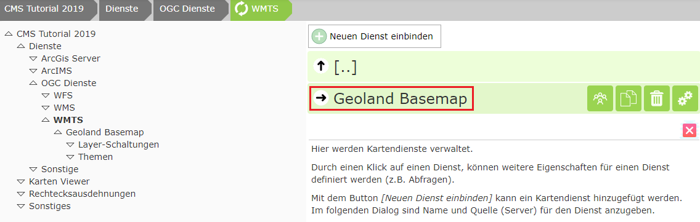

WMTS Tilecache Dienst einbinden
===============================

Dazu im CMS Baum zu ``Dienste/OGC Dienst/WMTS`` wechseln:

Auf ``Neuen Dienst einbinden`` klicken.

Im Dialog die Url zum WMTS Dienst eingeben (https://www.basemap.at/wmts/1.0.0/WMTSCapabilities.xml) und auf ``Aktualisieren`` klicken:

Die fehlenden Werte werden automatisch ausgefüllt. Im Falle von WMTS kann noch der gewünschte Tiled-Layer ausgewählt werden, wodurch sich wiederum die restliche Werte anpassen. 

Danach auf ``Übernehmen`` klicken:

**Achtung:** Damit ein Dienst später auch wie ein Hintergrunddienst geschalten werden kann, muss in den Erweiterten Eigenschaften noch der Wert Basemap auf „true“ gesetzt werden.
Das Web CMS sollte das automatisch erkennen von richtig ausfüllen. Sollte es sich bei dem Dienst noch zusätzlich um einen Overlay Tile Cache handeln (Straßennamen über Orhtofoto), muss auf die gleiche Weise noch für die Option „Overlay“ gehandhabt werden.

Auf den Dienst klicken:

Auf die gleiche Weise kann nun verfahren werden, um noch weiter Tiled-Layer der Basemap hinzuzuladen.

**Hinweis:** Das Einbinden eines Dienstes als WMTS hat den Vorteil, dass hier auch gleich Beschreibungen und Copyright-Verweise vorhanden sind. Diese werden direkt übernommen und später im Viewer angezeigt.

