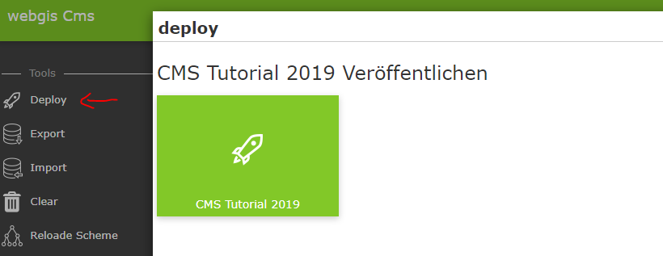
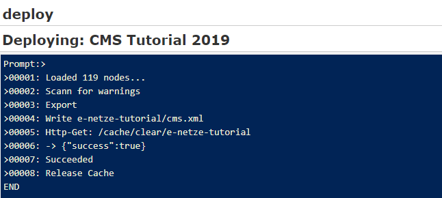
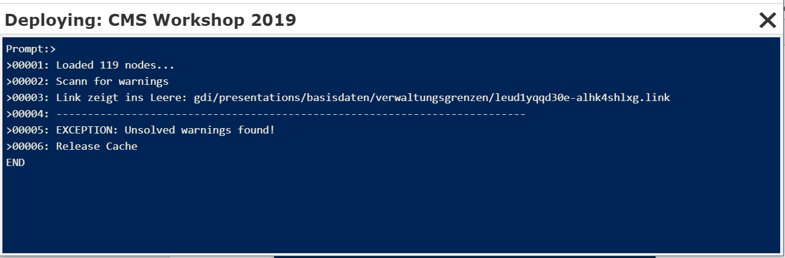
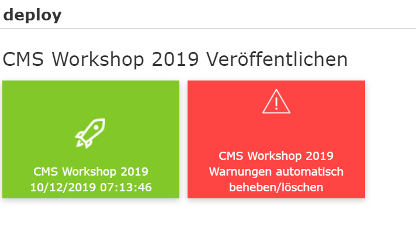
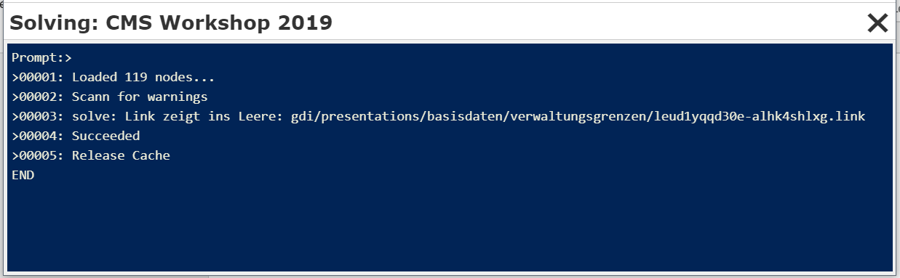

CMS Veröffentlichen
===================

Um zu überprüfen, wie die bisherige Parametrierung im Viewer aussieht, kann das CMS einmal veröffentlicht werden. Dazu klickt man in der Sidebar auf ``Deploy``:

Es erscheint ein Dialog mit einer Schaltfläche in der noch einmal der Name und gegebenfalls das Datum der letzten Veröffentlichung angeführt wird.

Ein Klick auf diese Schaltfläche startet den Erstellungsprozess:

Dieser Vorgang kann je nach Größe des CMS Baumes einige Momente dauern. Ist das Erstellen erfolgreich, wird am Ende die Meldung *Succeeded* ausgegeben und der Dialog kann mit ``X`` geschlossen werden. 

Treten beim Veröffentlichen Warnungen auf, etwa weil es Darstellungsvarianten gibt, die auf gelöschte Layer-Schaltungen verweisen, bricht der Vorgang ab:

Ein CMS mit einer Warnung kann nicht mehr veröffentlicht werden. Zum Lösen des Konfliktes gibt es zwei Möglichkeiten:

1.	Aufgrund der ausgegebenen Meldung das Problem suchen und den entsprechenden Verweis löschen (hier eine Darstellungsvariante)
2.	Die Warnung automatisch löschen

Zu 2:
Nach der Ausgabe von Warnungen das Fenster schließen. Die Deploy Dialog erscheint jetzt der Hinweis, dass es beim letzten Veröffentlichen Warnungen gegeben hat:

Klickt man auf die rote Schaltfläche, wird versucht, die Warnungen automatisch zu beheben, was so viel bedeutet, dass die entsprechenden Verweise gelöscht werden. 

**Achtung:** Diesen Vorgang sollte man nur durchführen, wenn das Löschen der zB Layer-Schaltung beabsichtigt war. Ansonsten werden vielleicht unabsichtlich Verweise gelöscht:

Nach diesem Vorgang ist die rote Schaltfläche im Deploy Dialog verschwunden und das CMS kann neu Veröffentlicht werden.