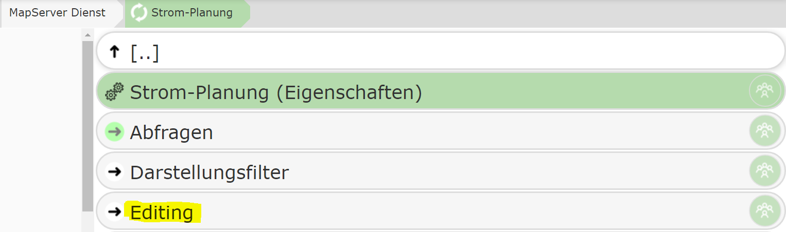
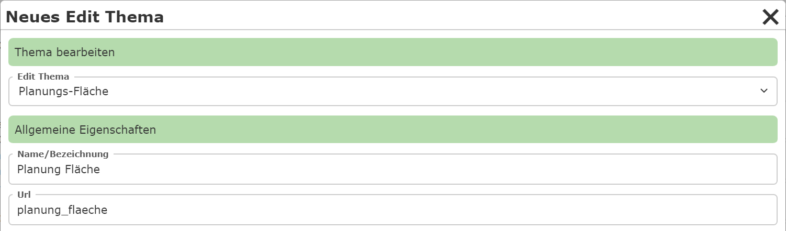
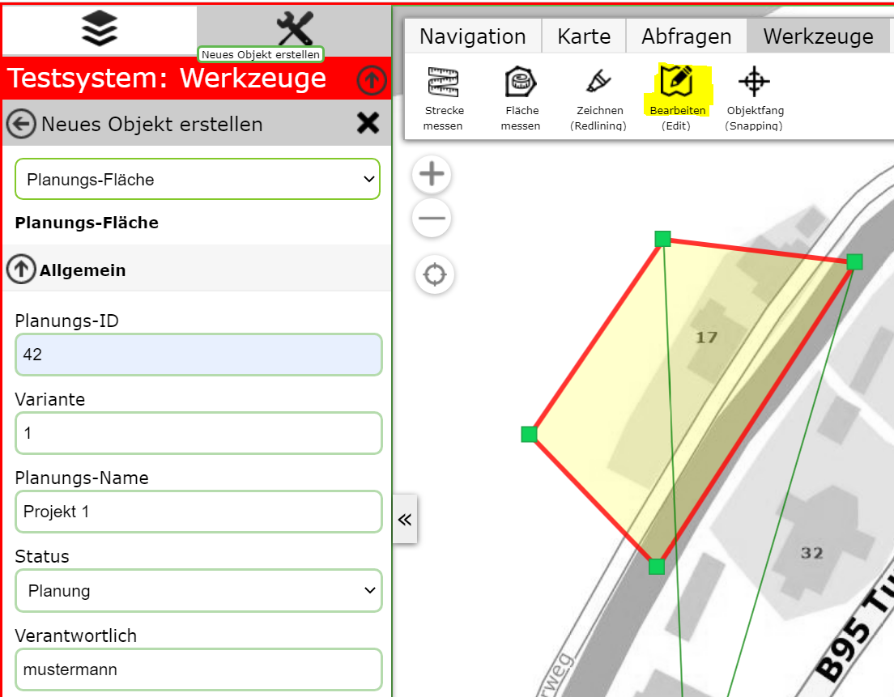
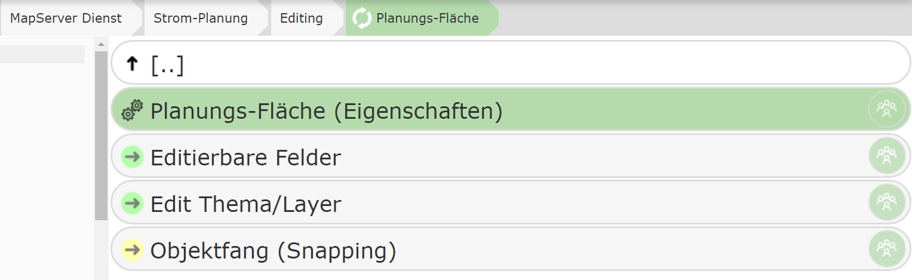

Editthema anlegen
=================

Dazu muss im (AGS) Dienst in den Bereich ``Editing`` gewechselt werden.

In diesem Bereich sind alle Themen aufgelistet, die in der Kartenanwendung bearbeitet werden können.
Kein Thema in einem Dienst ist apriori auch bearbeitbar. Erst durch hinzufügen eines Themas in diesen 
Bereich/Knoten ermöglicht die Abarbeitung durch den Anwender.

.. note::
   Der CMS Baum kann natürlich an jeder Stelle für die Anwendung berechtigt werden. So kann beispielsweise ein
   bestimmtes Edit-Thema nur einem eingeschränkten Benutzerkreis zur Verfügung stehen. Will man das gesamte Bearbeiten
   schützen, kann die Berechtigung auch gleich für den Bereich/Knoten ``Editing`` festgelegt werden.

Zum Hinzufügen eines Themas auf den den Button ``Neues Edit Thema`` klicken.

Hier wird beispielsweise ein Thema ``Plaungs Fläche`` ausgewählt, über das der Anwender eine Fläche einzeichnen
kann, die das Planungsgebiet eingrenzt. Unter Name/Bezeichnung kann angegeben werden, unter welchen Namen das 
Editthema angezeigt wird (das muss nicht zwingend gleich dem Namen des Darstellungslayers entsprechen).
Als Sachdaten sollte dann zur Geometrie noch Planungsnummer, Variante,
Status, Verantwortlichkeiten usw. eingegeben werden. Erstellt ein Anwender eine neue Planungsfläche, könnte die
Bearbeitungsmaske in etwa folgendermaßen aussehen:

Nach dem Erstellen des Editthemas erscheint es in der Liste. Klickt man auf das Thema, bieten sich folgende Möglichkeiten:

Unter Edit Thema/Layer ist ein Verweis auf den Kartendienst Layer, der bearbeitet werden soll. Nachdem dieser
schon im obigen Schritt beim Erstellen ausgewählt wurde, ist hier keine Aktion mehr notwendig.
