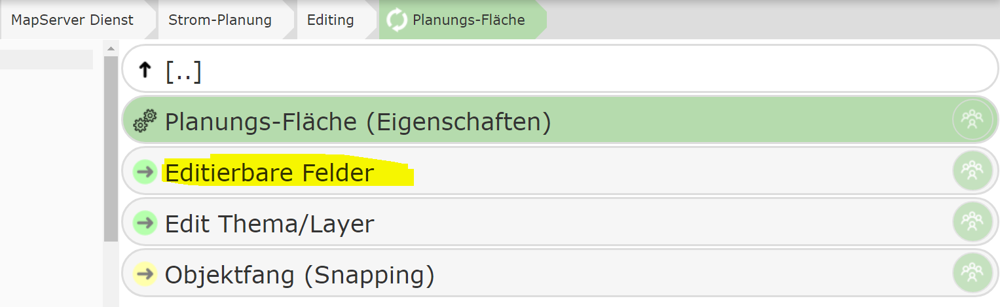
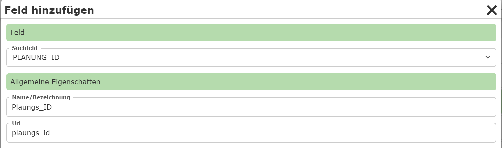
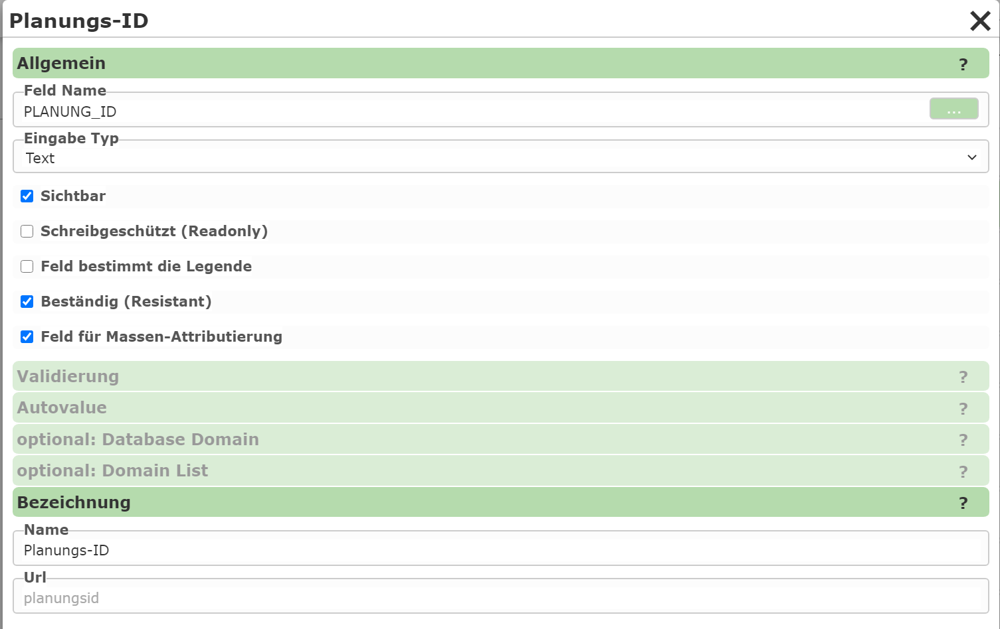

Editierbare Felder
==================

In diesem Abschnitt wird bestimmt, welche Sachdaten dem Anwender für ein Editthema zur Verfügung stehen.
Die einzelnen Attribute für eine Geo-Objekt können dabei über Eingabefelder, Auswahllisten, Datumsfelder usw.
eingegeben werden.

Müssen viele Attribute eingegeben werden, empfiehlt es sich, die Attribute in unterschiedliche Kategorien aufzuteilen.
Die einzelnen Kategorien können dann in der Sachdaten-Maske einzeln aufgeklappt werden.

Im Ersten Schritt muss daher erst einmal mit dem Button ``Neue Kategorie`` eine Kategorie erstellt werden.
Für das reicht beispielsweise eine Kategorie ``Allgemein``. Klickt man danach auf eine Kategorie,
können darin Eingabefelder definiert werden bzw. bereits vorhandene bearbeitet werden.

Zum Hinzufügen eines neuen Eingabefeld (Attribute) muss innerhalb einer Kategorie auf ``Feld hinzufügen``
klicken:

Unter ``Feld`` wird das Feld angegeben, das bearbeitet werden soll. Nach dem Auswählen muss noch ein Name
vergeben werden, unter dem das Feld in der Eingabemaske angezeigt wird.

Ein so erstelltes Eingabefeld wird nach dem Erstellen sofort aufgelistet. Ein Klick auf ein Eingabefeld öffnet einen
Dialog mit weiteren Eigenschaften:

Die Art der Eingabe wird über den ``Eingabe Type`` bestimmt:

* **Text:** Ein einfaches Texteingabe-Feld.
* **Domain:** Eine Auswahlliste mit definierten Werten. Die Werte können im CMS statisch definiert werden oder aus einer Datenbank stammen.
* **TextArea:** Ein mehrzeiliges Eingabefeld.
* **Date:** Ein Datums Eingabe Feld.
* **File:** Für den Upload von Dateien.
* **Info:** Ein reiner Informationstext (keine Interaktion mit dem Anwender).

Zusätzlich gibt es unter ``Allgemein`` noch folgende Optionen für ein Eingabefeld:

* **Sichtbar:** Gibt an, ob das Feld für den Anwender sichtbar ist. Unsichtbare Felder können praktisch sein, wenn diese eventuell erst später über einen AutoValue berechnet werden.
* **Schreibgeschützt (Readonly):** Ähnlich wie beim 'Sichtbar'. Hier wird das Feld zwar angezeigt, kann vom Anwender aber nicht geändert werden.
* **Feld bestimmt die Legend:** Besitzt das Editierthema in der Karte eine Legende mit unterschiedlichen Symbolen und ist das Symbol abhängig vom Wert dieses Feldes, kann diese Option gesetzt werden. Der Anwender hat dann über die Auswahlliste die Möglichkeit, neben dem Tabellenwert auch das (Legenden-) Symbol auszuwählen.
* **Beständig (Resistant):** Der Wert des Feldes bleibt nach dem Speichern erhalten und muss nicht jedes Mal vom Anwender neu eingeben werden. Das gilt auch, wenn es das gleiche Feld in unterschiedlichen Themen gibt. Z.B. muss so eine Projektnummer, die auf jedem Objekt mitverspeichert wird, nur einmal eingeben werden und bleibt im Formular 'beständig', bis der Anwender eine andere Projektnummer vergibt.
* **Feld für Massen-Attributierung:** Wird Massen-Attributierung (alle ausgewählten Objekte ändern) erlaubt, kann hier angegeben werden, ob das Feld über Massen-Attributierung gesetzt werden darf.

