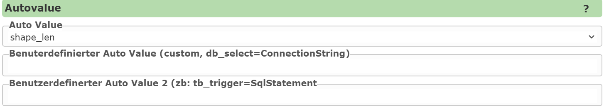
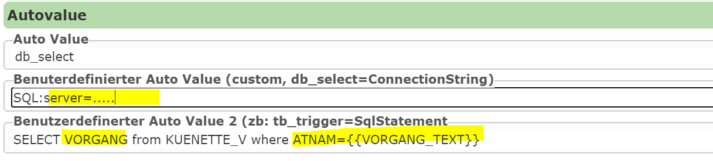

Editierbare Felder: Autovalues
==============================

*Autovalues* sind Felder, die nicht vom Anwender eingegeben werden müssen, sondern aufgrund von anderen Kriterien 
vor dem Speichern vom am Server *automatisch* gesetzt werden.
So kann damit beispielsweise der Username des aktuellen Anwenders oder das Erstellungsdatum in ein Feld übertragen 
werden. Diese Felder werden für die Eingabemaske in der Regel als *readonly* oder nicht sichtbar angeführt.

Im folgenden Beispiel wir beispielsweise die Länge der erstellten Liniengeometrie in ein Feld übernommen:

Wird als *Autovalue* ``custom`` verwendet, kann im Eingabefeld der Autovalue eingegeben werden.
Hier könnten beispielsweise Konstante Werte mit ``=WEBGIS`` eingegeben werden, wenn man möchte,
dass ein Feld (zB QUELLE) immer  ``WEBGIS`` eingetragen werden sollte.

Über ``custom`` können Werte aus den Url-Parametern verwendet werden, über den der Viewer aufgerufen wurde. Die funktioniert für sogenannte *originäre* Url-Parameter (siehe Abschnitt: Auf des Viewers).
Auf diese Werte kann man beispielsweise folgendermaßen zugreifen: ``url-parameter:project_id``.

Weiters sind auch automatische Attributierungen über räumliche Beziehungen zu anderen Featureklassen möglich,
beispielsweise:

``NR FROM GDBAbfrage SERVICE kataster``

In das Feld wird das Attribut NR jener Objekte aus dem Thema GDBAbfrage geschrieben, welche sich mit dem gespeicherten 
Objekt räumlich decken. Gibt es mehrere Ergebnisse, werden diese mit Strichpunkten getrennt.

``TYP FROM kasten SERVICE strom@mycms BUFFERDIST 20 SEPERATOR space-space MAX 10``

In das Feld wird das Attribute TYP jener Objekte aus dem Thema kasten geschrieben, welche im Umkreis von 20m
liegen (BUFFERDIST 20). Gibt es mehrer Ergebnisse werden diese mittels Leerzeichen-Bindestrich-Leerzeichen 
voneinander getrennt (SEPERATOR space-space). Es werden jedoch maximal zehn Ergebnisse übernommen (MAX10).

Der Autovalue ``db_select`` erfordert ebenfalls die Eingabe weiterer Werte in die beiden Eingabefelder.
Mit diesem Autovalue wird vor dem Speichern eine Wert über eine Datenbankabfrage befüllt. In die Felder
muss hier der *ConnectionString* und das *SQL Stamtement* eingeben werden:

Über Platzhalter wie ``{{VORGANG_TEXT}}`` kann dabei auf aktuelle Eingaben zugegriffen werden.

Als Datenquelle für ``db_select`` kann auch ein WebService angeben werden. Das kann beispielsweise auch eine 
*Datalinq* abfrage sein, die über als JSON abgeholt wird.

Liefert eine Abfrage etwas folgendes Ergebnis:

``https://localhost:44341/datalinq/select/auswahllisten(oJ...token)@color?value=blau``

.. code-block:: javascript

   [
      {
        "value": "4711",
        "name":"Blau"
      }
   ]

Zum Einbinden dieses Dienstes muss für die Felder ``ConnectionString`` und ``SqlStatement`` folgendes eingetragen werden:

ConnectionString:

``https://localhost:44341/datalinq/select/auswahllisten(oJ...token)@color``

SqlStatement:

``value={{color}}``

Wobei hier ``color`` das Edit Eingabe/Auswahllisten-Feld ist, das für diesen Autovalue verwendet wird.
In diesem Beispiel würde als Autovalue der Wert ``Blau`` übernommen werden.

.. note:: 
   In der Praxis wird nicht empfohlen, *ConnectionString* oder Urls (mit Tokens) wie oben gezeigt an dieser Stelle 
   ins CMS einzutragen. *ConnectionStrings* und Tokens sollte im Abschnitt ``secrets`` einmal eingetragen werden.
   An dieser Stelle wird dann nur mehr der Platzhalter für das Secret angegeben:

   ConnectionString: ``{{select-datalinq-endpoint-auswahllisten}}@color``