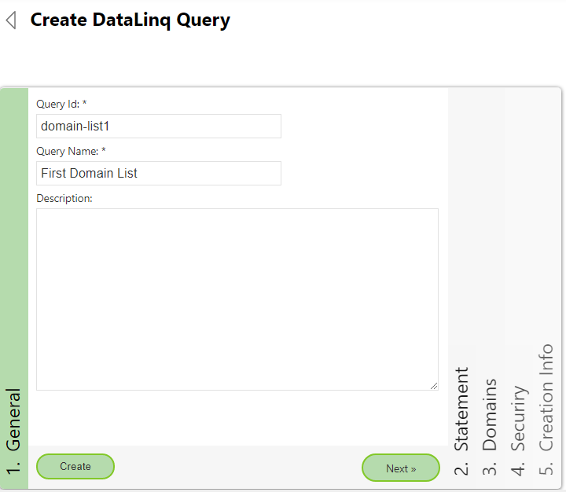
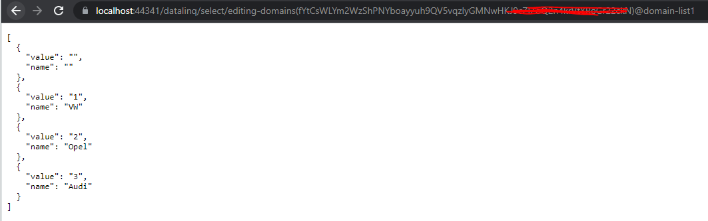
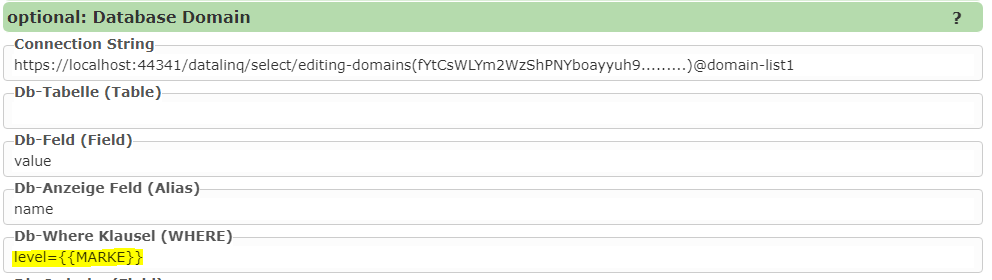

Auswahllisten aus WebServices (DataLinq)
========================================

*DataLinq* ist in der *WebGIS API* enthalten und wird hauptsächlich verwendet werden, um Berichte auf Basis von diversen Datenquellen zu erstellen.
Außerdem können die parametrieren Abfragen als JSON über eine REST Schnittstelle abgeholt werden. Die REST Schnittstelle kann auch als Quelle für 
Auswahllisten verwendet werden. Zu den vorher gezeigten Quellen hat das den Vorteil, dass *ConnectionString* und *SQL Statements* nicht bei jeder 
Auswahlliste parametriert werden müssen. Die CMS Parametrierung bleibt von frei von *ConnectionString* und *Datenbank Passwörten*. 

DataLinq kann auf unterschiedliche Quellen zugreifen und die Daten dann über die REST Schnittstelle veröffentlichen:

* Datenbankabfragen
* WebGIS API Abfragen auf Kartendienste, die über das WebGIS CMS parametriert wurden
* Eine (Plain) Text Listen

In dem hier gezeigten Beispiel sollten Auswahllisten aus *Plain-Text* erstellt werden. Eine Datenbank ist hier nicht notwendig. Das entspricht in etwa 
der vorher gezeigten Methode mit *statischen Auswahllisten*. Allerdings ist man hier flexibler, die eine Liste immer wieder verwendet werden kann 
und eine Aktualisierung der Liste sofort auf alle Editmasken durchschlägt.

.. note::
   Der Umgang mit *Datalinq* wird in diesem Abschnitt vorausgesetzt. 

DataLinq Endpoint anlegen
-------------------------

Im ersten Schritt muss ein neuer *DataLinq* Endpoint angelegt:

Als Typ kann hier ``PlainText`` angegeben werden. Ein *ConnectionString* ist für diesen Typ nicht notwendig:

Unter Security können mittels der ``Resest`` Buttons neue Zugriffstokens erstellt werden. Sollten die Listen nicht frei zugänglich sein,
müssen diese geschützt werden. Sollte der Client für die Listen nicht ein Anwender sondern ein Applikation sein, erfolgt der Zugang nicht über *User* und *Passwort* 
sondern über *Tokens*. Bei den Auswahllisten ist der Client, der die Listen abholt die *WebGIS Application*:

Datalinq Abfrage anlegen
------------------------

Im nächsten Schritt kann unter dem Endpunkt eine Abfrage erstellt werden:

Unter *Statment* kann der Editor geöffnet werden:

Ist die Quelle eine Datenbank, kann hier das SQL Statement angeführt werden. Beim Typ *PlainText* werden hier die Werte für die Liste als Text eingetragen:

Pro Zeile kann eine Wert eingetragen werden. Der Wert in der Liste wird so später in der Auswahlliste sowohl als ``value`` als auch als ``label (Anzeigename)`` verwendet.
Sollte sich ``value`` und ``label`` unterscheiden, müssen die beiden Werte mit einem ``:`` getrennt werden.

.. note::
   Hier wurde auch noch eine Zeile eingefügt, die nur einen Doppelpunkt enthält (``:``). Die Zeile gibt an, dass später in der Auswahlliste auch eine leerer Werte für die Liste angeboten wird.
   Hier könnte auch ``0:`` geschrieben werden, wenn in der Geo-Datenbank später für Leerwerte der Wert ``0`` stehen sollte.

.. note::
   Leerzeilen werden in dieser Liste ignoriert.

Den Editor mit ``Close`` schließen und zum Security Bereich wechseln. Hier sollte der User ``*`` hinzugefügt werden. Das bedeutet, dass jeder Anwender/Client, der den *Endpoint* erreichen 
kann, auch diese Abfrage abholen kann. Die Berechtigungen könnten hier auch noch weiter eingeschränkt werden. Für das Beispiel reicht es aber, wenn nur der *Entpoint* geschützt ist.

Zum Abschluss kann die Abfrage mit ``Create`` erstellt werden.

Zum Testen der Abfrage kann man der Abfragendialog geöffnet werden => *Statement* => *Test*
Das Ergebnis sollte wie folgt aussehen:

Die Abfrage wird angezeigt, weil wir uns in diesem Beispiel auf der API mit dem Benutzer ``subscriber::system`` gemeldet haben, für den der *Endpunkt* sichtbar ist.
Kopiert man den Link in einen anderen Browser (oder neues *Incognito Window*) kommt folgender Fehlermeldung:

Das kommt daher, dass der Zugriff auf den *Endpunkt* nicht für jeden Benutzer freigeben wurde. Damit der Client später auf die Abfrage zugreifen kann, muss einer der vorher beim *Endpunkt* 
erstellen *Tokens* übergeben werden. 
Dafür gibt es zwei zulässige Methoden:

http://...../datalinq/select/endpoint(ENDPOINT-TOKEN)@query(QUERY-TOKEN)
http://...../datalinq/select/endpoint@query?endpoint_token=ENDPOINT_TOKEN&query_token=QUERY_TOKEN 

Wir haben in diesen Beispiel nur Tokens für den *Endpunkt* definiert. Passt man die Url entsprechend an, funktioniert die Abfrage auch im *Incognito Window*:

Dieser Link muss so auch ins CMS übertragen werden.

.. note::
   Welcher der beiden Tokens verwendet wird, ist egal. Beide Tokens sind gleichwertig. Der Grund dafür, dass zwei Tokens erstellt werden müssen ist, dass später eventuell 
   ein störungsfreier Wechsel von Tokens möglich ist.

Auswahlliste im CMS einbinden 
-----------------------------

Hier wird beim jeweiligen *Domain Feld* (Edit Maske) unter *ConnectionString* der Link zur Abfrage eingetragen:

.. note::
 Da sich die WebGIS Anwendung nicht mit User und Passwort bei DataLinq anmelden kann, muss hier der Token mit angeführt werden.

 Grundsätzlich kann hier jedes *Web Service* angesprochen werden, dass ein JSON Array zurück gibt. Das Array muss einzelne Objekte mit ``value`` und ``name``  enthalten.
 Aus welche Properties die Werte genommen werden, kann hier über ``Db-Feld`` und ``Db-Anzeige Feld`` angeführt werden. Die Defaultwerte sind hier ``value`` und ``name``. Für unser
 Beispiel könnten diese Werte also auch leer gelassen werden.

Kaskadierende Auswahllisten
---------------------------

 Auswahllisten können auch von einer übergeordnet Liste abhängig gemacht werden. Möchte man das mit den hier gezeigten ``PlainText`` DataLinq-Abfragen umsetzen, wird das in
 der Liste durch Einrückungen umgesetzt (2x Leerzeichen):

 .. image:: img/datalinq-domains13.png 

Ruft man danach die Abfrage wieder ohne Parameter auf, ergibt sich wieder die Liste von oben mit den Automarken:

.. image:: img/datalinq-domains14.png

Möchte man die Modelle für eine bestimmte Marke anzeigen, muss der Parameter ``level0={value}`` übergeben werden:

.. note::
   Durch Einrückung könnten beliebig viele Ebenen (Levels) eingeführt werden. Die Einschränkung auf eine Ebene erfolgt dann über die Url 
   mit den Parametern ``level0={value0}&level1={value1}&level2={value2}``.

Im CMS kann die Einschränkung über die ``DB-Where Clause`` angegeben werden:

.. note::
   ``MARKE`` ist hier das Datenbank-Feld, in das die Automarke über die Auswahlliste geschrieben wurde.

