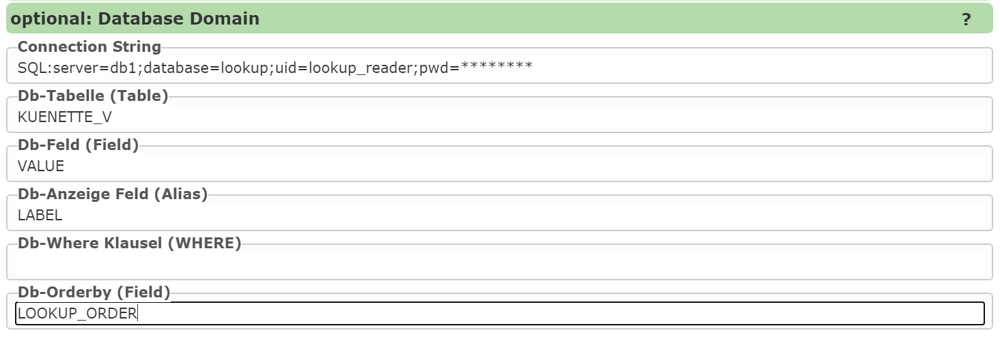
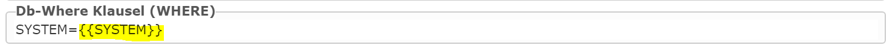

Auswahlliste aus Datenbank
--------------------------

Dabei muss zuerst ein *ConnectionString* zur Datenbank definiert werdem. ``SQL:`` gibt ab an, dass es sich um
eine *SqlServer* Datenbank handelt.
Als nächstes muss die Tabelle (oder der View) angeführt werden, in dem sich die Werte für die Auswahlliste befinden.
Die beiden nächsten Werte geben die Tabellen Spalten an, mir denen die Auswahlliste befüllt wird:

* **Db-Feld:** Die Spalte gibt den Wert (*value*) einer einzelnen Listenelemente an. Wählt der Anwender etwas aus der Liste aus, ist das der Wert, der beim Speichern in die Geo-Datenbank übertragen wird.
* **Db-Anzeige Feld:** In diese Spalte stehen die Werte, die dem Anwender angezeigt werden. Diese Spalte kann ident mit der *Db-Feld* Spalte sein. Allerdings handelt es sich hierbei nicht immer um sprechende Werte. Daher kann hier eine Spalte mit Werten angeführt werden, die für Anwender verständlich sind.

Optional können auch noch Werte für eine *Where* Bedingung und eine Spalte zum Sortieren der Werte angeben werden.

Auswahllisten werden beim Erstellen der Maske für dem Anwender vom Kartenviewer befüllt.
Es gibt allerdings Anwendungsfälle, in denen der Inhalt beim Erstellen der Eingabemaske noch nicht eindeutig ist.
Möglicherweise hängt der Inhalt einer Auswahlliste vom Wert einer anderen Auswahlliste ab. Erst wenn die erste 
Auswahl vom Anwender getroffen wird, sollte die zweite Auswahlliste aufgrund der Auswahl befüllt werden.

Um solche Abhängigkeiten zu gewährleisten, kann die *Where* Bedingungen mit speziellen Platzhaltern verwendet werden:

hier ist ``SYSTEM`` ein Eingabefeld mit Auswahlliste. Ändert sich dort die Auswahl durch den Anwender,
wird auch die Abhänge Auswahlliste neu befüllt. Die Abhängigkeit ergibt sich durch den Platzhalter ``{{SYSTEM}}``

Es gibt noch weiter Möglichkeiten für Platzhalter in der *Where* Bedingung.
Beispiele:

``{{role-parameter:gemnr,GEM_NR like '{0}'}}``

Hier würde beispielsweise eine Rollenparameter ``gemnr`` einen Anwenders verwendet werden, um die Auswahlliste über 
die *Where* Bedingung weiter einzuschränken. Welche Möglichkeiten Rollenparameter bieten ist einen eigenen
Whitepaper *Extended Role Parameters* zu entnehmen.

