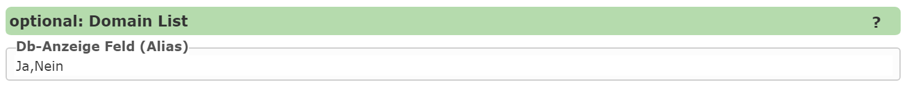

Statische Auswahllisten
-----------------------

Für einfache Auswahllisten mit wenigen Werten, können diese auch *statisch* im CMS definiert werden.
Dabei werden die Einträge einfach mit einem Beistrich als Trennzeichen im Textfeld angeführt.

Auch hier ist es möglich zwischen Wert und Anzeige zu unterscheiden. Dabei ist Wert und Anzeige durch einen Strichpunkt 
zu trennen. Das Trennzeichen zwischen den einzelnen Auswahllisten Einträgen ist weiterhin ein Beistrich:

``1:Ja,0:Nein``