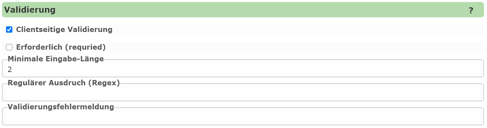

Editierbare Felder: Validierung
===============================

In diesem Abschnitt wird angeführt, ob ein Feld vor dem Speichern eines Geo-Objektes noch auf bestimmte Kriterien
überprüft werden sollte. Trifft eines der Kriterien nicht zu, bekommt der Anwender eine Fehlermeldung und das Objekt
kann nicht gespeichert werden.

Folgende Kriterien sind möglich:

* **Erforderlich (required):** Für diese Felder muss ein Wert eingegeben werden
* **Minimale Länge:** Die Eingabe muss mindestens x Zeichen lang sein.
* **Regulärer Ausdruck:** Die Eingabe muss einen regulärem Ausruck entsprechen.

Über *regulärere Ausdrücke* können auch komplexerer Eingaben (z.B. gültige E-Mail Adresse) überprüft werden.
Tritt ein Fehler auf, bekommt der Anwender eine Fehlermeldung. Sollte diese nicht der Standardfehlermeldung 
entsprechen, kann der Text unter ``Validierungsfehlermeldung`` angegeben werden.
Bei *regulärere Ausdrücken* sollte man dem Anwender hier auch Beispiele für richtige Eingaben anführen,.

Clientseitige Validierung
-------------------------

Die Validierung erfolgt im vor dem Speichern am Server und verhindert, das Falscheingaben in der Geo-Datenbank landen.
Eine besser *User Experience* ergibt sich aber, wenn Eingaben schon am Client (im Browser) während der Eingabe
passieren. Der Anwender bekommt dann beispielsweise schon beim Eingeben eines Wertes schon angezeigt, 
dass die Eingabe nicht dem gewünschten Ausdruck entspricht (und muss dafür nicht vorher auf Speichern klicken).

Damit *clientseitige* Validierung zu aktivieren muss hier die entsprechende Option aktiviert werden.