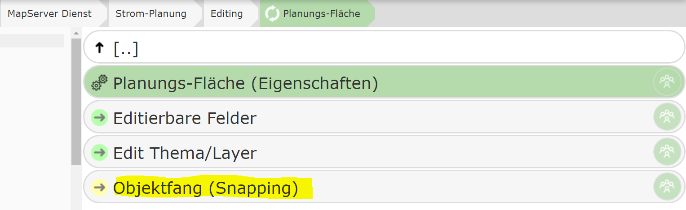
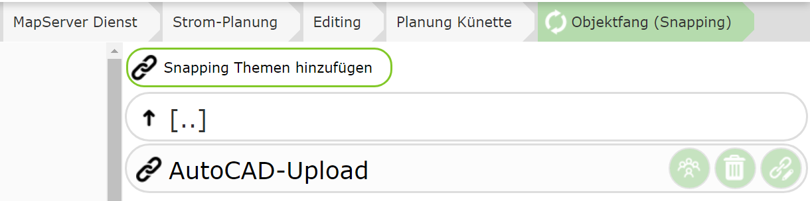
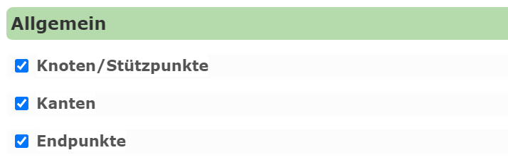

Objektfang (Snapping) Einstellungen
===================================

Zum exakten Konstruieren von Geo-Objekten ist ein Objektfang wichtig. Damit wird der Zeichen-Cursor auf bestimmte 
Objekte *gesnappt*, wenn er sich in der Nähe befindet. Für jeden Dienst können beliebig viele *Snapping Schematas*
erstellt werden, die wiederum beliebig viele Themen enthalten können. 
*Gesnappt* werden kann auf Knotenpunkt und Kanten.

Der Anwender ist in der Regel dafür verantwortlich, das richtig Snappingthema zu wählen.
Wenn beim Editieren *Snapping* zwingend vorgeben ist oder sich das Snappingthema je nach Editthema unterscheidet,
empfiehlt es sich, *Snappingthemen* automatisch vorzugeben. 

Dies passiert unter diesem Knoten. Die hier angegeben Snappingthemen werden beim Einstellen einen Editthemas durch
den Anwender automatisch gesetzt:

Unter den Einstellungen kann noch gewählt werden, welche Einstellungen in diesem Thema automatisch gesetzt werden:

