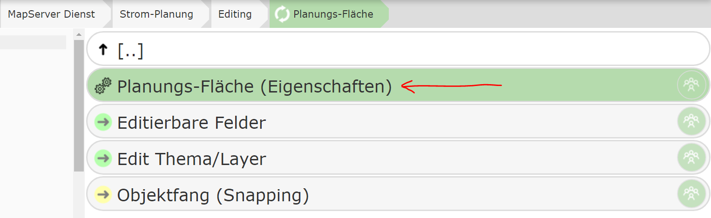
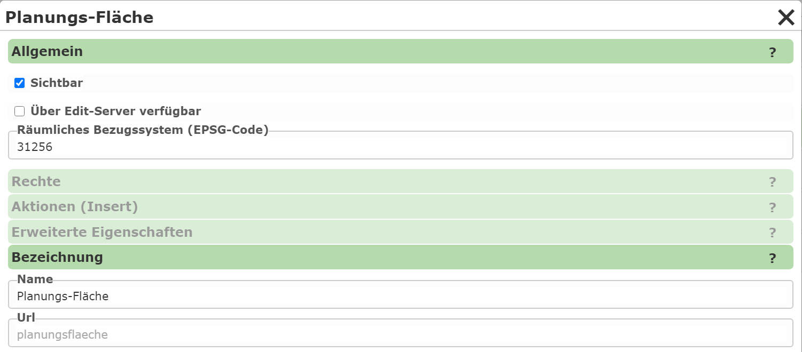
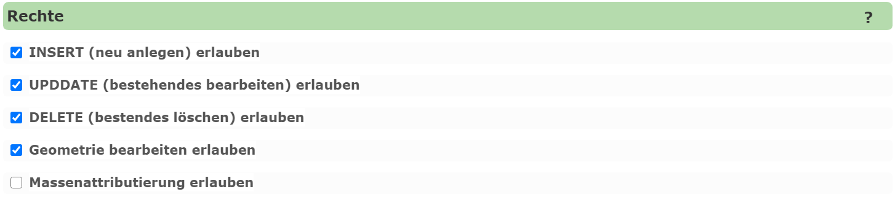
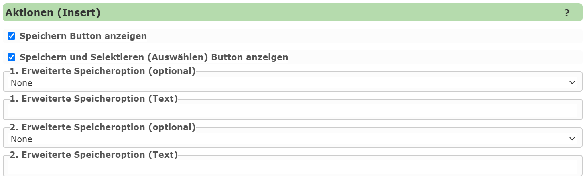
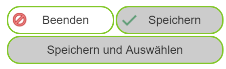
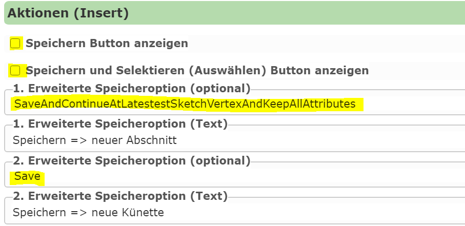
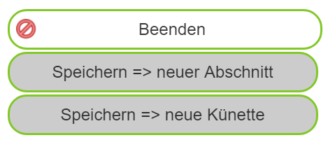
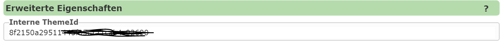

Editthema Eigenschaften bearbeiten
==================================

Unter ``Eigenschaften`` lassen sich allgemeine Eigenschaften für eine erstelltes Editthema bestimmen:

Die Eigenschaften werden ein einem Dialog mit unterschiedlichen Kategorien dargestellt:

Allgemein
---------

Hier wird angegeben, ob ein Editthema beim Bearbeiten-Werkzeug angezeigt werden soll. Möchte man das Thema
im Kartenviewer verwenden, muss die Option ``Sichtbar`` gesetzt werden. 
Themen können allerdings auch noch über andere Methoden bearbeitet werden. Zum Beispiel gibt es vorgefertigte
App Vorlagen für den *AppBuilder* (Collector) mit denen Daten erfasst werden können. Damit diese Werkzeuge das 
Editthema verwenden dürfen, ist die Option ``Über Edit-Server verfügbar`` zu setzen.

.. note:: 
   Aus Sicherheitsgründen, sollte man immer nur die notwendigen Optionen setzen. ``Edit-Server`` nur aktivieren,
   falls wirklich ein Zugriff über eine App erfolgen sollte. Sollte ausschließlich über eine App editiert werden,
   sollte ``Sichtbar`` nicht gesetzt werden, da sich dies auf den Kartenviewer bezieht.

Eine wichtige Einstellung ist auch das ``räumliche Bezugssystem (EPSG-Code)``. Hier wird festgelegt, in welchen
System die Daten über den (AGS-) *FeatureServer* ausgetauscht werden. Hier sollte das Koordinatensystem angeführt werden,
in dem die Daten auch in der Datenbank geführt werden. Das muss nicht mit dem Koordinatensystem der Karte 
überein stimmen, in der die Daten editiert werden. Gibt man hier das Bezugssystem der Daten an, vermeidet man
unnötiges Projizieren der Koordinaten, was zu Rundungsungenauigkeiten führen kann.

.. note::
   Projizieren sollte beim Bearbeiten möglichst vermieden werden. Möchte man beispielsweise nur Sachdaten ändern
   und lässt die Geometrie unberührt, sollte diese nicht beim überspeichern durch Ungenauigkeiten bei der 
   Projektion verändert werden.

Bezeichnung
-----------

Hier wird der vergebene Name des Editthemas angegeben und kann dort auch geändert werden.

Rechte
------

Für jedes Thema kann über die *Rechte* bestimmt werden, welche Aktionen für diese Thema möglich sind:

* **INSERT:** Neue Objekte dürfen angelegt werden.
* **UPDATE:** Bestehende Objekte dürfen bearbeitet werden.
* **DELETE:** Bestehende Objekte dürfen gelöscht werden.
* **Geometrie:** Neben den Sachdaten darf auch die Geometrie geändert werden. In manchen Fällen sinnvoll, bei denen der Anwender nur die Sachdaten bestehender Objekte bearbeiten darf.
* **Massenatributierung:** Ist diese Option gesetzt, kann ein Anwender die Sachdaten für alle ausgewählten Objekte durchführen.

Aktionen (Insert)
-----------------

In diesem Bereich kann bestimmt werden, welche Möglichkeiten der Anwender hat, um ein erstelltes Geo-Objekt
zu speichern. Standardmäßig besitzt ein Editthema in der ``Neues Objekte erstellen`` Maske im Kartenviewer
neben der Attributeingabe noch folgende *Buttons*:

Der Anwender kann ``Speichern`` und danach entweder ein weiteres Objekt des gleichen Typs zeichnen oder die 
Eingabemaske verlassen. Nach erfolgreichem Speichern erscheint das Objekte in der Karte und die 
Sachdaten-Eingabemaske wird auf den Standard zurückgesetzt. Für ein neues Objekt müssen von Anwender auch wieder
alle Sachdaten-Einträge neu vergeben werden (es gibt hier Ausnahmen, Felder die erhalten bleiben und einmal eingegeben 
werden müssen. Siehe später ``Beständige (Resistant)`` Felder).
Mit ``Speichern und Auswählen`` kann der Anwender das erstellte Objekte speichern und es dann sofort
auswählen. Ohne diesen Button müsste für diesen Zweck das Objekt erst gespeichert und dann mit dem Abfrage Werkzeug
ausgewählt werden. Voraussetzung ist dafür, dass im Dienst für dieses Thema auch eine Abfrage existiert.
Sinn macht die *Aktion* beispielsweise, wenn für ein erstelltes Objekte im Anschluss eine Nachbarschaftsberechnung 
durchgeführt werden soll.

Beiden Standardbuttons ``Speichern`` und ``Speichern und Auswählen`` können über die Optionen in diesem Dialog
auch weggeschalten werden.

Für spezieller Anforderungen gibt noch weitere optionale Buttons zum Speichern von Geo-Objekten. Über den Dialog,
können fünf zusätzliche Button erzeugt werden. Damit ein optionaler Button angezeigt wird, muss jeweils die 
*Speicheraktion* und eine *Text* für den Button angeführt werden.

Folgende *Aktionen* stehen dabei zur Verfügung:

* **Speichern (Save):** Entspricht dem einfachen Speichern über den ``Speichern`` Button. Hiermit kann der ``Speichern`` Button theoretisch mit einem alternativen Text dargestellt werden.
* **Speichern und Auswählen:** Entspricht ebenfalls dem Standardbutton ``Speichern und Auswählen``.
* **Speichern und Attribute behalten:** Hier bleiben nach den Speichern alle Attribute in der Sachdatenmaske erhalten. Der Anwender kann so theoretisch gleich ein weiteres Geo-Objekt erstellen und muss nicht alle Attributwerte neu vergeben.
* **Speichern und mit letzten Vertex weiterzeichnen:** Hier wird nach dem Zeichnen der letzte Punkt des gezeichnet Objektes für das nächste Objekt übernommen. Ein Anwendungsfall wird unten beschrieben.
* **Speichern,mit lebeten Vertix weiterzeichnen und Attribute behalten:** Eine Kombination aus den beiden obigen.

Hier ein kurzes Anwendungsbeispiel, bei dem die unterschiedlichen Aktion nützlich sein können:

Für die Planung von Leitungsobjekten sollte der Künettenverlauf im Kartenviewer erfasst werden (Linien-Objekt). 
Aufgrund der Länge der Linien können so die etwaigen Kosten geschätzt werden. Die Kosten der Grabungen sind dabei 
natürlich vom Untergrund (Wiese, Asphalt, ...) abhängig. Darum kann ein entsprechendes Attribute "Untergrund" 
ausgewählt werden. Ändert sich für ein längeres Leitungsprojekt der Untergrund, muss der Planer an den Übergangspunkten
die Linie speichern und beim letzten Punkt mit einem neuen *Abschnitt* fortfahren. Das es sich bei diesem 
Künettenabschnitt um ein neues Geo-Objekt handelt, muss er im Standardfall erst alle Sachdaten (Planungsnummer, Variante, Zuständiger, ...)
neu vergeben und beim Zeichnen an letzten Punkt des vorherigen Abschnittes anschließen.

Eine erhebliche Erleichterung würde hier die letzte oben angeführte Aktion darstellen: Nach dem Speichern
beim letzten Punkt weiterzeichnen und alle Attribute behalten. So würde mit dem Kick auf einem Button
ein neuer Abschnitt (neues Geo-Objekt) begonnen werden. Das einzige Attribut das neu vergeben werden müsste 
ist der *Untergrund*.

Parametrieren könnte man die ``Aktionen (Insert)`` folgendermaßen:

Die beiden Standardbuttons werden weggeschalten. Das *normale* Speichern wird als optionale Aktion (2) mit neuem
Text (*Speichern => neue Künette*) parametriert.
Die erste optionale Aktion (1) entspricht dem oben beschrieben verhalten (*Speichern => neuer Abschnitt*)

Im Kartenviewer erscheinen die Buttons für dieses Thema dann folgendermaßen:

Erweiterte Eigenschaften
------------------------

Intern bekommt jedes Editthema zur Identifizierung eine eindeutige Id. Wird das Editthema nicht (nur) über 
den Kartenviewer, sondern auch über oben erwähnte Apps (Collector) eingebunden, muss im entsprechenden 
Javascript Code auch diese Id verwendet werden. Da dafür oft eine sprechende Id wünschenswert ist,
kann der Wert hier geändert werden.

.. note::
   Ändert man diesen Wert manuell, muss gewährleistet sein, dass die Id trotzdem eindeutig (innerhalb des CMS)
   ist. Die Eindeutigkeit wird **nicht** vom System überprüft und muss von CMS Autor gewährleistet sein.
   Auch sollte dieser Wert nicht mehr geändert werden, da die Änderung dann in alle Apps mitgezogen werden
   muss. Möchte man das Thema auch in Apps verwenden und den Namen ändern, sollte dies gleich nach dem Erstellen
   passieren und danach nicht mehr geändert werden.

