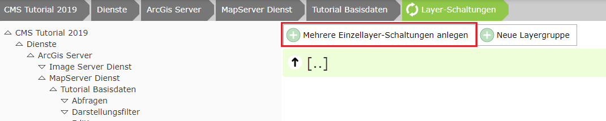

Layer-Schaltungen
================

.. note::
   Dieser Abschnitt kann nicht für *dynamische Dienste* (siehe vorheriges Kapitel) angewendet 
   werden. Ist bei den Eigenschaften des Dienstes im CMS unter ``Dynamische Darstellungsvarianten`` 
   ein Wert ungleich ``None`` eingestellt, steht dieser Abschnitt im CMS nicht zur 
   Verfügung.

Später im Kartenviewer sollten einige ausgewählte Themen auf einfache Weise als Darstellungsvarianten geschalten werden. In der Regel sind Dienste mittlerweile sehr umfangreich und nicht alle Themen sind für jeden Anwender interessant. Darum sind wir dazu übergegangen, nur jene Themen über den Darstellungsvarianten-TOC zugänglich zu machen, die für den Großteil der Anwender relevant sind. Über einen bei den Neuerungen gezeigten Umweg kann ein versierter Anwender bei Bedarf auf alle Themen zugreifen. Ein zu umfangreicher TOC überfordert die meisten Anwender in der Regel.

Über *Schemes* kann später sogar noch unterschieden werden, ob ein Anwender über den Desktop oder über ein Mobiles Gerät eingestiegen ist. Für Mobile Geräte können Darstellungsvarianten noch weiter eingeschränkt werden bzw. komplett unterschiedlich aussehen (siehe unten).

Um Layer-Schaltungen zu erstellen muss beim Dienst auf den entsprechenden Abschnitt zu klicken:

.. image:: img/image137.png

Eine Layer-Schaltung ist eine Menge von Layern die mit einem Klick geschalten werden können. Ein Anwender kann so mit einem Klick mehre Layer aus dem Dienst schalten, ohne von der Struktur des Dienstes etwas wissen zu müssen. 

Bei einfachen Diensten, wie hier beim Basisdaten-Dienst (besteht hauptsächlich aus Verwaltungsgrenzen), sind in der Regel keine komplizierten Layer-Schaltungen notwendig. Hier ist es legitim, pro Layer eine Layer-Schaltung zu machen. Für diesen Fall sollte man auf den Button ``Mehrere Einzellayer-Schaltungen anlegen`` klicken:

Man wählt die gewünschten Layer aus und drückt auf ``Übernehmen``.

Die Reihenfolge lässt sich durch Verschieben festlegen. Diese hat später im Viewer aber keine Relevanz, da das eigentliche Aussehen des Darstellungsvarianten Baumes später unter dem CMS Knoten „Karten Viewer“ (früher GDI) festgelegt wird.

