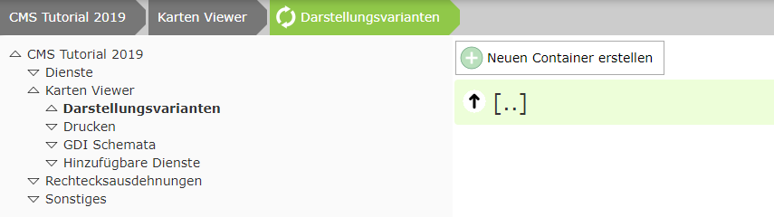
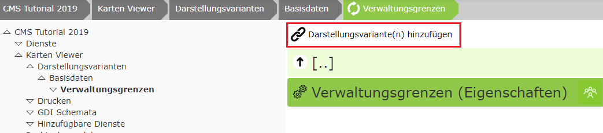

Darstellungsvarianten (Layer-Schaltungen für den Viewer bereitstellen)
======================================================================

Dazu um Knoten ``Karten Viewer/Darastellungsvarianten`` wechseln

Im ersten Schritt ist ein Container zu erstellen. Dieser stellt die oberste Ebene im Darstellungsvarianten TOC dar. Diese Container können später vom Anwender einzeln aufgeklappt werden. Innerhalb eines Containers können sich die eigentlichen Layer-Schaltungen oder eine/mehrere aufklappbare Gruppe(n)  befinden, die wiederum Layer-Schaltungen enthalten können. Die maximale Tiefe ist also drei. Dies gewährleistet auch, dass der Darstellungsvarianten Baum nicht zu komplex wird und der Anwender in der Regel mit wenigen Klicks zum Ziel kommt.

Im Tutorial parametrieren wir zwei Dienste:

*	Basisdaten (Verwaltungsgrenzen)
*	Kataster 

Die Layer-Schaltungen beider Dienste sollte sich im Viewer in einen Container „Basisdaten“ befinden. 

Dazu ist dieser Container über den Button ``Neuen Container erstellen`` anzulegen.

Innerhalb dieses Containers kann man nun Layer-Schaltungen hinzufügen:

In diesem Tutorial möchten wir allerdings noch eine aufklappbare Gruppe mit dem Namen *Verwaltungsgrenzen* anlegen:

Hier können nun die vorhin erstellten Layer Schaltung hinzugefügt werden. Wenn sich im CMS mehre Dienste befinden, muss im Dialog eventuell noch bis zum gewünschten Dienst navigiert werden:

Für die hier eingefügten Layer-Schaltungen ist jetzt auch die Reihenfolge für die Auflistung im Viewer relevant. Diese kann durch Ziehen der Knoten festgelegt werden.