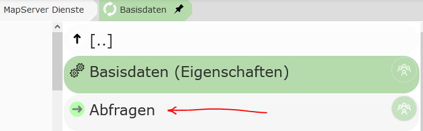
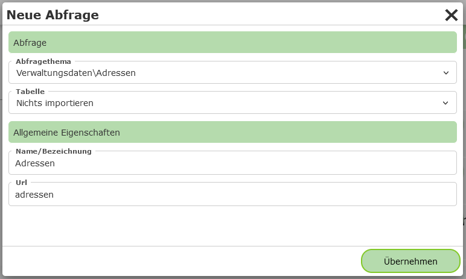
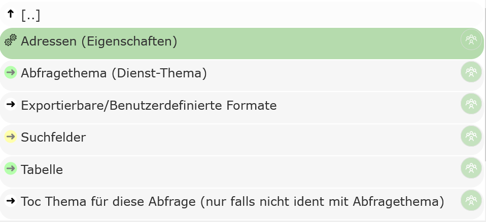
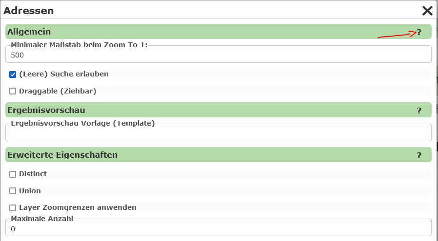

Abfragen
========

Neben der kartographischen Darstellung von *Geo-Objekte* in einer Karte bieten manche Kartendienste die Möglichkeit *Geo-Objekte* zu suchen oder abzufragen.
Dazu muss im CMS beim jeweiligen Dienst in den Abschnitt ``Abfragen`` gewechselt werden:

Dort kann über den Button ``Neue Abfrage`` eine neue Abfrage für diesen Dienst erstellt werden. In folgenden Dialog muss zuerst das Thema aus dem Dienst
ausgewählt werden, das abgefragt werden sollte:

Unter ``Tabelle`` kann ausgewählt werden, welche Felder für dieses Thema in der Ergebnistabelle importiert werden sollten:

* **Nichts importieren:** Bei Erstellen der Abfrage wird nichts importiert. Die gewünschten Felder werden zu einem späteren Zeitpunkt festgelegt.
* 
* **Felder dynamisch - (*) importieren:** Es wird für die Tabelle ein Feld mit dem "Feldnamen" * angelegt. Das bedeutet, die alle Felder in der Tabelle angezeigt werden.
  Das auslesen der vorhanden Felder erfolgt hier immer zur Laufzeit im *Kartenviewer*. Ändert sich das Datenmodell hinter dem Layer, werden die Änderungen automatisch im Kartenviewer angepasst.

* **einzelne Felder importieren:** Alle Felder, die zum Zeitpunkt des Erstellens der Abfrage vorhanden sind, werden für die Tabelle übernommen. Spätere Änderungen im Datenmodell müssen 
  nachträglich manuell nachgezogen werden. Diese Option für ein schnelles Erstellen von Abfrage hilfreich sein. Die importieren Felder können nach Wunsch in nächsten Schritt im CMS bearbeitet (Feldtyp, Reihenfolge, Bezeichnung) und ergänzt werden.

.. note::
   Nicht alle Diensttypen liefern über die *Capabilities* auskunft über die Feldnamen der Themen. Für diese Diensttypen (z.B. WMS) kann die letzte Option auch entfallen.

Unter ``Allgemeine Eigenschaften`` müssen noch ein Name und eine eindeutiger *Url (Name)* für den Dienst vergeben werden.
Danach kann die Abfrage mit ``Übernehmen`` erstellt werden. Die Abfrage sollte jetzt in der Liste aufscheinen.

Unter der Abfrage findet man folgende Punkte:

* **Adressen (Eigenschaften):** Eigenschaften der Abfrage

* **Abfragethema:** Das Thema des Dienstes, der abgefragt wird

* **Exportierbare/Benutzerdefinierte Formate:**: Hier können spezielle Regeln definiert werden, aus denen Textdateien auf Basis der 
  von Ergebnissen erstellt werden. Diese können dann vom Anwender über den Kartenviewer herunter geladen werden. Wird hier nichts definiert,
  steht trotzdem ein Export der Daten als CSV zur Verfügung

* **Suchfelder:** Sollten Daten nicht nur abgefragt werden, sondern sollte das Anwender auch die Möglichkeit haben, innerhalb bestimmter
  Felder zu suchen, können diese Felder hier definiert.

* **Tabelle:** Hier werden die einzelnen Spalten angeführt, die in der Ergebnistabelle angezeigt werden.
  Neben einfachen Werte-Spalten können auch Spalten mit *Expressions* und *Hotlinks* (setzten sich den Werten einer
  oder mehreren Spalten zusammen) angelegt werden.

* **Toc Thema für diese Abfrage:** hier können optional Themen das diesem oder einem anderen Dienst
  abgeben werden, auf die sich die Abfrage bezieht. Stellt der Anwender beim Abfrage ``sichtbare Themen``
  ein, wird diese Abfrage mit in den Abfrageprozess einbezogen, wenn das Abfragethema oder eines
  der hier angeführten Themen im sichtbaren Kartenbereich befindet.

Allgemeine Abfrage Eingenschaften
---------------------------------

Unter den allgemeinen Eigenschaften einer Abfrage lassen folgende Option einstellen:

Da eine Beschreibung der einzelnen Eigenschaften, ist über das ``?`` im Dialog abrufbar ist,
wird hier nicht auf alle Details eingegangen.

``Allgemein``

* **Minimaler Maßstab:** Nach eine Suche, wechselt der Kartenviewer Ausschnitt zum Suchergebnis. Handelt es sich hier nur um einen einzelnen Punkt, 
  kann hier ein Maßstab angegeben werden, auf den gezoomt werden sollte.

``Erweiterte Eigenschaften``

* **Distinct:**
  Gibt es Objekte mit idententer Geometie (zB gleicher Punkt) und sind ebenso die in der 
  Abfrage abgeholten Attributewerte ident, wird ein Objekt in der Ergebnisliste nur einmal 
  angeführt. Die Daten werden zuerst von der WebGIS Applikation vom Karten/Featuredienst 
  abgeholt und daraus das Distinct berechnet (serverseitig).
  Ein Anwendungsbeispiel könnten Kundenbestellungen sein, die alle an die gleich Adresse
  geliefert zum gleichen Kunden geliefert werden. Sollte in der Ergebnistabelle beispielsweise
  nur der Kundenname und die Adresse angezeigt werden, würde hier für jede Bestellung idente 
  Punkte überander als Marker dargestellt werden. Mit ``Distinct`` werden würden diese identen Punkte
  nur noch als einfacher Marker erscheinen.

* **Union:**
  Ergebnismarker, die in der Karte am gleiche Ort liegen (identer Punkt) werden zu einem Objekt
  zusammengefasst. Der Marker enthält in der Tabellenansicht alle betroffenen 'Records'.
  Hier kann das gleiche Anwendungsbeispiel wie bei ``Distinct`` herangezogen werden. Nimmt man
  in der Tabelle auch die Bestellnummer mit, können die einzelnen Punkte nicht mehr über 
  ``Distinct`` zusammengefasst werden, weil sich die Bestellnummer bei den einzelnen Punkten
  unterscheiden wird (Kunde:Bestellungen = 1:n). Damit nicht am selben Ort mehrere Marker in 
  der Karte dargestellt werden müssen, können Marker mit dem gleichen Einfügepunkt zusammengefasst werden.
  Klickt der Anwender auf einen dieser Marker werden als Ergebnis alle betroffen Bestellungen
  angezeigt. Für jede *Record* (Bestellung) wird nur die erste Spalte angezeigt, der Anwender
  durch Klick auf das erste Attribut den *Record* aufklappen und sieht dadurch alle Werte.

.. note::
   Kartendienst geben wärend einer Abfrage immer nur eine maximale Anzahl von Geo-Objekten zurück
   (z.B. ArcGIS Server Dienste liefern standardmäßig maximal 1000 Ergebnisse zurück). Wir die 
   Option ``Union`` für ein Abfrage gewählt und die maximale Anzahl von abfragbaren Geo-Objekten
   überschritten, liefert WebGIS eine Meldung zurück, dass die Abfrage nicht möglich ist. Der Grund ist,
   hier, dass ansonsten eine nicht vorhandene Vollständigkeit der Daten verschleiert werden würde.
   Können nicht alle Geo-Objekte abgefragt werden, würde ein Punkt zwar angezeigt werden, es wäre 
   jedoch nicht gewährleistet, dass die anzeigten *Records* unter diesem Marker vollständig sind.
   Daher wird in diesem Fall gar kein Ergebnis mit einem Hinweis angezeigt, damit unvollständige Daten nicht
   fälschlicherweise als vollständig interpretiert werden.#

.. note:: 
   Um den oben beschrieben Effekt abzudämpfen, kann unter Maximale Anzahl eine größerer Wert
   angegeben werden. Auch wenn der zugrundeliegende Dienst nur maximal 1000 Objekte zurück liefert,
   kann durch mehrfachabfrage im Hintergrund versucht werden, alle Geo-Objekte abzuholen.
   Der Wert sollte allerdings auch nicht zu groß sein, da es sonst zu einer höheren Serverlast
   kommen kann.

.. note::
   Eine weiter Möglichkeit den Effekt abzufangen, ist das einstellen der Option ``Layer Zoomgrenzen anwenden``.
   Der Abfrage kann dann nur mehr durchgeführt werden, wenn der Anwender in der Karte innerhalb 
   der Maßstabsgrenzen des Abfragethemas ist. Die Zoomgrenzen werden dabei im Kartendienst definiert.
   Die Wert ist auch Sinnvoll, wenn diese Abfrage als *dynamischer Inhalt* über den MapBuilder 
   oder über eine *Dynamischer Content Marker* Darstellungsvariante eingebunden wird.

 
   

 

