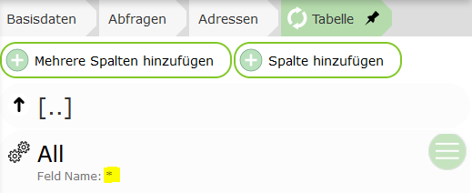
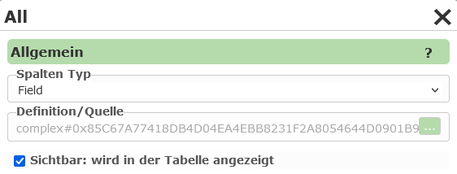
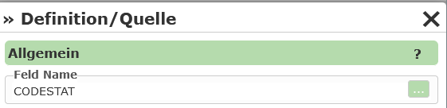
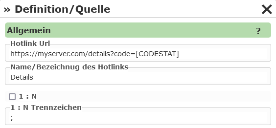

Abfragen
========

.. note::
   Dieser Abschnitt kann nicht für *dynamische Dienste* (siehe vorheriges Kapitel) angewendet 
   werden. Ist bei den Eigenschaften des Dienste im CMS unter ``Dynamische Abfragen`` ein Wert
   ungleich ``None`` eingestellt, steht dieser Abschnitt im CMS nicht zur 
   Verfügung.

Neben der kartographischen Darstellung von *Geo-Objekte* in einer Karte bieten manche Kartendienste die Möglichkeit *Geo-Objekte* zu suchen oder abzufragen.
Dazu muss im CMS beim jeweiligen Dienst in den Abschnitt ``Abfragen`` gewechselt werden:

.. image:: img/queries1.png

Dort kann über den Button ``Neue Abfrage`` eine neue Abfrage für diesen Dienst erstellt werden. In folgenden Dialog muss zuerst das Thema aus dem Dienst
ausgewählt werden, das abgefragt werden sollte:

.. image:: img/queries2.png

Unter ``Tabelle`` kann ausgewählt werden, welche Felder für dieses Thema in der Ergebnistabelle beim Erstellen importiert werden sollten:

* **Nichts importieren:** Bei Erstellen der Abfrage wird nichts importiert. Die gewünschten Felder werden zu einem späteren Zeitpunkt festgelegt.

* **Felder dynamisch - (*) importieren:** Es wird für die Tabelle ein Feld mit dem "Feldnamen" ``*`` angelegt. Das bedeutet, dass alle Felder in der Tabelle angezeigt werden.
  Das auslesen der vorhanden Felder erfolgt hier immer zur Laufzeit im *Kartenviewer*. Ändert sich das Datenmodell hinter dem Layer, werden die Änderungen automatisch im Kartenviewer angepasst.

* **einzelne Felder importieren:** Alle Felder, die zum Zeitpunkt des Erstellens der Abfrage vorhanden sind, werden für die Tabelle übernommen. Spätere Änderungen im Datenmodell müssen 
  nachträglich manuell nachgezogen werden. Diese Option kann für ein schnelles Erstellen von Abfrage hilfreich sein. Die importieren Felder können nach Wunsch in nächsten Schritt 
  im CMS bearbeitet (Feldtyp, Reihenfolge, Bezeichnung) und ergänzt werden.

.. note::
   Nicht alle Diensttypen liefern über die *Capabilities* Auskunft über die Feldnamen der Themen. Für diese Diensttypen (z.B. WMS) kann die letzte Option auch entfallen.

Unter ``Allgemeine Eigenschaften`` müssen noch ein Name und eine eindeutiger ``Url (Name)`` für den Dienst vergeben werden.
Der ``Url (Name)`` kann verwendet werden, um über einen parametrieren Aufruf der Karte eine Suche zu übergeben (``...&query=adressen&...``)
Danach kann die Abfrage mit ``Übernehmen`` erstellt werden. Die Abfrage sollte jetzt in der Liste aufscheinen.

Unter der Abfrage findet man folgende Punkte:

.. image:: img/queries3.png

* **[Abfragethema] (Eigenschaften):** Eigenschaften der Abfrage

* **Abfragethema:** Das Thema des Dienstes, der abgefragt wird

* **Exportierbare/Benutzerdefinierte Formate:**: Hier können spezielle Regeln definiert werden, aus denen Textdateien auf Basis der 
  Abfrageergebnisse erstellt werden. Diese können dann vom Anwender über den Kartenviewer herunter geladen werden. Wird hier nichts definiert,
  steht trotzdem ein Export der Daten als CSV zur Verfügung

* **Suchfelder:** Sollten Daten nicht nur abgefragt werden, sondern sollte der Anwender auch die Möglichkeit haben, innerhalb bestimmter
  Felder zu suchen, können diese Felder hier definiert.

* **Tabelle:** Hier werden die einzelnen Spalten angeführt, die in der Ergebnistabelle angezeigt werden.
  Neben einfachen Werte-Spalten können auch Spalten mit *Expressions* und *Hotlinks* (setzten sich aus den Werten einer
  oder mehreren Spalten zusammen) angelegt werden.

* **Toc Thema für diese Abfrage:** hier können optional Themen aus diesem oder einem anderen Dienst
  abgeben werden, auf die sich die Abfrage bezieht. Stellt der Anwender beim Abfragen ``sichtbare Themen``
  ein, wird diese Abfrage mit in den Abfrageprozess einbezogen, wenn sich das Abfragethema oder eines
  der hier angeführten Themen im sichtbaren Kartenbereich befindet.

Allgemeine Abfrage Eingenschaften
---------------------------------

Unter den allgemeinen Eigenschaften einer Abfrage lassen folgende Option einstellen:

.. image:: img/queries4.png

Da eine Beschreibung der einzelnen Eigenschaften, über das ``?`` im Dialog abrufbar ist,
wird hier nicht auf alle Details eingegangen.

``Allgemein``

* **Minimaler Maßstab:** Nach eine Suche, wechselt der Kartenviewer Ausschnitt zum Suchergebnis. Handelt es sich hier nur um einen einzelnen Punkt, 
  kann hier ein Maßstab angegeben werden, auf den gezoomt werden sollte.

``Erweiterte Eigenschaften``

* **Distinct:**
  Gibt es Objekte mit idententer Geometrie (zB gleicher Punkt) und sind ebenso die in der 
  Abfrage abgeholten Attributewerte ident, wird ein Objekt in der Ergebnisliste nur einmal 
  angeführt. Die Daten werden zuerst von der WebGIS Applikation vom Karten/Featuredienst 
  abgeholt und daraus das Distinct berechnet (serverseitig).
  Ein Anwendungsbeispiel könnten Kundenbestellungen sein, die alle an die gleich Adresse
  geliefert zum gleichen Kunden geliefert werden. Sollte in der Ergebnistabelle beispielsweise
  nur der Kundenname und die Adresse angezeigt werden, würden hier für jede Bestellung idente 
  Punkte überander als Marker dargestellt werden. Mit ``Distinct`` würden diese identen Punkte
  nur noch als einfacher Marker erscheinen.

* **Union:**
  Ergebnismarker, die in der Karte am gleiche Ort liegen (identer Punkt) werden zu einem Objekt
  zusammengefasst. Der Marker enthält in der Tabellenansicht alle betroffenen 'Records'.
  Hier kann das gleiche Anwendungsbeispiel wie bei ``Distinct`` herangezogen werden. Nimmt man
  in der Tabelle auch die Bestellnummer mit, können die einzelnen Punkte nicht mehr über 
  ``Distinct`` zusammengefasst werden, weil sich die Bestellnummer bei den einzelnen Punkten
  unterscheiden wird (Kunde:Bestellungen = 1:n). Damit nicht am selben Ort mehrere Marker in 
  der Karte dargestellt werden müssen, können Marker mit dem gleichen Einfügepunkt zusammengefasst werden.
  Klickt der Anwender auf einen dieser Marker werden als Ergebnis alle betroffen Bestellungen
  angezeigt. Für jeden *Record* (Bestellung) wird nur die erste Spalte angezeigt. Der Anwender kann
  durch Klick auf das erste Attribut den *Record* aufklappen und sieht dadurch alle Werte.

.. note::
   Kartendienst geben während einer Abfrage immer nur eine maximale Anzahl von Geo-Objekten zurück
   (z.B. ArcGIS Server Dienste liefern standardmäßig maximal 1000 Ergebnisse zurück). Wirf die 
   Option ``Union`` für ein Abfrage gewählt und die maximale Anzahl von abfragbaren Geo-Objekten
   überschritten, liefert WebGIS eine Meldung zurück, dass die Abfrage nicht möglich ist. Der Grund ist, 
   dass ansonsten eine nicht vorhandene Vollständigkeit der Daten verschleiert werden würde.
   Können nicht alle Geo-Objekte abgefragt werden, würde ein Punkt zwar angezeigt werden, es wäre 
   jedoch nicht gewährleistet, dass die anzeigten *Records* unter diesem Marker vollständig sind.
   Daher wird in diesem Fall gar kein Ergebnis mit einem Hinweis angezeigt, damit unvollständige Daten nicht
   fälschlicherweise als vollständig interpretiert werden.

.. note:: 
   Um den oben beschrieben Effekt ab zu dämpfen, kann unter Maximale Anzahl eine größerer Wert
   angegeben werden. Auch wenn der zugrundeliegende Dienst nur maximal 1000 Objekte zurück liefert,
   kann durch mehrfachabfrage im Hintergrund versucht werden, alle Geo-Objekte abzuholen.
   Der Wert sollte allerdings auch nicht zu groß sein, da es sonst zu einer höheren Serverlast
   kommen kann.

.. note::
   Eine weiter Möglichkeit den Effekt abzufangen, ist das einstellen der Option ``Layer Zoomgrenzen anwenden``.
   Der Abfrage kann dann nur mehr durchgeführt werden, wenn der Anwender in der Karte innerhalb 
   der Maßstabsgrenzen des Abfragethemas ist. Die Zoomgrenzen werden dabei im Kartendienst definiert.
   Die Wert ist auch sinnvoll, wenn diese Abfrage als *dynamischer Inhalt* über den MapBuilder 
   oder über eine *Dynamischer Content Marker* Darstellungsvariante eingebunden wird.

Suchfelder 
----------

Suchfelder können für eine Abfrage optional parametriert werden. Enthält eine Abfrage keine Suchfelder, 
kann das Thema *nur* Abgefragt werden (z.B. mit dem Identify-Werkzeug).
Werden Suchfelder definiert, scheint die Abfrage im *Karten Viewer* zusätzlich unter Detailsuche auf.

.. note::
   Nicht alle Dienst-Typen unterstützen das Suchen innerhalb eines Themas, z.B. WMS

Zum Anlegen eines Suchfeldes muss in den Bereich ``Suchfelder`` gewechselt und auf ``Suchbegriff hinzufügen``
geklickt werden.

Im Dialog muss zuerst das Feld ausgewählt werden, in dem gesucht werden soll. 
Unter ``Abfrage Methode`` kann eingestellt werden, wie im entsprechenden Feld gesucht werden soll.
Mit ``Exact`` muss der Anwender beispielsweise den Suchbegriff exakt so eingaben, wie er in der 
Datenbank angeführt wird (Sinnvoll bei Ids, Zahlen). Meistens ist es anwenderfreundlicher,
wenn automatisch mit *Wildcards* gesucht wird. Mit ``EndingWildcard`` wird automatisch nach dem 
eingegeben Suchbegriff ein Wildcard (* oder %) angehängt. So werden alle Geo-Objekte gefunden,
bei denen das entsprchende Attribut mit dem eingegeben Suchbegriff beginnt. In der Auswahlliste 
werden noch weitere Optionen angeführt, die beispielsweise alle Leerzeichen durch Wildcards* 
ersetzt (``SpacesToWildcard``, ``SpacesToWildcardWithEndingWildcard``, ...)

.. note::
   Damit die Suche performant ausgeführt wird, sollte darauf geachtet werden, das die Suchfelder 
   in der Datenbank entsprechend indiziert sind.

Abschließen muss noch ein Name angeben werden, der in der Suchmaske für dieses Feld angezeigt 
wird. Unter ``Url`` sollte eine für diese Abfrage eindeutige Ids für des Feld angeführt werden.
Ruft man den *Karten Viewer* auf, können so Parameter in der Url mitgegeben werden, die schon 
beim Start eine Abfrage ausführen. Die entsprechenden Parameter für sie Suchefelder entsprechen 
dem hier eingetragen werden (``...&query=adressen&adresse=hauptplatz...``) 

Schließt man den Dialog mit ``Übernehmen`` sollte der Suchbegriff in der Liste erscheinen.
Dort können die Eigenschaften auch noch nachträglich bearbeitet und die Reihenfolge der 
Suchbegriffe geändert werden. Über die Eigenschaften können auch noch weiter Eigenschaften wie 
Auswahlliste, Whitelists, usw parametriert werden.

Tabelle
-------

Hier wird angeführt, welche Felder in der Ergebnisliste angezeigt werden. Damit die Abfrage 
funktioniert müssen hier Werte eingetragen werden. Eine Ausnahme stellen hier WMS Dienste dar, 
wo das Schema der Daten nicht über die *Capabilities* bekannt ist. Hier kann in der 
Regel keine Tabelle definiert werden.

Hat man beim Erstellen der Abfrage (siehe oben) unter Tabelle ``Felder dynamisch importieren`` 
ausgewählt, befindet sich unter ``Tabelle`` bereits ein *Spalte*:

Hierbei handelt es sich um einen Sonderfall: als Feld wird hier ``*`` angeführt, was 
bedeutet, dass die Felder automatisch zur Laufzeit bestimmt werden. Alle Attribute, die von 
einer Abfrage vom *Kartendienst* zurückgeliefert werden, können werden angezeigt.

.. note::
   Diese Option kann auch verwendet werden wenn bei einem WMS Dienst als ``GetFeatures Type`` 
   beispielsweise ``application/geojson`` oder ``txt/xml`` eingestellt wird. Dann werden auch 
   hier alle Felder in die Tabelle übernommen. Alternativ könnten hier auch die einzelnen 
   Felder manuell angelegt werden.

Möchte man mehr Kontrolle über die Tabelle haben, können hier Felder auch einzeln angeben.
Dazu kann der Button ``Mehrere Spalten hinzufügen`` und ``Spalte hinzufügen`` verwendet werden.
Der erste Punkt funktioniert allerdings nur, wenn der zugrunde liegende Dienste auch auskunft 
über das Datenschema der einzelnen Themen liefert (AGS, IMS, ...).

Wurden Spalten hinzugefügt, kann die Eigenschaften weiter bearbeite werden:

Der ``Spalten Typ`` gibt an, was in der Tabellenspalte angezeigt wird. Der Standardwert ist 
hier ``Field``, was bedeutet, dass in der Spalte der Wert eines Attributes des Geo-Objektes angezeigt 
wird. Unter ``Definition / Quelle`` muss für diesen Type ein Feld aus den Abfragethema angeführt 
werden:

Wählt man als ``Spalten Typ`` beispielsweise ``Hotlink`` erscheint in der Tabelle ein *Hotlink* über 
den der Anwender auf eine neue Seite weitergeleitet werden kann. Unter ``Definition / Quelle`` 
kann hier eine ``Hotlink Url`` angegeben werden. In dieser Url können Felder aus dem 
entsprechen Geo-Objekt als Platzhalter (in eckigen Klammern) angeführt werden:

Unter ``Name / Bezeichnung des Hotlinks`` kann eingetragen werden, mit welchen Text der Hotlink in der 
Tabelle angezeigt wird.

``1:n`` gibt, ob der Link für alle Zeilen einer Tabelle aufgerufen werden kann. Dabei kann auch ein 
Trennzeichen angegeben werden, mit dem die einzelnen Werte in der Url getrennt werden.

Weiter Spalten Typen sind beispielsweise:

* **Expression:**
  Hier kann ein *Ausdruck* bestehenden aus (mehreren) Feldern und freiem Text angeben werden.
  Die Platzhalter für die Felder werden wieder in eckigen Klammern angegeben, z.B: ``Fläche: [THE_AREA_FIELD]m²``

* **ImageExpression:** 
  Wie Hotlink, nur muss die Ziel Url eine Bilddatei sein muss. Das Bild wird in der Ergebnistabelle 
  angezeigt. Die Größe kann eingestellt werden.

* **EmailAddress, PhoneNumber:** Das Ergebnis wird als anklickbare EMail Adresse oder Telefonnummer 
  in der Tabelle dargestellt.

* **DateTime:** Das Ergebnis wird als Datum dargestellt. Unter Definition kann dabei eingestellt 
  werden, wie das Datum formatiert werden soll.

