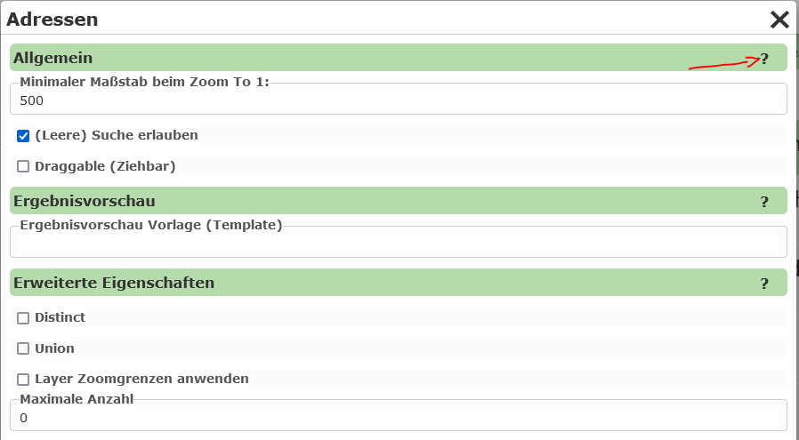

Allgemeine Abfrage Eingenschaften
---------------------------------

Unter den allgemeinen Eigenschaften einer Abfrage lassen folgende Option einstellen:

Da eine Beschreibung der einzelnen Eigenschaften, über das ``?`` im Dialog abrufbar ist,
wird hier nicht auf alle Details eingegangen.

``Allgemein``

* **Minimaler Maßstab:** Nach eine Suche, wechselt der Kartenviewer Ausschnitt zum Suchergebnis. Handelt es sich hier nur um einen einzelnen Punkt, 
  kann hier ein Maßstab angegeben werden, auf den gezoomt werden sollte.

``Erweiterte Eigenschaften``

* **Distinct:**
  Gibt es Objekte mit idententer Geometrie (zB gleicher Punkt) und sind ebenso die in der 
  Abfrage abgeholten Attributewerte ident, wird ein Objekt in der Ergebnisliste nur einmal 
  angeführt. Die Daten werden zuerst von der WebGIS Applikation vom Karten/Featuredienst 
  abgeholt und daraus das Distinct berechnet (serverseitig).
  Ein Anwendungsbeispiel könnten Kundenbestellungen sein, die alle an die gleich Adresse
  geliefert zum gleichen Kunden geliefert werden. Sollte in der Ergebnistabelle beispielsweise
  nur der Kundenname und die Adresse angezeigt werden, würden hier für jede Bestellung idente 
  Punkte überander als Marker dargestellt werden. Mit ``Distinct`` würden diese identen Punkte
  nur noch als einfacher Marker erscheinen.

* **Union:**
  Ergebnismarker, die in der Karte am gleiche Ort liegen (identer Punkt) werden zu einem Objekt
  zusammengefasst. Der Marker enthält in der Tabellenansicht alle betroffenen 'Records'.
  Hier kann das gleiche Anwendungsbeispiel wie bei ``Distinct`` herangezogen werden. Nimmt man
  in der Tabelle auch die Bestellnummer mit, können die einzelnen Punkte nicht mehr über 
  ``Distinct`` zusammengefasst werden, weil sich die Bestellnummer bei den einzelnen Punkten
  unterscheiden wird (Kunde:Bestellungen = 1:n). Damit nicht am selben Ort mehrere Marker in 
  der Karte dargestellt werden müssen, können Marker mit dem gleichen Einfügepunkt zusammengefasst werden.
  Klickt der Anwender auf einen dieser Marker werden als Ergebnis alle betroffen Bestellungen
  angezeigt. Für jeden *Record* (Bestellung) wird nur die erste Spalte angezeigt. Der Anwender kann
  durch Klick auf das erste Attribut den *Record* aufklappen und sieht dadurch alle Werte.

.. note::
   Kartendienst geben während einer Abfrage immer nur eine maximale Anzahl von Geo-Objekten zurück
   (z.B. ArcGIS Server Dienste liefern standardmäßig maximal 1000 Ergebnisse zurück). Wirf die 
   Option ``Union`` für ein Abfrage gewählt und die maximale Anzahl von abfragbaren Geo-Objekten
   überschritten, liefert WebGIS eine Meldung zurück, dass die Abfrage nicht möglich ist. Der Grund ist, 
   dass ansonsten eine nicht vorhandene Vollständigkeit der Daten verschleiert werden würde.
   Können nicht alle Geo-Objekte abgefragt werden, würde ein Punkt zwar angezeigt werden, es wäre 
   jedoch nicht gewährleistet, dass die anzeigten *Records* unter diesem Marker vollständig sind.
   Daher wird in diesem Fall gar kein Ergebnis mit einem Hinweis angezeigt, damit unvollständige Daten nicht
   fälschlicherweise als vollständig interpretiert werden.

.. note:: 
   Um den oben beschrieben Effekt ab zu dämpfen, kann unter Maximale Anzahl eine größerer Wert
   angegeben werden. Auch wenn der zugrundeliegende Dienst nur maximal 1000 Objekte zurück liefert,
   kann durch mehrfachabfrage im Hintergrund versucht werden, alle Geo-Objekte abzuholen.
   Der Wert sollte allerdings auch nicht zu groß sein, da es sonst zu einer höheren Serverlast
   kommen kann.

.. note::
   Eine weiter Möglichkeit den Effekt abzufangen, ist das einstellen der Option ``Layer Zoomgrenzen anwenden``.
   Der Abfrage kann dann nur mehr durchgeführt werden, wenn der Anwender in der Karte innerhalb 
   der Maßstabsgrenzen des Abfragethemas ist. Die Zoomgrenzen werden dabei im Kartendienst definiert.
   Die Wert ist auch sinnvoll, wenn diese Abfrage als *dynamischer Inhalt* über den MapBuilder 
   oder über eine *Dynamischer Content Marker* Darstellungsvariante eingebunden wird.