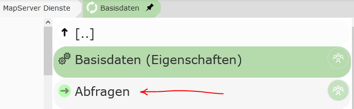
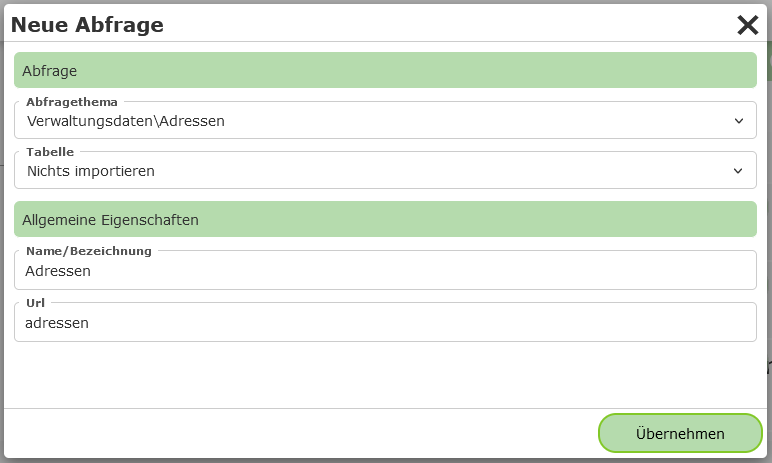
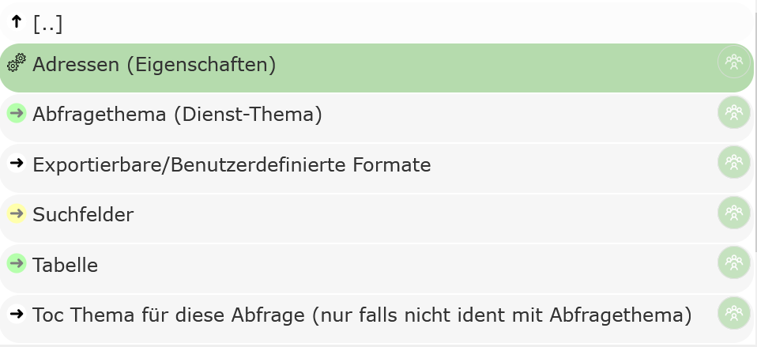

Abfragen
========

.. note::
   Dieser Abschnitt kann nicht für *dynamische Dienste* (siehe vorheriges Kapitel) angewendet 
   werden. Ist bei den Eigenschaften des Dienste im CMS unter ``Dynamische Abfragen`` ein Wert
   ungleich ``None`` eingestellt, steht dieser Abschnitt im CMS nicht zur 
   Verfügung.

Neben der kartographischen Darstellung von *Geo-Objekte* in einer Karte bieten manche Kartendienste die Möglichkeit *Geo-Objekte* zu suchen oder abzufragen.
Dazu muss im CMS beim jeweiligen Dienst in den Abschnitt ``Abfragen`` gewechselt werden:

Dort kann über den Button ``Neue Abfrage`` eine neue Abfrage für diesen Dienst erstellt werden. In folgenden Dialog muss zuerst das Thema aus dem Dienst
ausgewählt werden, das abgefragt werden sollte:

Unter ``Tabelle`` kann ausgewählt werden, welche Felder für dieses Thema in der Ergebnistabelle beim Erstellen importiert werden sollten:

* **Nichts importieren:** Bei Erstellen der Abfrage wird nichts importiert. Die gewünschten Felder werden zu einem späteren Zeitpunkt festgelegt.

* **Felder dynamisch - (*) importieren:** Es wird für die Tabelle ein Feld mit dem "Feldnamen" ``*`` angelegt. Das bedeutet, dass alle Felder in der Tabelle angezeigt werden.
  Das auslesen der vorhanden Felder erfolgt hier immer zur Laufzeit im *Kartenviewer*. Ändert sich das Datenmodell hinter dem Layer, werden die Änderungen automatisch im Kartenviewer angepasst.

* **einzelne Felder importieren:** Alle Felder, die zum Zeitpunkt des Erstellens der Abfrage vorhanden sind, werden für die Tabelle übernommen. Spätere Änderungen im Datenmodell müssen 
  nachträglich manuell nachgezogen werden. Diese Option kann für ein schnelles Erstellen von Abfrage hilfreich sein. Die importieren Felder können nach Wunsch in nächsten Schritt 
  im CMS bearbeitet (Feldtyp, Reihenfolge, Bezeichnung) und ergänzt werden.

.. note::
   Nicht alle Diensttypen liefern über die *Capabilities* Auskunft über die Feldnamen der Themen. Für diese Diensttypen (z.B. WMS) kann die letzte Option auch entfallen.

Unter ``Allgemeine Eigenschaften`` müssen noch ein Name und eine eindeutiger ``Url (Name)`` für den Dienst vergeben werden.
Der ``Url (Name)`` kann verwendet werden, um über einen parametrieren Aufruf der Karte eine Suche zu übergeben (``...&query=adressen&...``)
Danach kann die Abfrage mit ``Übernehmen`` erstellt werden. Die Abfrage sollte jetzt in der Liste aufscheinen.

Unter der Abfrage findet man folgende Punkte:

* **[Abfragethema] (Eigenschaften):** Eigenschaften der Abfrage

* **Abfragethema:** Das Thema des Dienstes, der abgefragt wird

* **Exportierbare/Benutzerdefinierte Formate:**: Hier können spezielle Regeln definiert werden, aus denen Textdateien auf Basis der 
  Abfrageergebnisse erstellt werden. Diese können dann vom Anwender über den Kartenviewer herunter geladen werden. Wird hier nichts definiert,
  steht trotzdem ein Export der Daten als CSV zur Verfügung

* **Suchfelder:** Sollten Daten nicht nur abgefragt werden, sondern sollte der Anwender auch die Möglichkeit haben, innerhalb bestimmter
  Felder zu suchen, können diese Felder hier definiert.

* **Tabelle:** Hier werden die einzelnen Spalten angeführt, die in der Ergebnistabelle angezeigt werden.
  Neben einfachen Werte-Spalten können auch Spalten mit *Expressions* und *Hotlinks* (setzten sich aus den Werten einer
  oder mehreren Spalten zusammen) angelegt werden.

* **Toc Thema für diese Abfrage:** hier können optional Themen aus diesem oder einem anderen Dienst
  abgeben werden, auf die sich die Abfrage bezieht. Stellt der Anwender beim Abfragen ``sichtbare Themen``
  ein, wird diese Abfrage mit in den Abfrageprozess einbezogen, wenn sich das Abfragethema oder eines
  der hier angeführten Themen im sichtbaren Kartenbereich befindet.

.. toctree::
    :maxdepth: 2

    general
    search_items
    lookups
    table