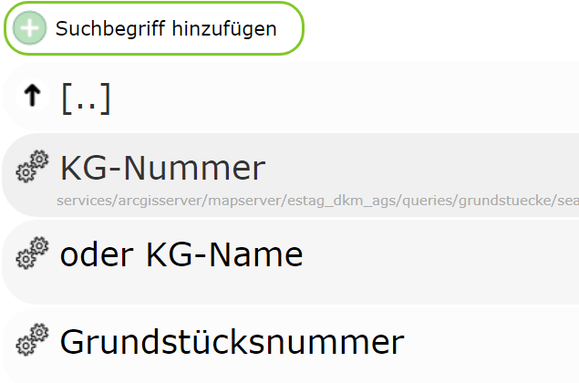
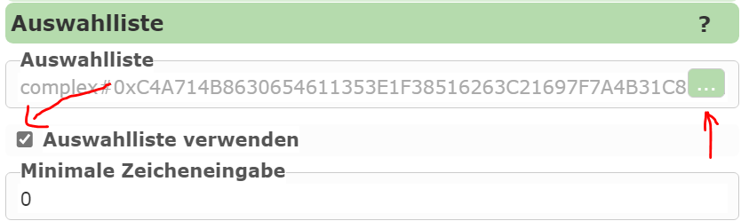
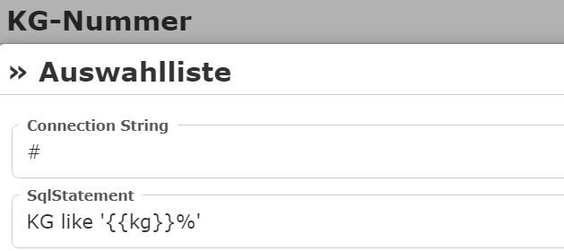

Auswahllisten
-------------

Um die Eingabe von Suchbegriffen für den Anwender zu erleichtern, können Auswahllisten angeboten werden.
Wenn der Anwender ein Zeichen in einem Suchfeld eingibt, wird im Hintergrund die Datenbank abgefragt und 
dem Anwender daraus Vorschläge angeboten.

Auswahllisten funktionieren auch kaskadierend: Bereits eingegebene Suchbegriffe können berücksichtigt werden.
(Beispiel: Es werden nur Grundstücke einer KG angeboten, wenn bereits die KG-Nummer eingegeben wurde).

Gehen wir von einer Grundstückssuche aus, in der der Anwender eine KG-Nummer oder einen KG-Namen
und eine Grundstücksnummer eingeben kann:

Die Datenbank-Felder zum Abfragen heißen im Beispiel:

* ``KG``: Eingabefeld Id - ``kg``
* ``KG_NAME``: Eingabefeld Id - ``kgname``
* ``GNR``: Eingabefeld Id - ``gnr``

Damit Auswahllisten funktionieren, muss das beim entsprechenden Suchfeld bei den Eigenschaften angegeben werden:

Über den Auswahllisten-Editor kann das entsprechende SQL Statement definiert werden:

Unter *ConnectionString* kann die Verbindung zur Datenbank angegeben werden, die abgefragt werden soll.

.. note:: 
    Verwendet man als Server *ArcGIS Server* oder *gView* (über die GeoServices REST Schnittstelle) muss
    keine direkte Verbindung zur Datenbank angegeben werden. Hier kann die Abfrage der Auswahllisten-Werte
    direkt über den *MapServer* erfolgen (empfohlen).
    In diesem Fall gibt man als *ConnectionString* einfach das Kürzel ``#`` an.

Unter *SqlStatement* wird jetzt der Ausdruck angegeben, der für die Suche verwendet wird. Bei einer Datenbank- 
Abfrage mit *ConnectionString* ist das in der Regel ein komplettes ``SELECT FROM WHERE`` Statement.
Verwendet man den *MapServer* zur Abfrage (ConnectionString = ``#``), gibt man hier nur die ``WHERE`` Klausel an (ohne WHERE).

Als Platzhalter können die Namen der Suchbegriffe eingegeben werden (z.B. ``{{kg}}``, Wildcards nicht vergessen).

Für unser Beispiel könnten die *SqlStatements* wie folgt aussehen:

**KG**

.. code-block:: 

    KG like '{{kg}}%'

**KG Name**

.. code-block:: 

    KG_NAME like '{{kgname}}%'

**Grundstücksnummer**

.. code-block:: 

    GNR like '{{gnr}}%'

    #if kg
      AND KG='{{kg}}'
    #endif

    #if kgname
      AND KG='{{kgname}}'
    #endif

Hier wird die Abfrage noch weiter eingeschränkt, wenn bereits eine KG-Nummer oder ein ein KG-Name eingegeben wurde.
über die ``#if`` Direktiven kann hier erzwungen werden, dass der entsprechende Code-Teil nur ins Statement aufgenommen 
wird, wenn der Anwender für dieses Feld einen Wert eingegeben hat.

.. note:: 
    Hier im Beispiel wurden für alle drei Eingabefelder Auswahllisten definiert. 
    Das ist nicht zwingend erforderlich. Wenn es für die Aufgabe sinnvoll ist, kann auch 
    nur ein Eingabefeld Auswahllisten anbieten.

