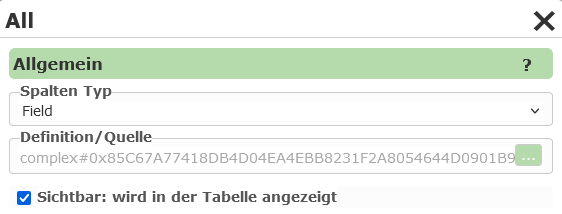
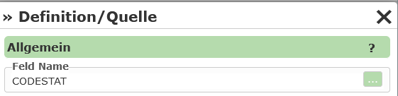
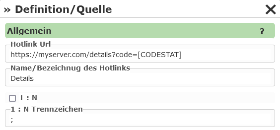

Tabelle
-------

Hier wird angeführt, welche Felder in der Ergebnisliste angezeigt werden. Damit die Abfrage 
funktioniert, müssen hier Werte eingetragen werden. Eine Ausnahme stellen hier WMS Dienste dar, 
wo das Schema der Daten nicht über die *Capabilities* bekannt ist. Hier kann in der 
Regel keine Tabelle definiert werden.

Hat man beim Erstellen der Abfrage (siehe oben) unter Tabelle ``Felder dynamisch importieren`` 
ausgewählt, befindet sich unter ``Tabelle`` bereits eine *Spalte*:

Hierbei handelt es sich um einen Sonderfall: Als Feld wird hier ``*`` angeführt, was 
bedeutet, dass die Felder automatisch zur Laufzeit bestimmt werden. Alle Attribute, die von 
einer Abfrage vom *Kartendienst* zurückgeliefert werden können, werden angezeigt.

.. note::
   Diese Option kann auch verwendet werden, wenn bei einem WMS Dienst als ``GetFeatures Type`` 
   beispielsweise ``application/geojson`` oder ``txt/xml`` eingestellt wird. Dann werden auch 
   hier alle Felder in die Tabelle übernommen. Alternativ könnten hier auch die einzelnen 
   Felder manuell angelegt werden.

Möchte man mehr Kontrolle über die Tabelle haben, können hier Felder auch einzeln angeben werden.
Dazu kann der Button ``Mehrere Spalten hinzufügen`` und ``Spalte hinzufügen`` verwendet werden.
Der erste Punkt funktioniert allerdings nur, wenn der zugrunde liegende Dienste auch Auskunft 
über das Datenschema der einzelnen Themen liefert (AGS, IMS, ...).

Wurden Spalten hinzugefügt, kann die Eigenschaften weiter bearbeitet werden:

Der ``Spalten Typ`` gibt an, was in der Tabellenspalte angezeigt wird. Der Standardwert ist 
hier ``Field``, was bedeutet, dass in der Spalte der Wert eines Attributes des Geo-Objektes angezeigt 
wird. Unter ``Definition / Quelle`` muss für diesen Typ ein Feld aus den Abfragethema angeführt 
werden:

Wählt man als ``Spalten Typ`` beispielsweise ``Hotlink`` erscheint in der Tabelle ein *Hotlink*, über 
den der Anwender auf eine neue Seite weitergeleitet werden kann. Unter ``Definition / Quelle`` 
kann hier eine ``Hotlink Url`` angegeben werden. In dieser Url können Felder aus dem 
entsprechen Geo-Objekt als Platzhalter (in eckigen Klammern) angeführt werden:

Unter ``Name / Bezeichnung des Hotlinks`` kann eingetragen werden, mit welchem Text der Hotlink in der 
Tabelle angezeigt wird.

``1:n`` gibt an, ob der Link für alle Zeilen einer Tabelle aufgerufen werden kann. Dabei kann auch ein 
Trennzeichen angegeben werden, mit dem die einzelnen Werte in der Url getrennt werden.

Weiter Spalten Typen sind beispielsweise:

* **Expression:**
  Hier kann ein *Ausdruck* bestehenden aus (mehreren) Feldern und freiem Text angeben werden.
  Die Platzhalter für die Felder werden wieder in eckigen Klammern angegeben, z.B.: ``Fläche: [THE_AREA_FIELD]m²``.
  Zusätzlich können bei Expression auch Funktionen zum Berechnen und Formatieren verwendet werden (siehe unten).

* **ImageExpression:** 
  Wie Hotlink, nur muss die Ziel Url eine Bilddatei sein. Das Bild wird in der Ergebnistabelle 
  angezeigt. Die Größe kann eingestellt werden.

* **EmailAddress, PhoneNumber:** Das Ergebnis wird als anklickbare E-Mail Adresse oder Telefonnummer 
  in der Tabelle dargestellt.

* **DateTime:** Das Ergebnis wird als Datum dargestellt. Unter Definition kann dabei eingestellt 
  werden, wie das Datum formatiert werden soll.

Funktionen innerhalb von Expressions
++++++++++++++++++++++++++++++++++++

Bei Tabellenspalten vom Typ *Expression* können innerhalb es Ausdrucks neben den oben angeführten Platzhaltern für Felder in eckigen Klammern,
auch Funktionen eingefügt werden. Diese dienen für spezielle Berechnungen und Formatierungen des Feldes.

Funktionen beginnen immer mit ``$`` gefolgt vom Funktionsnamen. Das Argument wird der Funktion in Klammern übergeben, zB ``$eval(42*42)``
Attribute aus dem aktuellen Objekt werden der Funktion wieder als Platzhalter in eckigen Klammern übergeben, zB ``$evel([THE_AREA_FIELD]*42)``.

Folgende Funktionen stehen zur Verfügung:

* ``$eval()``: Berechnet einen mathematischen Ausdruck (Addition, Subtraktion, Multiplikation, Division), zB ``$eval(11+1)``, ``$eval([AREA]*[COST])``

* ``$sin()``, ``$cos()``, ``$tan()``, ``$asin()``, ``$acos()``, ``$atan()``: Winkelfunktionen. Die Berechnung und die Ergebnis beziehen sich immer auf das Bogenmaß.
  Für Umrechnungen kann die Funktion ``$pi()`` verwendet werden, zB ``$sin(45.0*$pi()/180.0)``

* ``round0()`` ... ``$round5()``: Rundet den übergeben Wert. Die Zahl gibt die Nummer der Nachkommastellen an, zB ``$round0(100.123)``, ``$round2([AREA])``

* ``n0()`` ... ``n5()``: Wandelt eine Zahl ins *Standard Numeric Format* um. Dieses Format fügt beispielsweise Tausender-Punkte in eine Zahl ein (1000 => 1.000).
  Die Zahl gibt die Nummer der Nachkommastellen an. Diese Funktion kann also auch als Alternative zu ``$round`` verwendet werden. 

* ``n0_de()`` ... ``n5_de()``: Mit der Funktion ``n()`` erfolgt die Darstellung in der aktuellen ``Culture`` des Servers. Ist die Sprache am Server English,
  werden die Ergebnisse eventuell nicht richtig formatiert (1000,123 => 1,000.123). Um das zu vermeiden, kann mit der ``$n0_de`` deutsche Darstellung erzwungen werden.

.. note::
   Die einzelnen Funktionen können auch verschachtelt werden:

   - ``$round2($evel([AREA]*[COST])) €``
   - ``$n2_de($evel([AREA]*[COST])) €``

.. note::
  ``n0()`` bzw ``n0_de()`` sollte immer die äußerste Funktion sein. Verwendet man das Ergebnis zur Berechnung von weiteren Ergebnissen kann es Fehlern kommen,
  weil Berechnungsfunktionen mit Tausender-Punkten nicht umgehen können:

  - ``$eval($n0([AREA])*$n2([COST])) €`` => FALSCH
  - ``$eval($round0([AREA])*$round2([COST])) €`` => RICHTIG
  - ``$n2_de($eval($round0([AREA])*$round2([COST]))) €`` => RICHTIG

.. note::
  Macht man im Ausdruck einen syntaktischen Fehler (Parametrierfehler), wird das als Exception in der Ergebnisliste angezeigt (betrifft alle Zeilen in der Tabelle) 

.. note::
  Entsteht ein Fehler bei der Rechnung des Wertes, weil in einem Feld ``COST`` beispielsweise kein gültiger Zahlenwert steht, ist das Ergebnis in der 
  Tabelle ``NaN`` (Not a Number).
  Das betrifft dann nur die entsprechenden Zeilen in der Tabelle.