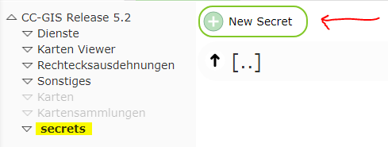
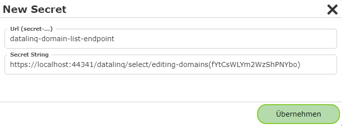
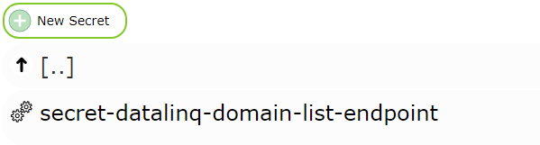
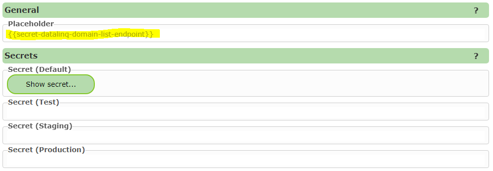
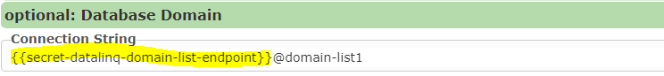
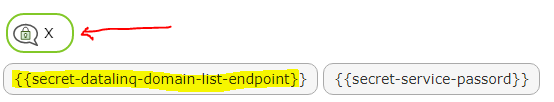

Secrets
=======

Mittels Secrets lassen sich innerhalb eines CMS *ConnectionStrings* und *Passwörter* zentral ablegen. 
Das hat den Vorteil, dass diese *ConnectionStrings* nicht an unterschiedlichen Stellen immer wieder auftauchen.
Muss beispielsweise ein *Passwort* geändert werden, kann so gewährleistet werden, dass diese Änderung nur an einer Stelle 
vollzogen werden muss.

Secret erstellen
----------------

Um ein *Secret* zu erstellen, muss man in CMS in den Bereich ``Secrets`` wechseln und ``New Secret`` wählen:

.. note::
   Sollte dieser Bereich nicht vorhanden sein, ist eventuell ein ``Reload Root`` über die *Sidebar* notwendig.

Sollte beispielsweise immer wieder auf Auswahllisten eines *DataLinq Endpoints* zugegriffen werden, empfiehlt es sich,
einen Teil der Url (inklusive Token) als Secret zu übernehmen.

``https://.../datalinq/select/editing-domains(fYtCsWLYm2WzShPNYbo)`` @domain-list1

Das neu erstellte Secret erhält einen Namen inklusive vorangestelltem ``secret-``:

Klickt man auf das *Secret*, öffnet sich folgender Dialog:

Unter ``Placeholder`` wird angezeigt, wie dieses Secret verwendet werden kann. Das Secret kann überall im CMS als Teil eines *ConnectionString* oder als Passwort eingefügt werden:

In jedem Dialog wird oben ein Symbol angezeigt, über das man die für das CMS vorhandene *Secret-Platzhalter* anzeigen kann. Klickt man auf einen Platzhalter, wird
dieser in die Zwischenablage kopiert:

Für unterschiedliche Umgebungen (*Environments*) können unterschiedliche *Secret-Werte* angelegt werden. Ist für eine Umgebung kein Wert angegeben, wird der Wert aus ``Default`` verwendet.
Die Umgebung für ein Deployment kann von System Administratoren in der ``cms.config`` eingestellt werden (Knoten ``deployment`` unter ``environment``).

.. note:: beim Veröffentlichen eines CMS wird die die verwendet Umgebung angezeigt:

   .. image:: img/secrets6.png 
