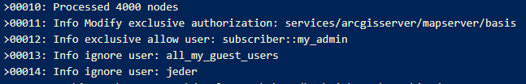

Knoten exklusiv berechtigen
===========================

Vorsetzung: Build >= 3.21.502

Knoten können auch *exklusiv* berechtigt werden. Das bedeutet, dass man einem Benutzer oder einer Gruppe die exklusiven Rechte für diesen Knoten erteilt.
Alle anderen Berechtigung verlieren damit für diesen Knoten seine Gültigkeit.

Exklusive Berechtigungen sind in der Entwicklungsphase oder im Wartungsfall sinnvoll, wenn Knoten noch nicht produktiv erreichbar sein sollten. Dazu gibt man beispielsweise 
nur dem Administrator die Exklusivrechte auf den Knoten. Erst wenn alles fertig ist, werden die Exklusivrechte wieder entfernt.

Der Vorteil bei exklusiven Berechtigungen ist, dass hier sehr wohl bereits die endgültigen *normalen* Rechte gesetzt werden können. Diese werden beim 
Veröffentlichen des CMS allerdings als "*ignoriert*" gekennzeichnet, solange es auf den Knoten mindesten ein exklusives Recht gibt.

Im Prinzip kann jede Berechtigung, egal ob Gruppe oder einzelner Benutzer, als *exklusive* gekennzeichnet werden. Dazu muss dem User beim Einfügen die Endung ``.@@EXCLUSIVE`` (Groß- Kleinschreibung egal)
hinten angefügt werden, also zum Beispiel ``subscriber::my_admin_user.@@EXCLUSIVE@@``.

.. note::
   Es ist egal, ob der User (z.B. ``subscriber::my_admin_user``) bereits eingefügt wurde. Die bestehenden Einstellungen werden dadurch nicht geändert. Für Wartungen kann dieser User jederzeit 
   eingebaut und später wieder entfernt werden, ohne die bestehenden Einstellungen zu verändern.

Fügt man ein exklusives Recht ein, werden alle anderen Berechtigungen für diesen Knoten transparent dargestellt und das exklusive Recht hervorgehoben: 

Hat ein Konten ein exklusives Recht, wird das auch in der Liste über ein schwarzes Symbol angezeigt:

Gibt es in einem CMS exklusive Rechte, werden die Berechtigungen beim Veröffentlichen des CMS entsprechenden angepasst.
Dabei wird in der *Ausgabe-Console* am Ende angezeigt, wie bestehende Berechtigungen modifiziert werden:

Löscht man zu einem späteren Zeitpunkt die exklusiven Berechtigungen wieder, werden die bereits gesetzten Berechtigungen wieder an diesem Knoten angewendet:

 