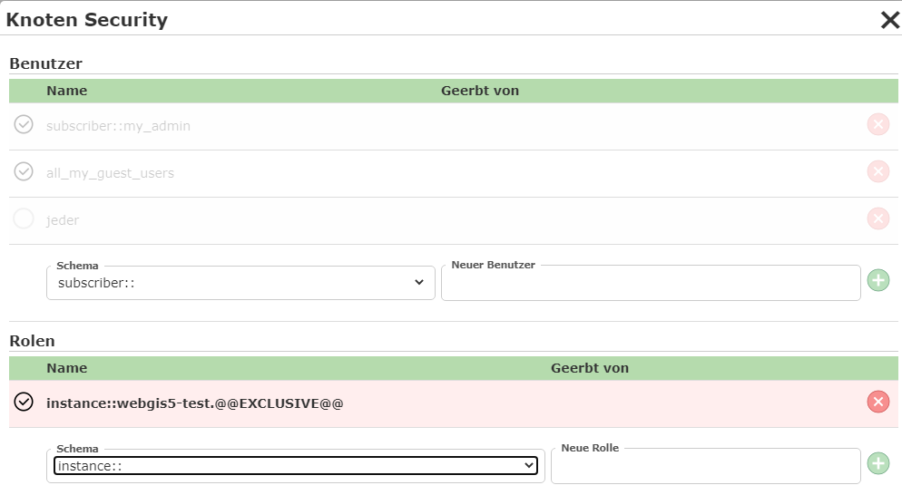
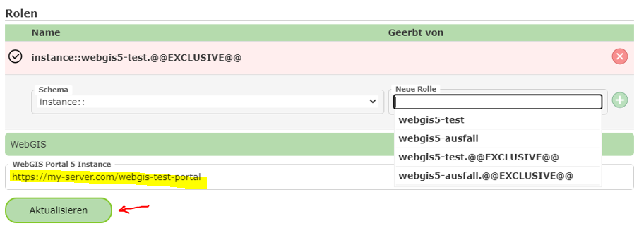

Instanzrollen
=============

Beim den Berechtigungen im CMS gibt es eine spezielle Rolle mit dem Prefix ``instance::`` 
Diese Berechtigungen beziehen sich auf eine bestimmte WebGIS Instanz.

Ein Anwendungsfall wäre etwa ein exklusives Rechte für einen Knoten auf eine WebGIS-Testinstanz zu berechtigen.

Dieser Knoten wäre dann für andere Instanzen (Produktivsystem) nicht sichtbar. Damit kann man gewährleisten, dass für den gesamte 
Zeitraum der Entwicklung von neuen Kartenanwendungen, diese Änderungen nicht im Produktivsystem angezeigt werden, auch wenn das CMS 
zwischenzeitlich für diese Instanz veröffentlicht wird.

Welche Instanzrollen von einer WebGIS Instanz möglich sind, wird bei der Eingabe durch Autovervollständigung angezeigt. Dabei muss natürlich
die Url zur entsprechenden WebGIS Portalseite angeben und mit ``Aktualisieren`` bestätigt werden:

Welche Instanzen möglich sind, hängt von Betreiber der WebGIS Instanz hab. Er hat die Möglichkeit, über die ``api.config`` Datei, beliebige 
Instanzrollen anzugeben:

.. code::

   <add key="instance-roles" value="webgis5-test,webgis5-ausfall"/>

.. note::
   Instanzrollen sollten vom Betreiber zum  Beginn festgelegt werden und nachträglich maximal ergänzt werden. Ansonsten könnten eventuell 
   bereits für die Instanz vergebenen CMS Berechtigungen nicht mehr funktionieren.

