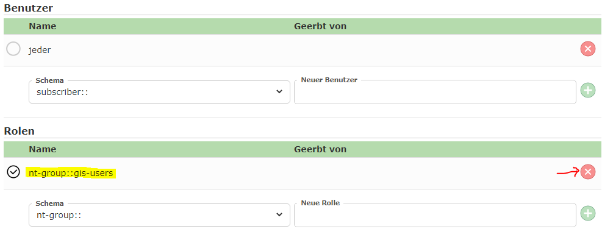

Knoten berechtigen
==================

Jeder Knoten im CMS kann berechtigt werden. Dazu muss beim entsprechenden Knoten in der Liste auf 
das *Berechtigungs-Symbol* geklickt werden:

Dadurch wird der **Knoten-Security** Dialog für diesen Knoten geöffnet. Standardmäßig wird hier für einen
*ungeschützten* Knoten folgendes dargestellt:

Grundsätzlich können einzelnen Benutzer oder Benutzergruppen (Rollen) berechtigt werden. 
Der Benutzer *Jeder* ist hier ein spezieller Benutzer, dem alle echten User entsprechen. Ist für einen Knoten der Benutzer *Jeder*
berechtigt, können diesen Knoten alle Anwender sehen.

Je nach Konfiguration der WebGIS Instanz stehen für Benutzer und Gruppen unterschiedliche *Schematas* zur Verfügung. Ein *Schema*
beschreibt hier die Methode, mit der die Authentifizierung vorgenommen wird. Bei Windows-Authentifizierung lauten die entsprechenden 
*Schematas* beispielsweise ``nt-user::`` und ``nt-group::``. 

Auf welche WebGIS Instanz sich die Anmeldungs-Schematas beziehen, ist im Dialog unter dem Abschnitt ``WebGIS`` ersichtlich:

Klickt man auf den ``Aktualisieren`` Button werden die Auswahllisten für die *Schematas* entsprechend neu befüllt.

Möchte man eine beispielsweise eine Gruppe für einen Knoten berechtigen, muss zuerst das richtige *Schema* gewählt und dann der Gruppenname eingetragen werden.
Je nach *Schema* werden nach Eingabe einiger Zeichen Vorschläge angezeigt. Klickt man danach auf den *Plus* Button wird diese Gruppe der Liste für
diesen Knoten hinzugefügt.

In diese Ansicht wurde auch die Default-Berechtigung für *Jeder* entfernt (die Checkbox ist nicht angehakt). Mit dem *Löschen* Symbol wird eine Berechtigung wieder entfernt.
Es können nur Berechtigung entfernt werden, die auch für diesen Knoten dezidiert gesetzt wurden. Vererbte Berechtigungen können nur überstimmt werden (durch an- oder abhaken).

Ist eine Berechtigung von einem übergeordneten geerbt, wird die Pfad dieses Knoten angezeigt, in dem die eigentliche Berechtigung gesetzt wurde:

Möchte man eine vererbte Berechtigung für den aktuellen Knoten wieder zurück nehmen, gescheit diese durch abhaken der entsprechenden Berechtigung. Dadurch wird die entsprechende 
Berechtigung für diesen Knoten neue gesetzt und die Vererbung wird überschrieben:

Da die Berechtigung hier für diesen Knoten neu gesetzt wurde, dann diese wieder mit den *Löschen* Symbol entfernt werden. Danach würde wieder die geerbte Berechtigung angezeigt werden:

