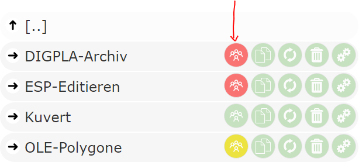
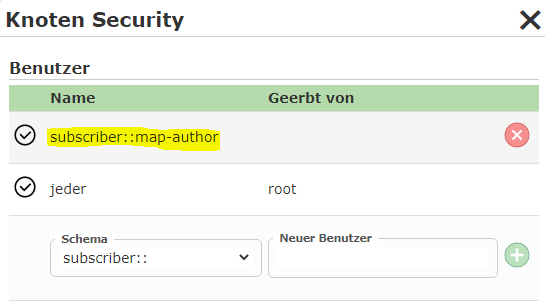
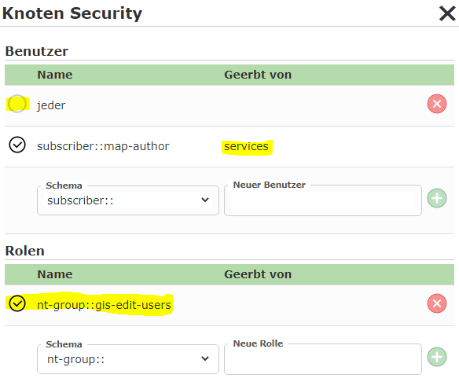
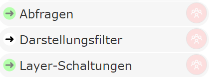

Anzeige des Berechtigungs-Button
================================

Um im CMS die Übersicht zu bewahren, welche Knoten berechtigt sind, wird der Berechtigungs-Button in unterschiedlichen Farben dargestellt:

Folgende Farben sind möglich:

* **Grün** (default Farbe - wie alle anderen Buttons): Für diesen Knoten gibt es keine Berechtigung. Der Knoten ist für *Jeden* sichtbar.

* **Rot**: Für diesen Knoten gibt es eine Berechtigung, die mindestens einen Benutzer für diesen Knoten ausgrenzt.

* **Gelb**: Für diesen Knoten wurden Berechtigungen definiert, die allerdings keine Benutzer beschränken. Dieser Knoten ist immer noch für alle Anwender sichtbar.

Beim letzten Punkt stellt sich vielleicht die Frage, warum ein Knoten "ohne" Einschränkung berechtigt werden sollte. Das macht beispielsweise bei einem 
übergeordneten Knoten wie ``Dienste`` Sinn. Dort könnte die Berechtigung etwa folgendermaßen aussehen:

Hier wird zusätzlich zu ``Jeder`` noch der Benutzer ``subscriber::map-author`` hinzugefügt. Dieser ist beispielsweise der Karten-Autor, dieser sollte natürlich auch alle
Dienste sehen. Da alle Dienste unter diesem Knoten angelegt werden, wird dieses Recht auf alle Dienst-Knoten vererbt.

Möchte man jetzt einen speziellen Dienst-Knoten für eine Benutzergruppe, etwa ``nt-group::gis-edit-users``, berechtigen, wäre die Einstellung für diesen 
Knoten folgendermaßen:

Der Benutzer ``Jeder`` wird dezidiert abgehakt. Dafür wird für diesen Knoten die Windows Gruppe ``gis-edit-users`` berechtigt. 
Obwohl der Karten Author ``subscriber::map-author`` nicht in der Windows Gruppe ist, kann er den Dienst trotzdem sehen, da dieses Recht vom übergeordneten Knoten 
geerbt wird.

**Rote** Berechtigungs-Buttons gibt es zusätzlich noch in einer etwas *blasseren* Darstellung:

Diese Einfärbung bedeutet, dass es für die Knoten zwar Einschränkung gibt (nicht für jeden sichtbar), allerdings alle einschränkenden Rechte geerbt wurden.