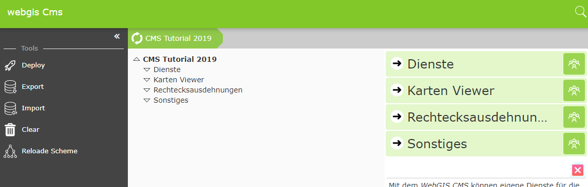

CMS Web Oberfläche
==================

Über die Eigenschaftenseite des CMS Accounts kommt man mit dem Button ``Open CMS Account`` zur eigentlichen CMS Web-Oberfläche (der erste Aufruf kann einige Sekunden dauern, da hier noch der CMS Baum angelegt wird).

Im ersten Schritt sollten einmal Hintergrunddienste angelegt werden. 

**Hinweis:** In der Praxis würde man in einem leeren CMS zuerst auch eine Rechteckausdehnungen definieren. Diese sind im WebGIS 5 notwendig um überhaupt eine Karte Initialisieren zu können. In diesem Objekte wird nicht nur die koordinative Ausdehnung einer Karte, sondern auch die Maßstäbe (Resolutions) angeführt. Diese müssen den Auflösungen der eingebunden Tile Caches ensprechen.
In der Cloud können wir allerdings später vorgefertigte Ausdehnung für WebMercator aus dem öffentlichen CMS „webgiscloud“ verwenden.
Im öffentlichen Cloud CMS „webgiscloud“ sind ebenfalls die Basemap.at Tiles bereits vorhanden und könnten verwendet werden. Trotzdem werden diese hier zur Demonstration eingebunden.   
