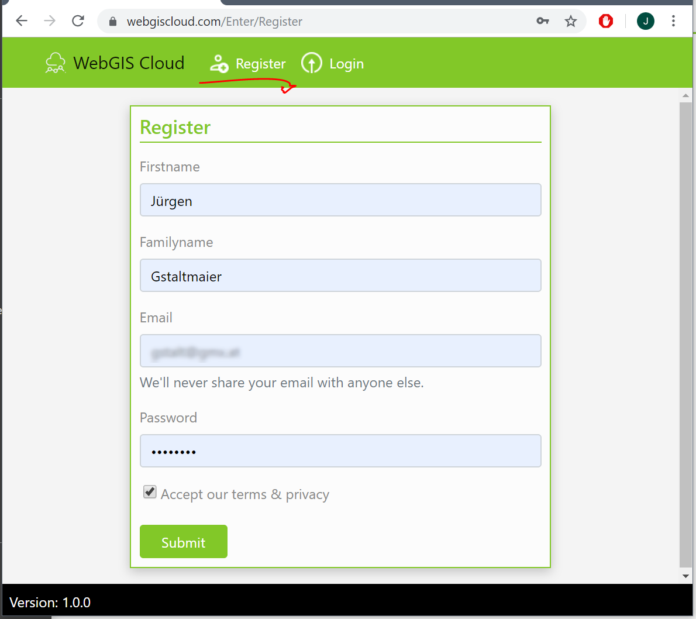
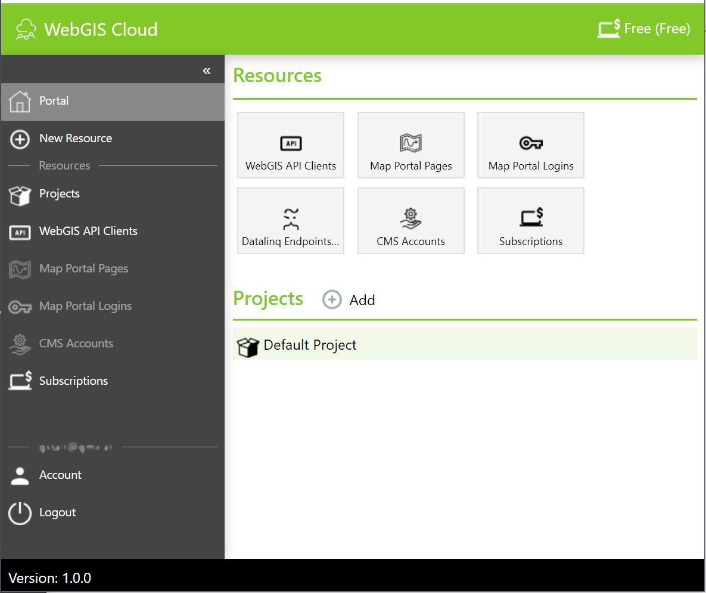
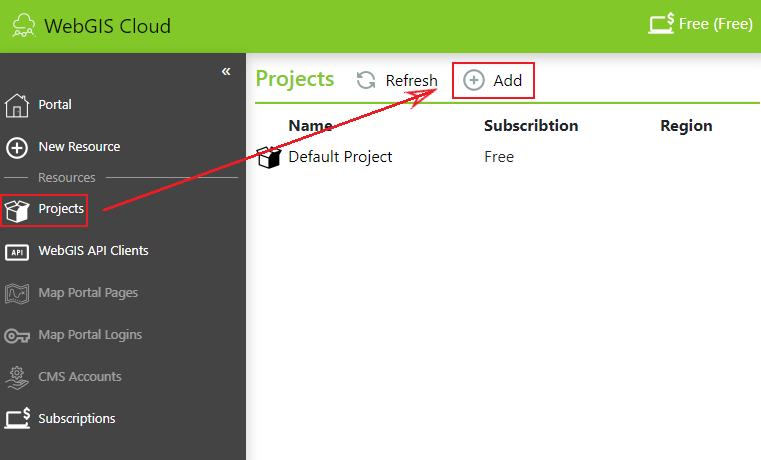
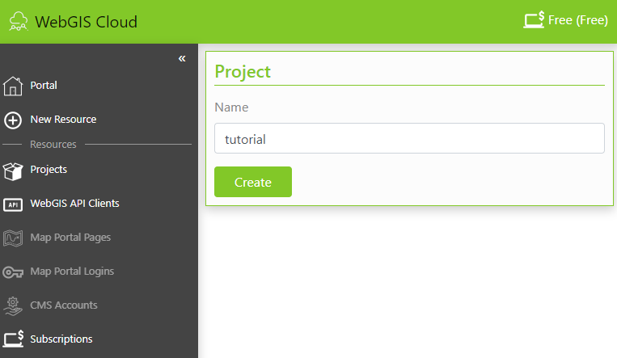
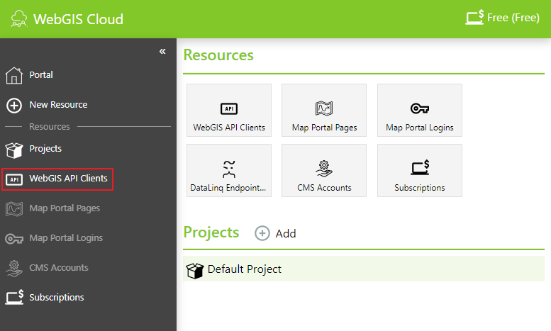
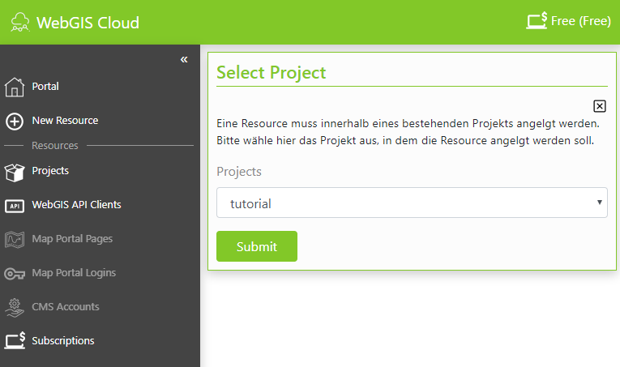
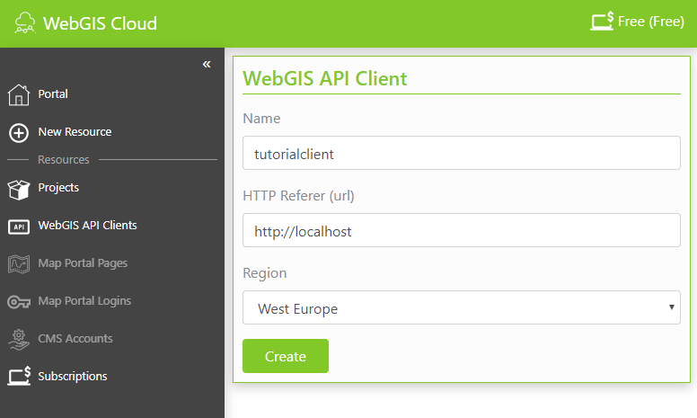

WebGIS Cloud
============

Einleitung
----------

Das Tutorial erfolgt in der WebGIS Cloud. 

Die folgende Themen werden behandelt:

*	Erstellen eines CMS Accounts
*	Parametrierung von ArcGIS Server Diensten im Web CMS (Layerschaltungen, Darstellungsvarianten, Editthema)
*	Erstellen einer Map Portal Seite
*	Erstellen und Veröffentlichen von Karten auf der Map Portal Seite mit dem MapBuilder
*	Anpassen von Styles

Die weitere Beschreibung der Vorgehensweise erfolgt teilweise in Stichworten mit entsprechenden Screenshots. Auf die Unterschiede zur Vorgehensweise bei Kundeninstallationen von WebGIS 5 wird hingewiesen.

Einführung ins Verwaltungsportal der WebGIS Cloud
-------------------------------------------------

Aufruf des Portals mit https://webgiscloud.com

**Registrieren**

Registrierungsformular ausfüllen und anmelden (Email sollte ein gültige E-Mail Adresse ein)

Es wird eine Gratis (Free) Subscription und ein Projekt (Default Projekt) angelegt. Mit dieser Subscription können nur API Clients für das Einbinden von Karten auf eine eigene Homepage erstellt werden.

Projekt erstellen
-----------------

Um die Übersicht zu behalten, müssen Resources innerhalb eines Projektes angelegt werden.

Resources mit gleicher Lebensdauer sollten innerhalb eines Projektes angelegt werden. Sobald Resources später nicht mehr benötigt werden, kann dies durch Löschen eines Projektes erfolgen.

Um ein Projekt zu erstellen, muss zuerst auf ``Projects``, dann auf ``Add`` und anschließend auf ``Create`` gedrückt werden. 

Anschließend ist der Name des Projekts einzugeben.

WebGIS API Client erstellen
---------------------------

Um auf die WebGIS API zuzugreifen, ist ein API Client notwendig. 

Um eine neue WebGIS API zu erstellen, muss zuerst ``WebGIS API Clients`` ausgewählt und anschließend auf ``Create`` bzw. ``Add`` (wenn bereits ein WebGis API Client vorhanden ist) geklickt werden.

Eine Resource muss innerhalb eines bestehenden Projekts angelegt werden. Bitte wähle hier das Projekt aus, in dem die Resource angelegt werden soll.

Jeder Client bekommt eine eindeutige ID. Wird die WebGIS API in eine Webseite eingebunden, muss diese ID angeführt werden.

Zusätzlich zur ID muss für einen API Client noch die Url der Webseite angeben werden, in die die WebGIS API eingebunden wird. Dies erfolgt über den HTTP-Referer, der garantieren soll, dass ein API Client nicht in einer anderen Seite verwendet werden kann.

