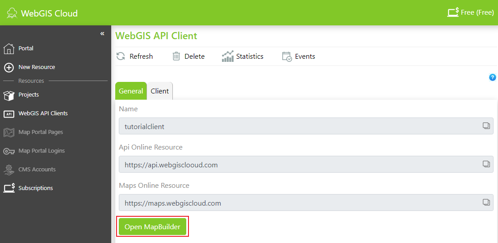
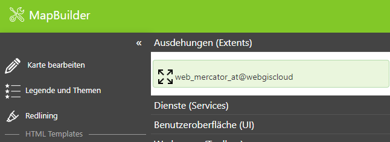
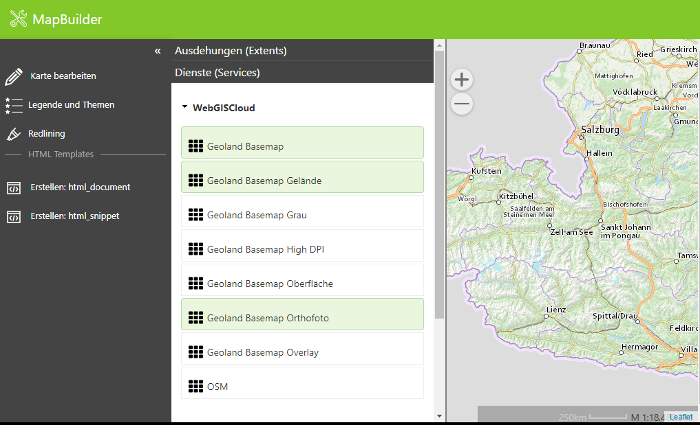
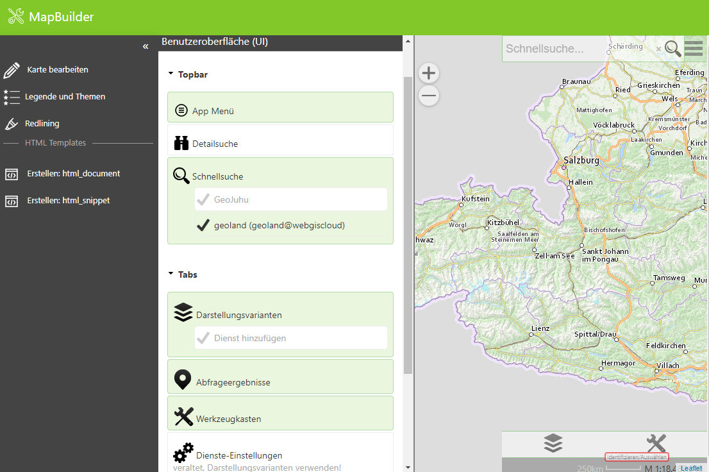
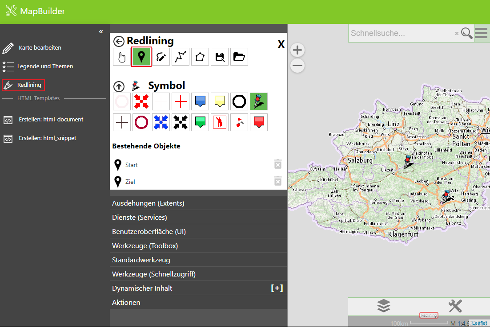

MapBuilder
==========

Mit dem MapBuilder können einfache Karten erstellt werden.

Nachdem auf den im vorigen Schritt erstellten Client geklickt wurde, kann der MapBuilder geöffnet werden.

Im ersten Schritt muss einmal die Ausdehnung (Extents) ausgewählt werden. Wir verwenden dazu den von WebGIS Cloud vordefinierten Extent:

Diese Ausdehnung definiert die Rechteckausdehnung von Österreich und die Maßstabsstufen der Web Mercator Projektion (wird beispielsweise von Google, OpenStreetMap und Basemap.at verwendet).

Im nächsten Schritt wählen wir die Dienste (Services) aus: 

Wählen wir hier Dienste aus, sollte die Kartenvorschau aufgebaut werden.

**Hinweis:** Damit die Kartenvorschau aufgebaut werden kann, muss mindestens eine Ausdehnung und ein Dienst ausgewählt werden.
Hintergrund (Tiling)-Dienste müssen zu den Maßstabsgrenzen aus der Ausdehnung passen, damit sie richtig dargestellt werden.

Unter Benutzeroberfläche (UI) stellen nur Darstellungsvarianten, Abfrageergebnisse, Werkzeugkasten, Schnellsuche und App Menü ein:

Damit ist unsere erste Karte einmal fertig. 

Redlining
---------

Unter Redlining können unter anderem Punkte gesetzt und mit einem Kommentar versehen werden.

html
----

FEHLT NOCH