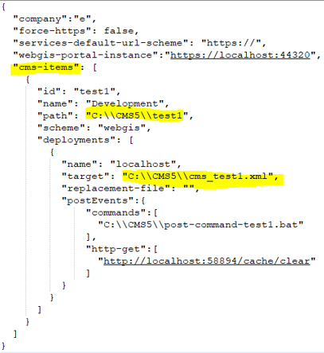

Konfiguration der CMS Applikation
=================================

Die Konfiguration der CMS Anwendung erfolgt über die Datei ``webgis-cms/_config/cms.config``.

Dabei handelt es sich um eine JSON Datei (JavaScript Object Notation). Darum ist beim Editieren dieser Datei auf die Besonderheiten der JavaScript Syntax aufzupassen. 
Nach dem Editieren muss es sich wieder um eine gültige JavaScript Datei handeln. Die Vorlage sieht folgendermaßen aus:

**Hinweis zur Javascript Syntax:**

•	Attribute und Werte werden durch ``:`` getrennt, z.B: ``"force-https": false``
•	Objekte (mit mehreren Attribute) beginnen werden in geschwungene Klammern gesetzt ``{ … }``
•	Array werden durch eckige Klammern gekennzeichnet ``[ … ]``. Die einzelnen Werte werden mit Beistrich getrennt
•	In einem Array können Objekte aufgelistet werden (z.B: cms-items): ``[ { object1 }, {object2} ]``
•	In einem Array können einzelne Werte (String, Zahlen) aufgelistet werden (z.B: http-get): ``[ "url1", "url2"]``
•	Ein Backslash ``\`` ist in einer Zeichenkette in JavaScript in besonders Zeichen. Um tatsächlich einen Backslash anzugeben, muss hier ein doppelter ``\\`` gegeben werden (siehe im Beispiel bei den Pfaden). Ansonsten ist das config File kein gültiges JSON File mehr!!!

Mit einem Web CMS können mehrere Bäume verwaltet werden. Pro Baum wird ein Objekt im cms-items-Array angelegt.
Der Wert für cms-items muss ein Array sein. Ein cms-item-Objekt hat dann wieder einzelne Werte. Die beiden gelb markierten Werte (path, target), 
geben beispielsweise an, wo sich die Wurzel des CMS Baumes befindet (path) und wohin ein CMS veröffentlicht wird (target). 
Hier werden die einzelnen Attribute von CMS Item erläutert:

