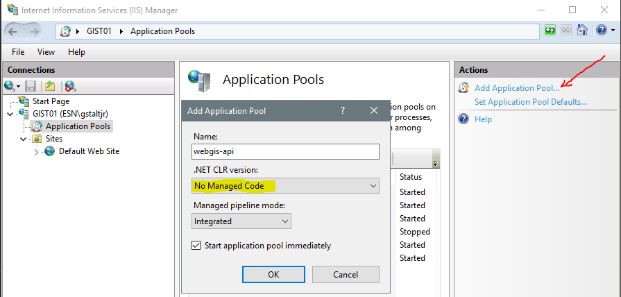
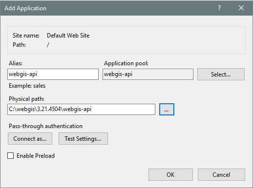
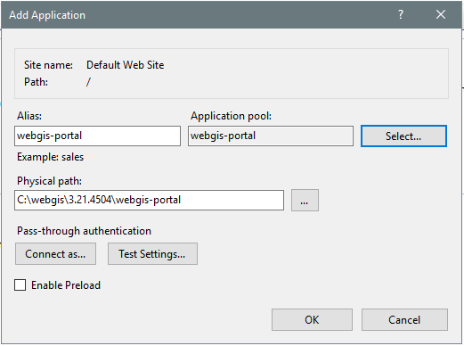
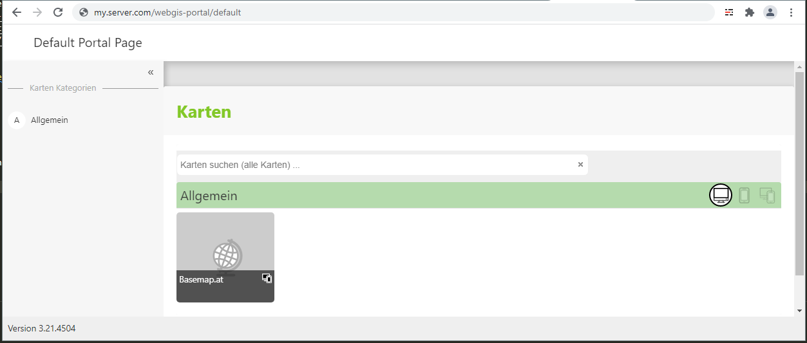

Installation im Internet Information Server (IIS)
=================================================

In diesem Abschnitt wird gezeigt, wie aufbauend auf der oben gezeigten Windows Installation WebGIS über den Microsoft IIS veröffentlicht werden kann.
Dieses WebGIS kann von allen Anwendern ohne lokaler Installation über einen *Web-Browser* genutzt werden.

Im ersten Schritt müssen Applikation Pools für die einzelnen Web-Applikationen erstellt werden. 

.. note::
   Pro Anwendung (WebGIS API und WebGIS Portal) muss ein Applikation Pool angelegt werden. Es ist nicht möglich, dass sich beide Applikationen einen Pool teilen.

Für die WebGIS Anwendung müssen zwei Applikation Pools (``webgis-api`` und ``webgis-portal``) mit folgenden Einstellungen erstellt werden:

Bevor die eigentlichen Anwendungen im IIS erstellt werden, sollte noch die Konfiguration angepasst werden. Dazu öffnet man im Installationsverzeichnis 
die Dateien ``webgis-api/_config/api.config`` und ``webgis-portal/_config/portal.config``

Sollte die beiden Web-Applikation später ``webgis-api`` und ``webgis-portal`` heißen, müssen die Konfigurationsdateien folgendermaßen angepasst werden:

.. code::

   <!-- webgis-api/_config/api.config Anpassungen -->
   <add key="api-url" value="https://my.server.com/webgis-api" />                                        
   <add key="portal-url" value="https://my.server.com/webgis-portal" />                                  
   <add key="portal-internal-url" value="http://localhost/webgis-portal" />          

.. code::
   
   <!-- webgis-portal/_config/portal.config Anpassungen -->
   <add key="api" value="https://my.server.com/webgis-api" />                   
   <add key="api-internal-url" value="http://localhost/webgis-api" />      
   <add key="portal-url" value="https://my.server.com/webgis-portal" />

Mit ``Add Application`` (zB auf der ``Default Web Site``) können die beiden Anwendungen erstellt werden.
Dazu muss jeweils der entsprechende *ApplicationPool* angeführt werden und das richtig Verzeichnis in Filesystem ausgewählt werden:

Danach sollte die Anwendungen aufgerufen werden können:

.. image:: img/install4.png

.. note::
   Die WebGIS Web-Applikationen brauchen Lese- und Schreibzugriff auf das ``webgis-repository`` Verzeichnis. Für den ApplikationPool muss ein User verwendet werden, der das gewährleistet.
   Der IIS Default User ``ApplicationPoolIdentity`` hat dieses Recht in der Regel nicht. Hat die Web-Applikation zu wenig (Schreib) Rechte kommt beim Aufruf einer Karte beispielsweise folgende
   Fehlermeldung:

   .. image:: img/install6.png

   Für Testzwecke kann der ApplicationPool User ``LocalSystem`` verwendet werden. Dieser hat in der Regel Zugriff auf alle Verzeichnisse. In produktiven Umgebungen ist davon allerdings abzuraten.
   Hier sollte eine User verwendet (angelegt) werden, der nur genau die Rechte hat, die unbedingt notwendig sind.

