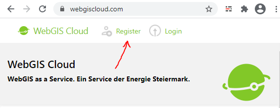

Registrierung
=============

Um das *WebGIS Portal* nutzen zu können, muss ein Account angelegt werden. Eine Registrierung erfolgt über die
Web-Seite https://webgiscloud.com

.. note::
   Hat man bereits einen Account für das *WebGIS Cloud Portal*, erfolgt die Anmeldung über ``Login``

Klickt man auf ``Register``, gelangt man zum Registrierungsformular:

Das Formular muss korrekt ausgefüllt werden. Pflichtfelder sind mit einem ``*`` gekennzeichnet.

Unter ``Email`` muss eine gültige E-Mail Adresse angegeben werden. Diese wird nach der Registrierung dazu verwendet, die Registrierung abzuschließen.
Die E-Mail Adresse ist später gleichzeitig der Username, der für die Anmeldung am Portal verwendet wird.

.. note:: 
   Im Feld ``Promotion Code`` muss ein gültiger Promotion Code eingetragen werden. Zur Zeit können Sie nur einen Account angelegen, wenn Sie
   über einen gültigen ``Promotion Code`` verfügen! Auf Anfrage können Sie einen ``Promotion Code`` unter juergen.gstaltmaier@e-netze erhalten.

Nach der Registrierung wird an die angeführte E-Mail Adresse eine Bestätigungs-E-Mail versendet. Über den Link in der Mail wird die Gültigkeit 
der E-Mail Adresse garantiert und die Registrierung abgeschlossen.

Nach dem Abschluss der Registrierung kann auf der Seite https://webgiscloud.com auf ``Login`` geklickt werden. Über das Anmeldeformular kann sich
mit E-Mail Adresse und Passwort angemeldet werden.

Als Username muss die bei der Registrierung angegeben E-Mail Adresse angegeben werden. 