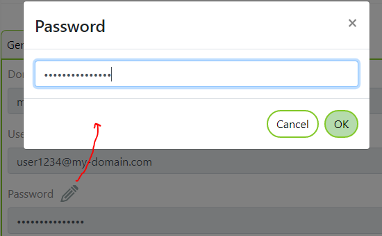

Map Portal Login Domain
=======================

Mit Map Portal Login Domains können Gruppen von Anwendern angelegt werden, die auf Kartenportale und Kartendienste berechtigt werden können.
Unter einer *Domain* kann eine beliebige Anzahl von Benutzern angelegt werden, die sich für ein *Karten Portal* anmelden können.

Das Format einer Domain entspricht einer *Web Domain*, zB ``my-company.com``. Die Domain muss dabei eindeutig sein. Eine *Domain* die bereits unter einer 
anderen *Subscription* angelegt wurde, kann keine zweites mal angelegt werden.

Die Benutzernamen die zur Anmeldung angelegt werden, müssen innerhalb der *Domain* eindeutig sind. Damit die Logins später *global* eindeutig sind, wird jedem
Benutzernamen nach der *Domain-Name* mit vorangestelltem ``@`` angehängt:

Beispiel: Domain = ``my-domain.com``

* ``user1@my-domain.com``
* ``user2@my-domain.com``

*Karten Portale* und *Kartendienste* (CMS Account) können für eine gesamte Domain oder für einzelne User berechtigt werden. 
Sollte *Karten Portal* und *Kartendienste* von anderen WebPortal-Accounts für diese *Domain* freigeschalten werden, kann eine *Domain* auch geteilt (Share) werden (siehe unten).

Domain erstellen
----------------

Eine Domain wird erstellt, indem man in der *Sidebar* auf **New Resource** und dann **Map Portal Login Domain** klickt. Alternativ, dann auch gleich über die *Sidebar* zu **Map Portal Login Domain** springen. Damit werden alle für
die aktuelle Subscription angelegten angezeigt bzw. eine neue Domain angelegt:

Zuerst muss ein eindeutiger *Domain Name* angegeben werden:

Domain Benutzer erstellen
-------------------------

Ist das Erstellen der *Domain* erfolgreich, können über die Eingenschaften Seite der *Resource* Benutzer (Logins) angelegt werden:

.. image:: img/domains2.png

Beim Erstellen einen neuen Benutzers muss wieder ein Benutzernamen/Anmeldename angegeben werden (mindestens 8 Zeichen). Dieser muss innerhalb der Domain eindeutig sein:

Beim Erstellen wird für diesen Benutzernamen ein zufälliges, starkes Passwort angelegt. Ein Anwender kann sich bei einem *Karten Portal* auf unterschiedliche Arten anmelden.

1. Mit Username und Password
2. Mithilfe eines Links inklusive *Access Tokens*

Um eine dieser Methoden verfügbar zu machen, muss die Eigenschaften Seite der *Map Portal Domain Benutzer* Resource geöffnet und auf den Reiter ``User`` gewechselt werden:

Sollte sich der Benutzer mit Usernamen und Passwort anmelden können, muss ein Passwort vergeben werden. Dazu das Editsymbol (Stift) beim Passwort geklickt werden:

.. note::
   Das hier eingetragene Passwort wird nicht im Klartext angezeigt. Auch nachträglich kann das Passwort nicht mehr abgefragt werden, da intern nur ein *Hash-Code* verspeichert wird.
   Wird das Passwort vergessen, kann es hier wieder geändert werden. Eine Änderung des Passwortes durch den Endanwender ist nicht vorgesehen.

Sollte ein Anwender nur einen zeitlich beschränkten Zugriff auf ein Kartenportal haben, kann anstelle eines Passwortes auch ein Link mit *Access Token* erzeugt werden.
Klickt man auf den Button ``Generate Access Token`` öffnet sich folgender Dialog:

Hier muss zuerst die Url des *Karten Portals* für das der Link erzeugt werden sollte (``{portal}``). Außerdem muss angeführt werden, wie lange der Link gültig sein sollte.
Klickt man danach auf ``Generate Url Token`` wird ein Link erzeugt, mit dem an das angeführte Portal aufrufen kann:

Diese Methode ist zu bevorzugen, wenn ein Anwender nur einen zeitlich beschränkten Zugang bekommen sollte. Es ist nicht ausreichend, für einen Anwender nur nach Ablauf eines
Zeitpunktes das Passwort zu ändern. Ein Anwender, der bereits ein Portal benutzt könnte es auch noch den Änderen des Passworts benutzen, solange eine gültiges ``Cookie`` für die letzte Anmeldung besitzt.
Mit der *Access Token* Methode wird gewährleistet, dass der erzeugt Link mach dem angegeben Zeitpunkt nicht mehr aufgerufen werden kann.

.. note::
   Es ist nicht gewährleistet, dass das *Karten Portal* das unter ``{portal}`` eingetragen wurde, auch für den Benutzer berechtigt ist. Der *Access Token* gewährleistet nur die Identität des Benutzer.
   Ob ein Benutzer ein Portal anrufen darf, stellt der Eigentümer des *Karten Portals* ein (siehe unten). Ein hier erstellter Link sollte vor dem Weitergaben immer testen.
   
Domains und Benutzer berechtigen
--------------------------------

Deine komplette Domain oder einzelne Benutzer können für eine oder mehrere Karten *Portal Seiten* berechtigt werden. Dazu muss man zur aktuellen Eigenschaften Seite des *Karten Portals* wechseln und auf den
Reiter ``Logins`` klicken:

Möchte man eine komplette Domain zu den Zugriff berechtigen, muss ``*@my-domain.com`` ausgewählt werden. Alternativ können auch nur einzelnen User ausgewählt werden.

.. note::
   werden im *Portal* *Karten-Dienste* angeboten, die nicht frei zugänglich sind und über einen *CMS Account* parametriert werden, muss dieser Vorgang auch beim *CMS Account* eingestellt werden.
   Nur so wird gewährleistet, dass eine veröffentlichtes CMS für diese Anwender sichtbar sind.
   
Domains für externe Resources berechtigen
-----------------------------------------

Befinden sich das *Karten Portal* oder der *CMS Account* in einer fremden Subscription (zB. Domain Verwaltung und bereitstellung von Karten/Diensten erfolgt von unterschiedlichen Organisationen) kann eine Domain *geteilt* werden.
Durch das Teilen sieht der Eigentümer das *Karten Portals* dieser Domain auf der Eigenschaften seiner *Karten Portale* bzw *CMS Accounts*. Dadurch ist ein berechtigen fremder Domains möglich. 
Der Empfänger einer geteilten Domain hat ansonsten keinen Einfluss auf die Anwender der Domain (es können von ihm keine Anwender angelegt oder Passwörter geändert werden).

Zum Teilen einer Domain muss die die Eigenschaften Seite der Domain gewechselt und auf ``Share`` geklickt werden:

Damit wird ein Token erzeugt, der dem Empfänger übermittelt werden muss (E-Mail, ...):

Der Empfänger klickt in der *Sidebar* auf ``Transfered Resources`` und erstellt so unter Eingabe des *Tokens* eine neue *Transfered Resource*.
Beim Sender scheint diese Resource danach ebenfalls unter ``Shared Resources`` in der *Sidebar* (inklusive Username des Empfängers) auf. Beide Parteien können die Resource wieder entfernen und das Teilen so wieder rückgängig machen.

