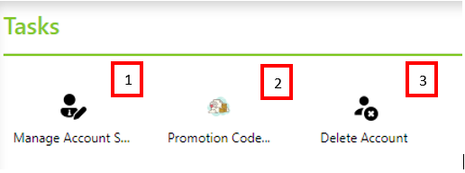

Benutzerkonto verwalten
=======================

Klickt man in der *Sidebar* auf ``Account`` werden im *Content* Bereich die Werkzeug zum Verwalten des *Benuterkontos* angezeigt:

1. **Manage Account Settings:**
   Hier können allgmeine Konto Einstellung wir Name, Passwort, Zwei-Faktor-Authentifizierung geändert werden:

2. **Promotion Code:**
   Über *Promotion Codes* können die Credits für eine *Subscription* aufgeladen werden. Der *Promotion Code* muss in dem hier 
   angezeigten Dialog eingefügt und mit ``Honor`` bestätigt werden. Danach kann noch angegeben werden, für welche 
   *Subscription* die Credits gut geschrieben werden sollte, falls diese nicht schon über den *Promotion Code* bestimmt wurde.

3. **Delete Account**
   Hier kann ein Benutzerkonto gelöscht werden. Bevor ein Konto gelöscht werden kann, müssen alle *Subscriptions* gelöscht werden.
   Damit werden auch alle in der *Subscription* angelegten *Resourcen* gelöscht und Credits gehen verloren. Wurden alle *Subscriptions* 
   gelöscht, kann unter Angabe des Passwortes das Konto gelöscht werden.
   

   