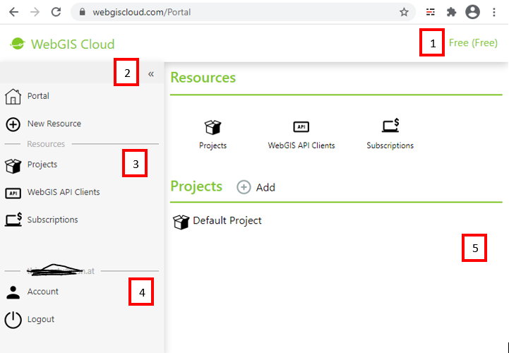

WebGIS Portal Benutzeroberfläche
================================

Nach der ersten Anmeldung erscheint *WebGIS Portal Benutzeroberfläche*:

Die Benutzeroberfläche ist in folgende Bereiche eingeteilt:

1. Titlezeile mit anzeiger der aktuelle Subscription. Wie schon beschrieben können unterscheidliche *Subscriptions* angelegt werden. Nach dem ersten Anmelden, wird
   automatisch eine freie *Subscription* angelegt. Für alles wird hier angelegt wird, fallen keine Kosten an.

2. Links befindet sich die *Sidebar*. Diese teilt sich wieder in unterschiedleche Bereiche auf. Um oberen Bereich kann über ``Portal`` zu Standardansicht
   gesprungen werden oder mit ``New Resource`` eine neue *Resource* angelegt werden.

3. Unter ``Resources`` können die unterschiedlichen Typen von *Resourcen* angezeigt, die mit der aktuellen *Subscription* angelegt werden können.
   Klickt man beispielsweise auf ``Projects`` werden alle Projekte der *Subscription* aufgelistet. Von dort kann auch eine neues Projekt angelegt werden.

.. note::
   Wie und wann welche *Resource* angelegt werden sollte, wird im nächsten Abschnitt beschrieben.

4. Im Bereich unter dem Username (E-Mail Adresse), kann der aktuelle Account verwaltet werden. Hier findet man die Möglichkeit um das Passwort zu 
   ändern oder eine Zwei-Faktor-Authentifizierung einzurichten.
   Mit ``Logout`` kann die aktuelle Sitzung beendet werden.

5. Im *Content* werden je nach Auswahl unterschiedliche Werkzeuge oder Informationen angezeigt.

.. toctree::
   :maxdepth: 2
   :caption: Inhalt:

   account.rst
   manage.rst

