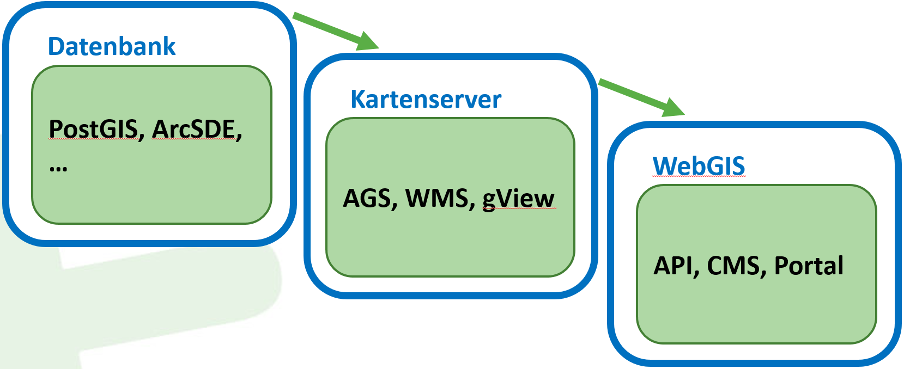
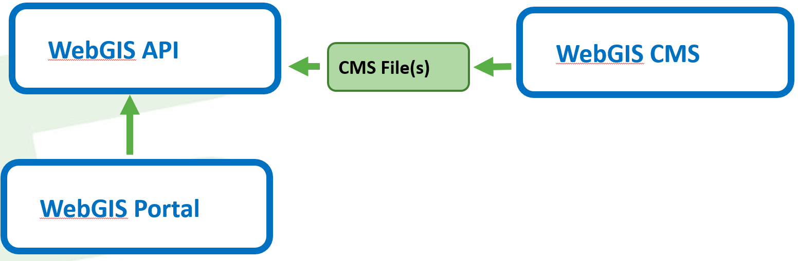
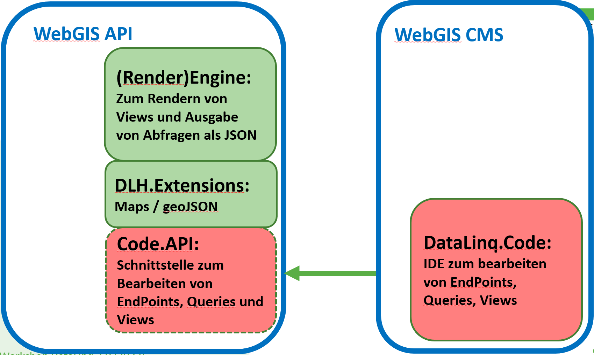

Aufbau der WebGIS Plattform (Architektur)
=========================================

Über die *WebGIS Plattform* können Karten mit *Hintergrund-* und *Fachdaten* über eine Browseranwendung angeboten werden.
Die  *Hintergrund-* und *Fachdaten* müssen dabei über gängige Kartendienst-Schnittstellen implementiert werden:

* WMTS
* WMS 
* ArcGIS Server
* ArcIMS 

Die *WebGIS Plattform* bietet Werkzeuge zur Darstellung und Abfrage dieser Kartendienste. Abhängig von den Eigenschaften des Kartendiensts können die Geodaten auch erstellt und bearbeitet werden.

*WebGIS* bietet keine Werkzeuge zum *Hosten* von Kartendiensten. Die Kartendienste müssen von eigenen Applikationen, sogenannten Kartenservern gehostet werden.
Beispiele für Kartenserver sind beispielsweise *GeoServer* (https://geoserver.org/), *gView Server* (https://github.com/jugstalt/gview5) oder auch kommerzielle Produkte wie *ArcGIS Server* (https://www.esri.com/).
Die Kartenserver greifen in der Regel über ihr Backend auf Geodaten in einer Datenbank zu (z.B. PostGreSQL/PostGIS) und implementieren eine der oben angeführten Schnittstellen.

Mit dieser Methode lassen sich sehr gut verteilte Kartenanwendungen erstellen. Möchte man eigene Daten über *WebGIS* veröffentlichen, ist zusätzlich ein Kartenserver notwendig:

Die WebGIS Plattform besteht aus mehreren (Web-) Applikationen, die je nach Anforderungen installiert/gestartet werden müssen.

WebGIS API
----------

Die *WebGIS API* ist der Kern der WebGIS Plattform. Über diese Anwendung werden (Programmier-) Schnittstellen für den Zugriff auf Kartendienste
angeboten. Als Schnittstelle wird eine REST API angeboten. Zur Entwicklung von Browserbasierten wird auch eine Javascript API angeboten, in der
die REST API Aufrufe bereits gekapselt sind. Eine Beschreibung der Javascript API findet man hier: https://docs.webgiscloud.com/dev/index.html

Möchte man selber Kartenanwendungen entwickeln (über Javascript) ist in der Regel nur diese Anwendung zu installieren.

WebGIS Portal
-------------

Das *WebGIS Portal* ist eine Web-Applikationen, die auf die Schnittstellen der *WebGIS API* zugreift, und daraus fertige interaktive (Online) Karten bereitstellen kann.
Diese Anwendung reichtet sich an alle Anwender/WebGIS Betreiber, die die Kartenanwendungen nicht über Programmierschnittstellen (REST, Javascript) entwickeln wollen.

Das *WebGIS Portal* bietet bereits einen voll funktionsfähigen Kartenviewer, der bereits folgende Funktionen erfüllt:

* Darstellung mehrerer Kartendienste innerhalb einer Kartenanwendung
* Schaltung einzelner Themen/Schichten/Layer der eingebunden Kartendienste
* Legende
* Abfragen und Suchen in den eingebundenen Kartendiensten
* Maßstäbliches Drucken von Karten im PDF Format
* diverse Kartenwerkzeuge (Messen, 3D Modell, Redlining, Editieren von Geodaten, Abfragen, Suchen, Koordinaten, ...)

Als Beispiel kann hier auf eine einfache Karte (nur Hintergrundkarten) verwiesen werden:
https://maps.webgiscloud.com/examples/map/Basemaps/Geoland%20Basemap.at

Für Administratoren bietet das *WebGIS Portal* einen MapBuilder, um die Karten zu erstellen. Diese Karten können dann auf sogenannten *Kartenportalen* (Kartensammlungen) veröffentlicht werden (z.B. https://maps.webgiscloud.com).

WebGIS CMS
----------

Das *WebGIS CMS* ist nur für Administratoren relevant und muss/soll nicht für alle Anwender von WebGIS zugänglich sein. 
Über diese Anwendung wird festgelegt, welche Kartendienste über eine *WebGIS API* Instanz zur Verfügung gestellt werden. Außerdem kann für die einzelnen Dienste bestimmt werden,
welche Themen sichtbar, abfragbar oder bearbeitbar sind.

Die Konfiguration der Kartendienste erfolgt über eine Web-Oberfläche in einer Baumstruktur. Dieser *CMS-Baum* kann dann für eine *WebGIS API* Instanz veröffentlicht werden. In diesem Schritt wird der Baum zu einem 
*CMS File* zusammengefasst. Dieses File kann über *WebGIS API Konfiguration* in eine *WebGIS API Instanz* einbunden werden. Eine *WebGIS API* kann dabei mehrere *CMS Files* einbinden. 

(WebGIS) DataLinq
-----------------

WebGIS beinhaltet eine *DataLinq Instanz*, die DataLinq um den Umgang mit integrierten Karten erweitert.
Das DataLinq Rendering erfolgt dabei innerhalb einer WebGIS API Instanz. Die Konfiguration erfolgt in 
``api/_config/api.config`` Abschnitt ``datalinq``.

Das Editieren von DataLinq Objekten (Endpoints, Queries, Views) erfolgt über *DataLinq.Code*. Der Editor
ist im WebGIS in der CMS Anwendung integriert und kann über die Datei ``cms/_config/datalinq.config`` 
konfiguriert werden.

