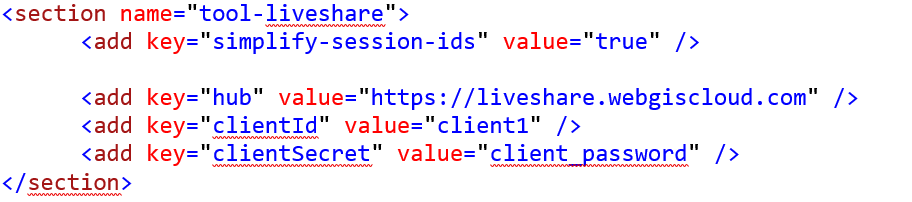

Konfiguration der API Applikation
=================================

Datei ``_config/api.config``
----------------------------

Diese Datei wird (falls nicht vorhanden) beim ersten Start der API mit Default Werten angelegt.
In diesem Abschnitt wird gezeigt, wie diese Datei den eigenen Bedürfnissen für einen 
produktiven Betrieb angepasst werden kann:

Die Datei ist ein XML Datei mit unterschiedlichen ``Schlüssel/Werte`` Paaren.

.. code::
   
    <?xml version="1.0" encoding="utf-8" ?>
    <configuration>
        <appSettings>

            <!-- App Roles -->
            <add key="app-roles" value="all" />      
            
            ...

        </appSettings>
    <configuration>

Abschnitt ``CMS``
+++++++++++++++++

* ``cmspath``, ``cmspath_geoland``, ...
  Pfad zu den CMS Dateien, die in die API eingebunden werden.

Abschnitt ``Output Pfad und Url/Konfiguration``

* ``outputPath``
  Pfad, in dem Bilder abgelegt werden können. 
  Die Webapplikation sollte darauf zugreifen und schreiben dürfen.

* ``outputUrl``
  Die zugehörige Url, die dann für den Anwender sichtbar ist 
  (Virtuelles Verzeichnis, sollte nicht über den Browser *listbar* sein!)

* ``server-side-configuration-path``
  Verzeichnis, in dem sich ``etc`` und ``config`` Verzeichnis befinden. 
  Im ``etc`` Verzeichnis befindet sich Serverseite Konfiguration der API für die 
  komplette Instanz (zB. Drucklayouts)

Abschnitt ``Proj Database``
+++++++++++++++++++++++++++

* ``p4database``:
  Connection String zu einer Datenbank, in der die Projektionsinformationen stehen (Tabelle P4). 
  Hier kann die gleiche Datenbank, die auch für webGIS 4.0 genutzt wird, angegeben werden.
  Dieser Key wird nur aus Kompatibilitsgründen zu WebGIS 4 angeboten. Möchten man die 
  Standardwert Projektionsinformationen verwenden, reicht es hier ``value="#"`` anzugeben.

Abschnitt ``Cache Datenbank``
+++++++++++++++++++++++++++++

In dieser Datenbank werden die „Sessions“ gespeichert. Darin muss sich die Tabelle 
``webgis_cache``, siehe unten. Verwendet man auch die Portal Anwendung, müssen beide den 
gleichen Session-Cache verwenden. Alternativ zu einer Datenbank, kann man diese Daten 
auch vereinfacht in einem Verzeichnis im Filesystem ablegen. Dann muss keine Tabelle angelegt werden.

* ``cache-provider``
  ``db`` (Datenbank) oder ``fs`` (Filesystem)

* ``cache-connectionstring``
  Connection-String auf die Datenbank oder Pfad in Filesystem.

Abschnitt ``Cache Aside`` (optional)
++++++++++++++++++++++++++++++++++++

Um die Zugriffe auf die Cache Datenbank zu verringern (auf den Cache wird bei jedem API Request zugegriffen)
empfiehlt es sich bei hoch ausgelasteten Instanzen einen Cache neben der Datenbank anzurichten. 
Dieser ermöglicht schnelle Zugriffe.

* ``cache-aside-provider``
  ``value="redis"`` => Redis Cache verwenden (Mehrere Instanzen können hier den gleiche Side-Cache verwenden)
  ``value="InApp"`` => InApp Cache verwenden (Daten werden in der Applikation im Speicher gehalten)
  ``value=""`` => Kein Cache Aside 

* ``cache-aside-connectionstring``
  Der dazugehörige Connection String: zB ``localhost:6379`` bei Redis
  Bei InApp wird hier der Wert in Sekunden angegeben, für die ein Wert im Side-Cache gehalten werden soll, zB ``3600``

Abschnitt ``Subscriber Datenbank``
++++++++++++++++++++++++++++++++++

Subscriber sind User, die sich am WebGIS Portal anmelden können, um Karten zu erstellen.
Die Information dieser User können in einer Datenbank oder vereinfacht auch im Filesystem
gehalten werden (Connection-String: ``value="fs:C:\webgis\webgis-repository\...."``)

* ``subscriber-db-connectionstring``
  Connection-String zur Subscriber Datenbank

* ``subscriber-admins``
  Eine Liste (mit Beistrich getrennt) von Subscriber Namen, die Administratoren sind, 
  zB ``admin``. Diese User können dann anderer Profile bearbeiten (Löschen, Änderen, …)

Abschnitt ``Subscriber Registration``
+++++++++++++++++++++++++++++++++++++

* ``allow-subscriber-login``
  Hier kann angegeben werden, ob sich Subscriber in dieser Instanz anmelden können (``true`` ,``false``). 
  Für geschlossene Instanzen, die nur von einem Administrator verwaltet werden ist diese 
  Option ratsam, damit kann ein böswilliges Zugreifen auf die Konfiguration verhindert werden. 
  Beispielsweise könnte eine Instanz im Intranet zum Konfigurieren verwendet werden und die 
  Internet Instanz geschlossen sein. Die Konfiguration (Storage) können sich die beiden 
  Instanzen teilen (bzw Kopiert werden)
  Default: ``true``

* ``allow-register-new-subscribers``
  Gibt an, ob sich Subscriber selbst für die API Registrieren dürfen (``true`` ,``false``). 
  Sollte für die Installation einmal auf ``true`` gesetzt werden, weil ja erst noch mindestens 
  ein (Administrations) Subscriber angelegt werden muss (siehe unten). Setzt man diesen Wert 
  später auf ``false``, empfiehlt es sich, noch eine weitere (intranet/test) Instanz der API 
  anzulegen, auf die nur der Administrator Zugriff hat und eventuell neue Subscriber bei 
  Bedarf anlegen kann. Diese Instanz muss dann natürlich auf die gleiche Datenbank verweisen.

* ``subscription-tools``
  Gibt an, was ein beliebiger Subscriber auf dem Portal erstellen darf (default: ``clients``).
  Sollten auch Portal Seiten erstellt werden, kann hier 
  ``clients`` ,``portal-pages``, ``datalinq-endpoints`` angeführt werden.

Abschnitt ``Api/Portal Url``
++++++++++++++++++++++++++++

* ``api-url``
  Die Url auf das Portal, wie sie für den Anwender sichtbar ist.

* ``portal-url``
  Die Url auf das Portal, wie es für den Anwender sichtbar ist.

* ``portal-internal-url``
  Die API muss teilweise mit dem Portal reden können. zB um Auswahllisten für 
  Authentifizierung zu befüllen. Für diese Kommunikation empfiehlt sich hier eine Interne 
  Url anzugeben. Wenn beide Applikationen am gleichen Server installiert sein, 
  zB: ``http://localhost/webgis-portal``
  Wird dieser Wert nicht befüllt, greift die API intern immer mit der portal-url auf das Portal zu.

Abschnitt ``Storage``
+++++++++++++++++++++ 

Benutzerprojekte, Inhalt von Portalseiten, usw. werden hier abgelegt. 
Es handelt sich hier nicht um eine Datenbank im klassischen Sinn sondern Daten/Blobs 
werden im Dateisystem angelegt.

* ``storage-rootpath``
  Pfad auf ein Verzeichnis, das als Storage verwendet werden soll. 
  Das Verzeichnis kann jederzeit geändert werden (Inhalt einfach woanders hin kopieren).

  .. note::
     Die API Applikation muss auf dieses Verzeichnis Lese- und Schreibrechte haben

Abschnitt ``Marker``
++++++++++++++++++++

* ``default-marker-colors``
  Verwendet man dynamische Marker (empfohlen), kann können hier die Standardfarbwerte für 
  die Marker definiert werden. Der Wert muss mit Beistrich getrennt aus drei Hexwerten für 
  Füllfarbe, Umrandungsfarbe und Textfarbe bestehen, zB: ``82C828,b5dbad,fff``
  
  Wie Dynamische Marke in den Viewer Eingebunden werden, wird in der ``custom.js`` Beschreibung 
  gezeigt:
 
  https://docs.webgiscloud.com/cloud/KartenViewer/CustomJS/benutzerdefmarker.html
  
  Verwendet man die ``custom-recommendtion.js`` werden dynamische Marke automatisch für 
  Suchergebnisse verwendet.

  .. note::
     Änderung dieses Wertes werden nicht zwingend sofort sichtbar, 
     weil Marker am Client gecached werden => Browser Cache leeren!

* ``default-text-download-encoding``
  Werden vom Anwender beispielsweise CSV Dateien heruntergeladen, muss das Encoding so 
  eingestellt werden, dass alle enthaltenen Sonderzeichen richtig Codiert werden. 
  Der Name des Encodings kann hier eingestellt werden. Der Default Wert ist ``iso-8859-1`` 
  und sollte alle deutschen Sonderzeichen berücksichtigen. 
  Welche Werte Möglich sind, ist ersichtlich, wenn man ``/admin/info`` Seite für die API aufruft. 
  Dort wird auch angezeigt, welches *Encoding* aktuell verwendet wird.

Werkzeug Konfiguration
----------------------

Einige Werkzeuge, die im WebGIS Viewer angeboten werden, benötigen Konfigurationseinträge. 
Das passiert ebenfalls in der ``api.config``. 
Damit die ``api.config`` nicht unübersichtlich wird, werden diese Einträge über *Sections* gegliedert. 

``<section>`` Tags müssen sich innerhalb das ``<appSettings>`` Tag befinden.

Hier die Werkzeuge, für die eine eigene Konfiguration notwendig ist:

Werkzeug Redlining
++++++++++++++++++

Die Konfiguration für das Redlining-Werkzeug schaut in etwa folgendermaßen aus:

Über die Konfiguration wird bestimmt, was mit Redlining in welchem Ausmaß erlaubt ist:

•	``allow-add-from-selection``: Aus Selektion übernehmen erlauben
•	``allow-add-from-selection-max-features``: Die maximale Anzahl an Features, die übernommen warden darf (wenn 0 => beliebig)
•	``allow-add-from-selection-max-vertices``: Gibt an, wie viele Vertices die Objekte in Summe haben dürfen
•	``allow-download-from-selection``: gibt an, ob Objekte, die aus der Selektion übernommen wurden, auch heruntergeladen werden dürfen
•	``default-download-epsg``: Gibt den EPSG Code, der beim Download von Shapefiles voreingestellt wird. Der Wert ist optional, wird hier nichts angegeben, wird als Voreinstellung für den Downlaod der ESPG Code der Karte verwendet.

Beim Redlining  ist zu beachten, dass alle Objekte am Client (Browser) gerendert werden müssen. 
Werden das sehr viele Objekte (oder Objekte mit sehr vielen Vertices – Bezirksgrenzen Katastergenau) 
kann das zu Performanceeinbußen am Client führen. Ebenfalls steigt die Datenrate zwischen Server/Client.

Es sollten daher, dem Anwendungsfall entsprechend,  Einschränkungen bezüglich der Max-Werte vorgenommen werden. 
Besonders wichtig bei (freien) Internet Anwendungen.

Werkzeug Koordinaten (XY) Werkzeug
+++++++++++++++++++++++++++++++++++

Beim XY Werkzeug können Koordinatenlisten hochgeladen werden. Das kann zum Visualisieren oder 
zum Projizieren (wenn die Koordinaten später wieder heruntergeladen werden) verwendet werden.

Außerdem werden zu den Koordinaten automatisch Höhenwerte ermittelt:

•	Koordinaten werden hochgeladen
•	Je nach Konfiguration im ``etc``-Verzeichnis (siehe unten) werden Höhenwerte ermittelt und als Attribute hinzugefügt
•	Beim einem Download werden diese Höhe auch heruntergeladen

Um die maximale Anzahl an Koordinaten zu beschränken, die auf diesem Weg hochgeladen werden können, 
dient der Wert ``allow-upload-max-rows``

Werkzeug Drucken
++++++++++++++++

Für das Drucken kann in der Konfiguration eingestellt werden, welche Qualitäten (DPI) beim Drucken möglich sind. 
Eine hohe Qualität erhöht die Lesbarkeit (vor allem von Texten) des Ausdrucks. Allerdings entstehen dadurch 
auch größere PDF Dateien und eine höhere Serverlast. Höhere Auflösung als 150 Dpi sollte in öffentlichen 
Internetanwendungen eher nicht verwendet werden, da dies bei größeren Papierformaten zu einer hohen Last 
führen kann.

Die Konfiguration in der ``api.config`` sieht für das Drucken folgendermaßen aus:

Die einzelnen Werte werden mit Beistrich getrennt.
Ein Wert besteht aus der DPI Zahl (Integer) und einem Anzeigetext (mit Doppelpunkt getrennt).

Im Viewer werden die DPI Wert sortiert angeführt (120, 150, 225). 
Der erste Wert aus der List ist der Standardwert,  der beim ersten Aufruf des Druckwerkzeuges ausgewählt erscheint.

Optional können hier auch die Maßstäbe angeführt werden, in denen gedruckt werden kann. 
Werden diese Werte nicht angeben, werden die in der Karte möglichen Kartenzoomstufen angegeben.

Eine weitere Möglichkeit, die Druckmaßstäbe anzugeben ist direkt im Drucklayout File:

Die Einstellungen im Layout File überbieten die Werte in der ``api.config`` Datei bzw. die Kartenmaßstäbe.

Die Maßstäbe im Layout zu parametrieren ist gute Praxis, weil so für unterschiedliche Layouts 
die erlaubten/sinnvollen Maßstäbe angegeben werden und der Anwender die verwenden muss.

Werkzeug LiveShare
++++++++++++++++++

Damit LiveShare verwendet werden kann ist die Url des Hubs in der api.config anzugeben.

Der erste Wert gibt an, dass die SessionIds vereinfacht werden (9 stellige Zahl).

Ist der Hub nicht für offen, muss hier noch eine Client Id und ein Client Secret angeführt werden.
Diese Werte bekommt man von Betreiber des Hubs.

Werkzeug 3D Messen
++++++++++++++++++

Damit 3D Messen funktioniert müssen folgende Werte in der ``api.config`` parametriert werden:

Neben der minimalen und maximalen Auflösung [m] kann hier die maximale Modellgröße angegeben werden (hier 1500 x 1500). 
Außerdem kann ein Maßstab angegeben werden, über dem kein Model mehr erstellt werden darf.

Die beiden letzten Werte geben die den Dienst (Dienst-CMS-Id : Layer-Id) für die Texturen 
Luftbild und Straßenkarte an.

Werkzeug Karte teilen 
+++++++++++++++++++++

Karten können über einen Hyperlink geteilt werden. Dazu wird die aktuelle Karte inklusive 
Redlining und Layerschaltung am Server abgespeichert. 
Damit nicht unnötig Karten (als JSON) im WebGIS Storage abgelegt werden, haben diese Links ein Ablaufdatum. 
Der Anwender kann wählen, wie lange ein Link gültig ist. Standwerte sind: ein Tag, eine Woche oder ein Tag:

Sollten hier andere Werte angeboten werden, kann dies über die ``api.config`` eingestellt werden:

Die Syntax für den Key duration lautet: ``[Anzahl de Tage(Integer)]:[Anzeigetext], []…``

Werkzeug Identify
+++++++++++++++++

Geo-Objekte können mit den Identify Werkzeug abgefragt werden. Klickt der Anwender in die Karte (Punkt-Identify)
wird mit einer bestimmten Pixel Toleranz angefragt. Diese Toleranz gibt an, wie groß der Bereich ist, in dem 
gesucht werden soll. Das ist notwendig, weil nicht gewährleistet ist, das der Anwender das gewünschte Geo-Objekt genau 
trifft. Beim punkt- und linienhaften Objekte ist das quasi unmöglich.

Standardmaßig wird mit einer Toleranz von +/- 15 Pixel um dem Mauszeiger gesucht.
Bei flächenhaften Objekte kann das allerdings nicht wünschenswert sein. In der ``api.config`` kann eine
*Section* für das Identify Werkzeug angegeben werden, in der für jeden Geometrietyp eine Toleranz angegeben werden kann:

.. code:: XML

   <section name="tool-identify">
      <add key="tolerance" value="20" />   <!-- Standardwert -->   <!-- pixel -->
      <add key="tolerance-for-point-layers" value="10" />   <!-- optional -->
      <add key="tolerance-for-line-layers" value="5" />     <!-- optional -->
      <add key="tolerance-for-polygone-layers" value="0" /> <!-- optional -->
   </section>

Proxy Server
++++++++++++

Werden Dienste aus dem Internet eingebunden, dann dafür ein Proxy Server notwendig sein. Die entsprechenden Einstellungen erfolgen in der optionalen 
*Section* ``proxy``:

.. code-block:: XML

  <section name="proxy">
		  <add key="use" value="true" />
		  <add key="server" value="webproxy.mydomain.com" />
		  <add key="port" value="8080" />

		  <add key="user" value="" />
		  <add key="pwd" value="" />
		  <add key="domain" value="" />
		  <add key="ignore" value="localhost;localhost:8080;.my-domain.com$;^8\.;" />
	  </section>

``user``, ``pwd`` und ``domain`` sind optional. Bei ``ignore`` können mehrere Regeln mit ``;`` getrennt angegeben werden. Beginnt der aufgerufene Server mit 
einer dieser Zeichenkette, wird der Proxy ignoriert. Hier können ebenfalls reguläre Ausdrücke eingetragen werden.

DataLinq 
++++++++

Über die *Section* an gegeben werden, ob DataLinq von einer WebGIS API Instanz angeboten wird.

.. code:: XML

   <section name="datalinq">
      <add key="include" value="true" />
      <add key="allow-code-editing" value="true" />
      <!-- optional -->
      <add key="allowed-code-api-clients" value="https://my-server/cms" >
      <add key="environment" value="production" /> <!-- default, production, development, test -->
      <add key="add-namespaces" value="" />
      
      <add key="add-razor-whitelist" value="DXImageTransform.Microsoft." />
      <add key="add-razor-blacklist" value="FobiddenNamespace." />

      <add key="add-css" value="~/content/styles/my-company/default.css?{version}" />
      <add key="add-js" value="~/scripts/api/three_d.js?{version}" />
   </section>

* ``include``: gibt an, ob DataLinq über diese Instanz angeboten wird.

* ``allow-code-editing``: Über diesen Parameter wird angegeben, ob DataLinq Objekte (Endpoints, Queries, Views)
  über eine DataLinq.Code Instanz bearbet werden kann. 
  Aus Sicherheitsgründen sollte das nur für lokake oder intranet Instanzen möglich sein. Produkivsystem sollten
  DataLinq Views nur anbieten. Die Entwicklung sollte nur lokal oder über das sichere Intranet erfolgen. 
  
* ``environment``: Hier kann optional ein Environment angegeben werden. DataLinq entsteidet darauf hin etwa,
  welcher *Connection String* bei Endpunkte verwendet werden soll.

* ``allowed-code-api-clients``: Lässt das Bearbeiten über DataLinq.Code zu, können hier mit Beistrich 
  getrennt, die Urls angegeben werden, auf denen erlaubte DataLinq.Code instanzen laufen (zusätzliche Security)
  Im WebGIS Umfeld ist DataLinq.Code in der *WebGIS CMS Applikation* ungebracht. Hier sollte also der Link
  zum CMS stehen. Die versucht über eine andere DataLinq.Code Instanz die Objekte zu editiern, kommt eine Fehlermeldung.

* ``add-namespaces``: Hier können mit Beistrich getrennt Namespaces angegeben werden, auf die innerhalb
  Views unbedingt zugegriffen werden muss. Diese werden dann über ``@using`` Derektiven im Hintergrund im View
  hinzugefügt. Standardmäßig sind ``System``, ``System.Linq``, ``System.Text`` eingebunden.
  **Achtung**: jeder weieter Namensraum kann ein Sicherheitsrisiko sein. 

* ``add-razor-whitelist``:
  Hier können mit Beistrich getrennt Werte angegeben werden, die beim Validieren der Razor Views ignoriert werden.
  Der Zeck ist hier, Werte aus der *Blacklist* zu overrulen. Enthält eine View beispielsweise Styles mit ``DXImageTransform.Microsoft...`` wird diese beim Kompilieren geblocked, weil ``Microsoft.`` 
  standardmäßig in der *Blacklist* steht. Führt man diese Ausnhame hier ein, kann ein Validierungsfehler für dies Fall ignoriert werden. 
  Man könnte hier auch direkt ``Microsoft.`` angeben. Allerdings würden dann mögliche Schwachstellen entstehen, weil Microsft dann als Namespace ohne Validierung einbunden werden kann. 
  Whitespaces sollte eimmer sehr genau wiedergeben, welche Ausnahmen möglich sind.

* ``add-razor-backlist``:
  Hier kann die *Blacklist* zusätzlich erweitert werden. Standardnäßig enthält die Backlist folgende Begriffe: ``System.``, ``Microsoft.``

* ``add-css``:
  Über diesen Key können mit Beistrich getrennt benutzerdefinierte CSS Dateien angegeben werden, die in jedem Report View
  geladen werden, damit bestehende Styles (Farben für Buttons) überschrieben werden.
  Die Urls können absolute oder relativ zur API Url sein. Damit ein Pfad relativ ist, muss er mit ``~/`` 
  beginnen (siehe Beispiel oben). Absolute Pfade beginnen mit ``https://``.
  Zusätzlich kann noch optional ein Platzhalter ``{version}`` angegeben werden. Dieser espricht beim Laden der aktuellen 
  Versionsnummer der API. Damit kann garantiert werden, dass nach dem Ausrollen einer neuen API Version, auch die CSS
  neu geladen werden und nicht vom Browser aus dessen Cache kommen.

* ``add-js``:
  Wie ``add-css``, nur das hier benutzerdefinierte Javascripts allen Report Views hinzugefügt werden.

Um zu Überprüfen, ob die Einstellungen von DataLinq richtig eingestellt sind, dann die API mit dem 
Pfad ``/datalinq`` aufgerufen werden:

.. image:: img/config-tools9.png