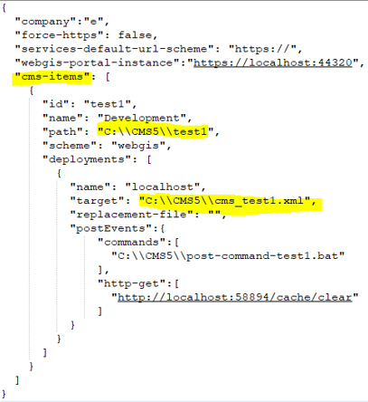
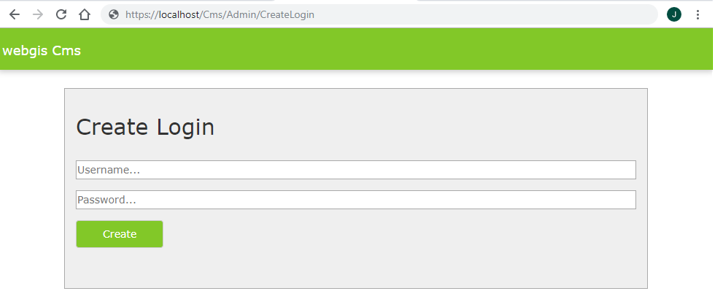
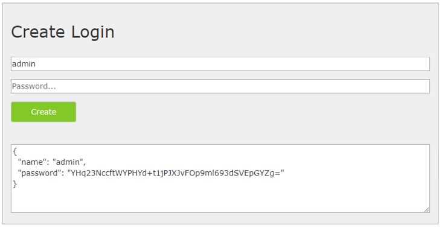
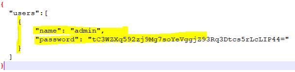
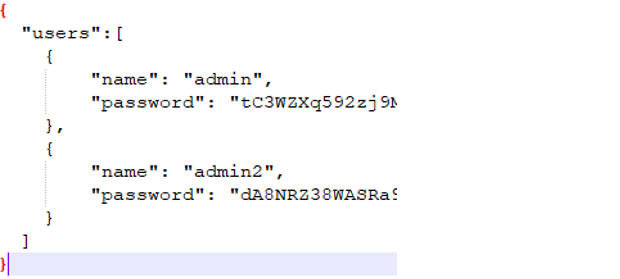
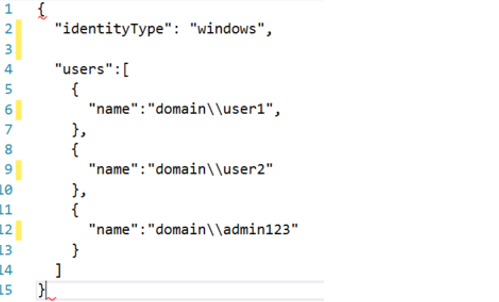
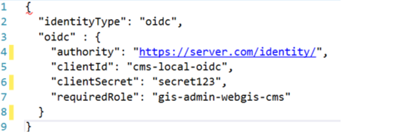

Konfiguration der CMS Applikation
=================================

Datei ``_config/cms.config``
----------------------------

Die Konfiguration der CMS Anwendung erfolgt über die Datei ``webgis-cms/_config/cms.config``.

Dabei handelt es sich um eine JSON Datei (JavaScript Object Notation). Darum ist beim Editieren dieser Datei auf die Besonderheiten der JavaScript Syntax aufzupassen. 
Nach dem Editieren muss es sich wieder um eine gültige JavaScript Datei handeln. Die Vorlage sieht folgendermaßen aus:

**Hinweis zur Javascript Syntax:**

•	Attribute und Werte werden durch ``:`` getrennt, z.B.: ``"force-https": false``
•	Objekte (mit mehreren Attribute) werden in geschwungene Klammern gesetzt ``{ … }``
•	Array werden durch eckige Klammern gekennzeichnet ``[ … ]``. Die einzelnen Werte werden mit Beistrich getrennt
•	In einem Array können Objekte aufgelistet werden (z.B.: cms-items): ``[ { object1 }, {object2} ]``
•	In einem Array können einzelne Werte (String, Zahlen) aufgelistet werden (z.B.: http-get): ``[ "url1", "url2"]``
•	Ein Backslash ``\`` ist in einer Zeichenkette in JavaScript ein besonderes Zeichen. Um tatsächlich einen Backslash anzugeben, muss hier ein doppelter ``\\`` gegeben werden (siehe im Beispiel bei den Pfaden). Ansonsten ist das config File kein gültiges JSON File mehr!!!

Mit einem Web CMS können mehrere Bäume verwaltet werden. Pro Baum wird ein Objekt im cms-items-Array angelegt.
Der Wert für cms-items muss ein Array sein. Ein cms-item-Objekt hat dann wieder einzelne Werte. Die beiden gelb markierten Werte (path, target) 
geben beispielsweise an, wo sich die Wurzel des CMS Baumes befindet (path) und wohin ein CMS veröffentlicht wird (target). 
Hier werden die einzelnen Attribute von CMS Item erläutert:

Knoten ``cms-item``
+++++++++++++++++++

* ``id``
  Eine eindeutige Id für das CMS. Sollte nur aus Kleinbuchstaben und Nummern bestehen (keine umlaute)

* ``name``
  Ein sprechender Name für das CMS

* ``path``
  Pfad zum Wurzelverzeichnis des CMS Baumes

* ``scheme``
  =webgis (hier immer webgis angeben!)

* ``secrets-password``: (optional)
  Möchte man in diesem CMS auf die Secrets zugreifen, erscheint ein Passwort Dialog.
  Hier kann das Passwort vergeben werden, dass eingegeben werden muss. Dieser Wert kann auch
  weg oder leer gelassen werden. Der Dialog erscheint dann trotzdem im CMS. Er muss in diesem
  Fall aber einfach ohne Eingabe bestätigt werden.

* ``deployments``
  Ein Array von Deployment-Objekten. Pro Baum können 1:n Deployments angelegt werden. 
  Das Ergebnis eines Deployments ist eine cms.xml Datei, die ins WebGIS eingebunden werden kann.

  .. code::

    [
        {
        ….. deployment 1
        },
        {
        ….. deployment 2
        }
    ]

  Mehrere Deployments können hilfreich sein, um für Test-, Ausfall-, 
  Schulungs- und Produktivsystem unterschiedliche xml-Dateien zu erzeugen.

Knoten ``deployments``
++++++++++++++++++++++

* ``name``
  Ein sprechender Name für das Deployment (z.B: localhost, Entwicklung, Schulung, Test, Produktion, …).

* ``target``
  Der Pfad für die CMS Datei. Das CMS erstellt im gleichen Ordner später noch ein Verzeichnis ``_archive``, 
  in dem bestehende xml-Dateien vor dem überschreiben gesichert werden. Dieser Ordner 
  kann bei Bedarf auch wieder manuell gelöscht werden, falls die Sicherungen nicht mehr nötig sind.

* ``replacement-file`` (optional)
  Pfad zu einem Replacement-File (aus altem CMS), 
  das für dieses Deployment angewendet werden soll.

* ``ignoreAuthentification`` (optional ``true``/``false``)
  Default: ``false``
  Ist dieser Wert auf true gesetzt, wird Berechtigungen aus dem CMS ignoriert. 
  Das kann beispielsweise für Schulungs- und/oder Testsysteme interessant sein, 
  wo jeder Teilnehmer für alles berechtigt sein sollte.

* ``postEvents`` (optional)
  Ein Array von Events, die nach erfolgreicher Erstellung ausgeführt werden sollten. 

* ``environment`` (optional)
  Gibt die Umgebung für das Deployment an. Die Umgebung ist beispielsweise bei den ``Secrets`` wichtig. 
  Für ein ``Secret`` kann für jede Umgebung ein eigener Wert angegeben werden. So können für die Test- und Produktivsysteme unterschiedliche 
  *ConnectionStrings* definiert werden.
  Mögliche Werte sind hier: ``Default``, ``Test``, ``Staging``, ``Production``.

Knoten ``postEvents``
+++++++++++++++++++++

* ``commands`` (optional: *Array von Strings*)
  Die hier angeführten Kommandozeilen-Befehle werden nacheinander abgearbeitet.
  Das kann hilfreich sein, wenn ein CMS nach dem Erstellen noch an einen anderen 
  Ort kopiert werden muss. Werden beispielsweise mehrere Instanzen von WebGIS hinter 
  einem LoadBalancer betrieben, kann das xml-File so auf alle Instanzen verteilt werden.

* ``http-get`` (optional)
  http-Get Requests, die nach dem Erstellen ausgeführt werden sollten. 
  Das kann z.B. dazu verwendet werden, um nach einem Deploy ein cache/clear einer 
  WebGIS Instanz aufzurufen, damit das neue XML-File in den Cache geladen wird.

Weitere Attribute
+++++++++++++++++

* ``company``
  Ein Kürzel für die Firma. Optional kann später eine ``wwwroot/css/{company}/site.css`` 
  Datei angelegt werden.  Darin können CSS Stile für das CMS überschrieben und so Farben
  usw. anpasst werden.

* ``force-https``
  Sollte für Kundeninstallationen immer ``false`` sein

* ``service-default-url-scheme``  (``http://`` oder ``https://``)
  Wenn Karten-Dienste eingebunden werden, wird in der Erstellen-Maske oft nur der 
  Servername angeben. Mit diesem Wert kann gesteuert werden, ob für die eigentliche Url 
  zum Karten-Dienst als Schema http oder https verwendet wird.

* ``webgis-portal-instance`` (optional)
  Wenn im CMS Berechtigungen parametriert werden, muss das CMS im Hintergrund eine WebGIS 
  Portal Instanz abfragen, um zu wissen, welche Anmeldemöglichkeiten und Benutzer zur 
  Verfügung stehen. Das kann grundsätzlich auch im entsprechenden Dialog im Web CMS 
  angeführt werden (jedes mal neu). Gibt man den Wert hier an, erhöht sich später der 
  Eingabekomfort.

Datei ``_config/datalinq.config``
---------------------------------

Die CMS Applikation beinhaltet auch *DataLinq.Code* zum Bearbeiten von DataLinq Endpoints, Queries und Views.
Die eigentliche *DataLinq Engine* läuft bei WebGIS immer innerhalb einer WebGIS API Instanz.

Welche Instanzen über die CMS Startseite zum Editieren angezeigt werden, kann über die Datei 
``_config/datalinq.config`` gesteuert werden:

.. code-block::

   {
      "instances": [
         {
            "name": "Local WebGIS Api",
            "description": "My local WebGIS test and developing API",
            "url": "https://my-server/webgis-api"
         }
      ],
      "useAppPrefixFilters": true
   }

* ``instances``:
   Über das *Array* können mehrere Instanzen angegeben werden. Ruft man eine dieser Instanzen über die CMS Startseite
   auf, erscheint ein Anmeldefenster. Hier muss man sich mit einem *Subscriber* für die jeweilige API Instanz anmelden.

.. note::
  Die jeweilige API Instanz kann über die Konfiguration (api.config: ``datalinq => allowed-code-api-clients``)
  festlegen, von welcher Url DataLinq.Code Editing möglich ist. Ist die entsprechende CMS Instanz dort nicht 
  eingetragen, kommt beim Aufruf eine Fehlermeldung (*Invalid Client*).

* ``useAppPrefixFilters``:
   Wird diese Option auf ``true`` gesetzt, kann man die einzelnen Endpoints beim Start der *DataLinq.Code* Anwendung filtern. 
   Dabei wird davon ausgegangen, dass die Bezeichnungen/Namen der Endpoints folgendermaßen organisiert sind:

   ``{APPLICATION}-{db/lov/...}-{etc...}``

   Vor dem ersten ``-`` steht der Name der Applikation. Dahinter gibt es optional weiter Beschreibungen zur Unterscheidung der Endpoints.
   Eine *Applikation* hat in der Regel mehrere Endpoints (ein Endpoint pro Datenbank - lesend, PlainText für Auswahllisten, ein Endpoint für schreibende Datenbank Zugriffe, ...)

   Wählt man beim Start eine oder mehrere Applikationen aus, werden nur diese im Baum dargestellt. Da erhöht die Performance und die Übersichtlichkeit, wenn viele Applicationen 
   existieren. Der Filter kann immer wieder neu gesetzt werden, wenn man auf die Überschrift *DataLinq.Code* über dem *Baum* klickt.

Datei ``_config/settings.config``
---------------------------------

In dieser optionalen Datei können allgemeine Einstellung für die WebGIS CMS Applikation eingetragen werden. Ein Anwendungsfall
ist derzeit das Einstellen eines Proxy Servers. Bindet man Dienste aus dem Internet ein, kann für den Zugriff ein Proxy Server notwendig sein.
Mit folgender Einstellung kann über diese Datei ein *Proxy Server* angegeben werden, der für jeden Zugriff auf das Internet angewendet wird:

.. code-block::

   {
      "proxy": {
         "use": true,
         "server": "webproxy.mydomain.com",
         "port": 8080,
         "user": "",            // optinal
         "password": "",        // optional
         "domain": "",          // optional
         "ignore":"localhost;my-intranet.com;.my-domain.com$;"
      }
   }

``user``, ``password`` und ``domain`` sind optional. Bei ``ignore`` können mehrere Regeln mit ``;`` getrennt angegeben werden. Beginnt der aufgerufene Server mit 
einer dieser Zeichenkette, wird der Proxy ignoriert. Hier können ebenfalls reguläre Ausdrücke eingetragen werden.

Datei ``_config/application-security.config``
---------------------------------------------

Das Web CMS ist von jedem, der die Url zum CMS kennt, verwendbar. 
Um das CMS nur mit User und Passwort aufzurufen, kann diese Datei verwendet werden. 
Existiert die Datei nicht, ist das CMS frei zugänglich.

.. note::
   Der hier eingeführte Mechanismus ist nicht als Schutz im Internet empfohlen.
   Hier wir nur ein „einfacher“ User + Passwort Schutz geboten, der eventuell mit böswilligen 
   Methoden ausgehebelt werden kann. Das Web CMS sollte nur über das Intranet verfügbar sein, 
   da hier ein einfacher Schutz in der Regel ausreicht. Muss das Web CMS auf einem Internet 
   Server installiert werden, empfehlen wir, das CMS nicht in den IIS einzubinden und ins 
   Internet freizugeben. Empfohlen wird hier, dass das CMS (am Server) wie eine Desktop
   Anwendung gestartet wird und nicht ins Internet gebunden wird.
   Sicherere Anmeldemethoden (Windows Authentifizierung, OpenId Connect) werden weiter 
   unten beschrieben.

Um ein Passwort für den Zugriff auf das CMS zu erstellen, geht man folgendermaßen vor:
Das CMS über den Browser mit der zusätzlichen url ``/admin/CreateLogin`` aufrufen:

.. note::
   Diese Url kann nur aufgerufen werden, wenn es noch keine ``application-security.config`` 
   Datei gibt. Wenn schon eine solche Datei existiert, 
   muss man bereits angemeldet sein, um zu dieser Seite zu kommen.

In dieses Formular User und Passwort eingaben und auf ``Create`` klicken:

Das Code Snippet kopieren und an die entsprechende Stelle an die Datei ``_config/application-security.config`` kopieren:

``Users`` ist hier wieder ein Array. Es können theoretisch auch mehrere User 
angelegt und mit Beistrich getrennt angeführt werden:

Beim nächsten Aufruf des Web CMS muss ein User mit Passwort eingegeben werden (event. ApplicationPool durchstarten).

Zusätzlich zur Anmeldung über eine Login Formular kann die Anmeldung auch über 
Windows Authentifizierung oder einen OpenID Connection Server (Auth0, Azure AD, usw.) erfolgen.
Eine Beispiel application-security.config für für Windows-Authentifizierung:

Hier werden drei User aus der Windows Domäne (z.B. domain) für den Zugriff auf das 
CMS berechtigt. Wichtig ist bei dieser Methode, dass auf die WebApplication im 
IIS Windows Authentifizierung eingestellt wird (keine anonyme Anmeldung).

Möchten man für die Anmeldungen einen OpenId Connection Konformen Anmeldeserver verwenden, 
könnte die ``application-security.config`` wir folgt aussehen:

Hier dürfen in alle Anwender, die die Rolle „gis-admin-webgis-cms“ haben, 
ins CMS einsteigen. ``ClientId`` und ``ClientSecret`` müssen am OpenId Server eingestellt werden. 
Also Scopes müssen für den Client mindestens ``openid``, ``profile`` und ``role`` zur möglich sein.

