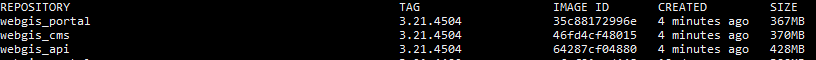
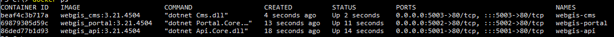

Installation unter Docker
=========================

In diesem Abschnitt wird gezeigt, wie WebGIS in einer (Linux) Docker Umgebung verwendet werden kann.

Dazu sind die entsprechenden Images aus dem *Docker Store* zu ziehen:

(Comming soon...)

Danach sollten die Images auf dem lokalem System zur Verfügung stehen. Mit dem Kommando ``docker images`` sollten die Images aufgelistet werden.

Damit die einzelnen *WebGIS Web-Applikationen* intern miteinander reden können, ist ein eigenes *virtuelles Netzwerk* anzulegen:

``docker network create -d bridge webgis-network``

Beim Anlegen der einzelnen Applikation wird diese Netzwerk an angeben. Wichtig ist hier, dass die Namen der einzelnen Anwendungen eingehalten wird (``webgis-api``, ``webgis-portal`` und ``webgis-cms``).
Diese Namen sind teil der *Default Konfiguration*, die in den Containern beim Starten erstellt wird. Gleiches gilt für die Ports 5001, 5002 und 5003.
Ein gemeinsames Repository wird in der *Default Konfiguration* unter ``/etc/webgis`` angelegt. Dieses Verzeichnis muss auf das ausführende System gemappt werden.
Wird zum Testen beispielsweise ``Docker Desktop for Windows`` (mit Linux Containern) verwendet, erfolgt das mit der Option ``-v C:\Docker_Drive\webgis:/etc/webgis``. Unter Linux muss anstelle von C:\Docker_Drive/webgis ein anderes Verzeichnis angeben werden,
zb: ``-v /etc/webgis:/etc/webgis``.

Die einzelnen Aufruf zum erstellen der Anwendungen sehen in etwa folgendermaßen aus:

.. code::
  
   docker run -d -v C:\Docker_Drive\webgis:/etc/webgis -p 5001:80 --name webgis-api --network webgis-network webgis_api:3.21.4504
   docker run -d -v C:\Docker_Drive\webgis:/etc/webgis -p 5002:80 --name webgis-portal --network webgis-network webgis_portal:3.21.4504
   docker run -d -v C:\Docker_Drive\webgis:/etc/webgis -p 5003:80 --name webgis-cms --network webgis-network webgis_cms:3.21.4504

Konnten die Anwendungen erfolgreich erstellt werden. Was das erstellen erfolgreich sollte der Befehl ``docker ps`` in etwa folgende Ausgabe liefern:

Über den Browser (http://localhost:5001) sollte die einzelnen Anwendung aufrufbar sein.

Möchte man die einzelnen Anwendungen nicht mir der Standardkonfiguration starten, können über
Umgebungsvariablen (``--env VARIABLE=value``) Werte überschrieben werden.

Umgebungsvariablen Image webgis-api
-----------------------------------

* ``API_REPOSITORY_PATH``: Pfad zum WebGIS Repository (default: ``/etc/webgis``)
* ``API_ONLINERESOURCE_URL``: die ``api-url``. Url mit der die API Anwendung nach außen sichtbar ist (default: ``http://localhost:5001``)
* ``PORTAL_ONLINERESOURCE_URL``: die ``portal-url``. Url mit der das Portal nach außen sichtbar ist (defalt: ``http://localhost:5002``)
* ``PORTAL_INTERNAL_URL``: die ``portal-internal-url``. Url mit der die API intern mit der Portalanwendung kommunizieren kann (default: ``http://webgis-portal``)

Umgebungsvariablen Image webgis-portal
--------------------------------------

* ``API_REPOSITORY_PATH``: Pfad zum WebGIS Repository (default: ``/etc/webgis``)
* ``API_ONLINERESOURCE_URL``: die ``api-url``. Url mit der die API Anwendung nach außen sichtbar ist (default: ``http://localhost:5001``)
* ``API_INTERNAL_URL``: die ``api-internal-url``. Url mit der die Portal Anwendung intern mit der API kommunizieren kann (default: ``http://webgis-api``)
* ``PORTAL_ONLINERESOURCE_URL``: die ``portal-url``. Url mit der das Portal nach außen sichtbar ist (defalt: ``http://localhost:5002``)

Umgebungsvariablen Image webgis-cms
-----------------------------------

* ``API_REPOSITORY_PATH``: Pfad zum WebGIS Repository (default: ``/etc/webgis``)
* ``API_INTERNAL_URL``:  Url mit der die CMS Anwendung intern mit der API kommunizieren kann (default: ``http://webgis-api``)
* ``PORTAL_INTERNAL_URL``: Url mit der die CMS Anwendung intern mit der Portalanwendung kommunizieren kann (default: ``http://webgis-portal``)
