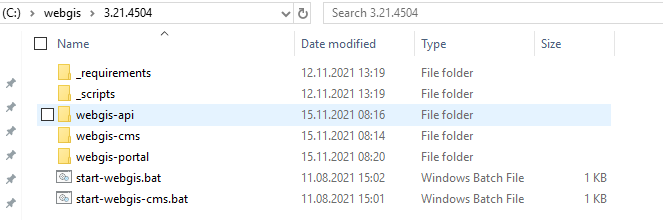
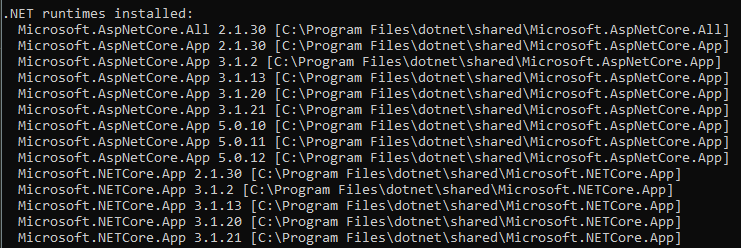
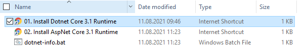
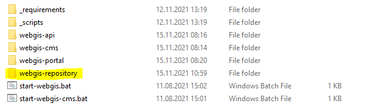
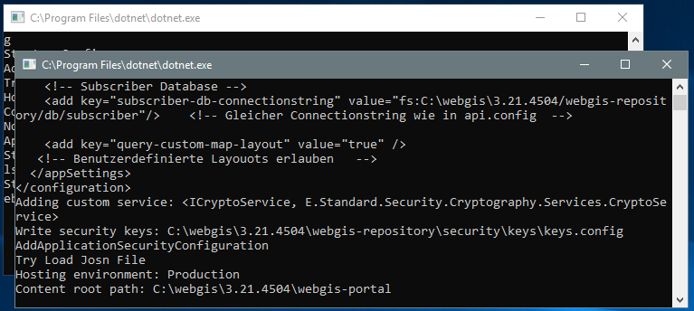
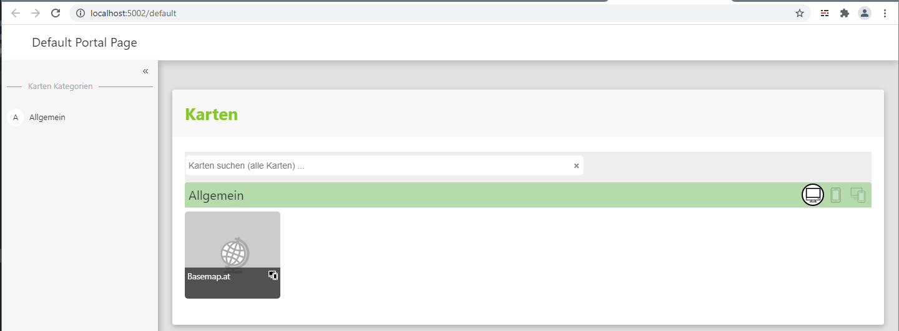
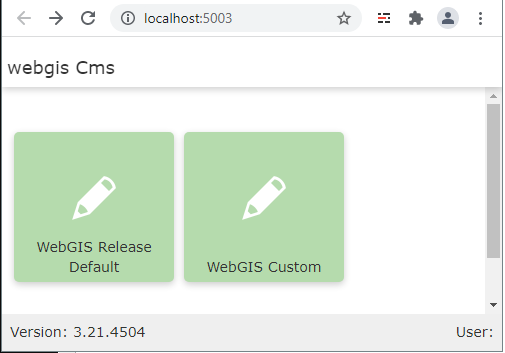

Installation unter Windows
==========================

Die Installationspakete können unter *Releases* aus dem GitHub Repository https://github.com/gis-eni/webgis/releases heruntergeladen werden.

Das Paket besteht aus einer ZIP-Datei und muss im ersten Schritt an einer beliebigen Stelle entpackt werden.
Es können unterschiedliche Versionen von gView GIS parallel installiert werden. Dabei empfiehlt es sich, das ZIP File beispielsweise unter ``C:\webgis\3.21.4504`` zu entpacken:

*WebGIS* baut auf DotNet Core (derzeit 3.1) auf. Die entsprechenden Runtimes sind auf Windows Desktops und Servern nicht zwingend installiert.
Um zu überprüfen, ob die entsprechende Runtime Installiert ist, kann man den Ordner ``_requrements`` wechseln und dort die Datei ``dotnet-info.bat`` ausführen.
Die Anzeige kann dabei etwas folgendermaßen aussehen:

Hier ist zu beachten, dass für die vorausgesetzte Version (3.1.x) sowohl eine Runtime für ``Microsoft.AspNetCore.App`` als auf für ``Microsoft.NETCore.App`` auf dem System verfügbar ist.
Trifft diese nicht zu, können die entsprechenden Runtimes über die beiden mitgelieferten Links heruntergeladen werden.

.. note::
   Wird bisher noch keine Version ``Dotnet Core`` auf dem Zielsystem installiert, liefert ``dotnet-info.bat`` eine Fehlermeldung.

Sind die Voraussetzungen für das Zielsystem erfüllt, kann wieder in den Übergeordnet Ordner gewechselt werden.
Darin befinden sich zwei ausführbare Batch-Dateien. Diese können verwendet werden, um WebGIS *local* zu starten. Das bedeutet, dass WebGIS hier wie eine Desktop-Anwendung gestartet wird.
Für die einzelnen Anwendungen wird dazu je eine *lokaler WebServer* gestartet und die Anwendungen über den Browser angezeigt.

* ``start-webgis.bat``:
  Startet die ``WebGIS Api`` (lokaler WebServer unter HTTP Port 5001) und das ``WebGIS Portal`` (lokaler WebServer unter HTTP Port 5002). Zusätzlich wird ein Browserfenster geöffnet, in das WebGIS Portal angezeigt wird.

* ``start-webgis-cms.bat``:
  Startet die ``WebGIS CMS`` Anwendung in einem lokalen Server unter dem HTTP Port 5003. Zusätzlich wird ein Browserfenster geöffnet, in dem die CMS Anwendung angezeigt wird.

.. note::
   Bevor man *WebGIS* produktiv betreiben kann, sind einige *Konfigurationsschritte* notwendig. Jede Applikation im *WebGIS* Paket muss im Ordner ``_config`` eine entsprechende Konfigurationsdatei enthalten (``api.config``, ``portal.config``, ``cms.config``).
   Die Konfigurationsdateien befinden sich im Installationspaket. Allerdings wird eine Standardkonfiguration vom ersten Start der Anwendung erstellt. Diese kann dann für die individuelle Bedürfnisse angepasst werden.
   Siehe auch Abschnitt **Konfiguration**. 

Startet man ``start-webgis.bat`` zum ersten Mal, wird überprüft, ob es für die Anwendungen *WebGIS API* bzw. *WebGIS Portal* eine Konfigurationsdatei gibt (``webgis-api/_config/api.config`` bzw. ``webgis-portal/_config/portal.config``).
Falls dies nicht der Fall ist, wird ein Prototyp der WebGIS Konfiguration angelegt. Diese kann später angepasst werden. Neben den Konfigurationsdateien wird zusätzlich auch ein Verzeichnis ``webgis-repository`` angelegt.

Dort werden zusätzliche Dateien angelegt, die für den Betrieb von *WebGIS* notwendig sind (Kartenprojekte, CMS Datenbank, ...).

.. note::
   Einige Dateien im ``webgis-repository`` werden verschlüsselt abgelegt. Ebenfalls wird die interne Kommunikation zwischen den einzelnen WebGIS Web-Applikationen und Anmeldungscookies verschlüsselt.
   Die ``Keys`` für diese Verschlüsselungen werden nach dem ersten Start unter ``webgis-repository/security/keys`` abgelegt. Die darin enthalten Dateien sollte nicht an Dritte weitergegeben werden.
   Betreibt man WebGIS sowohl im Internet/Intranet als auch als *Offline Lösung*, sollten für die *Offline Lösung* nicht die gleichen ``keys`` verwendet werden, wie am Server. Bei einer *Offline Lösung* erhalten
   die Anwender ein Paket mit allen Programm- und Konfigurationsdateien.

Startet man ``start-webgis.bat``, öffnen sich zwei Konsolenfenster, in denen die lokalen WebServer laufen:

In einem Browserfenster wird die *WebGIS Portal* Anwendung angezeigt:

.. note::
   Gerade beim ersten Start werden einige Konfigurationsdateien erstellt und kopiert. Dabei kann es leider vorkommen, dass die *WebGIS API* langsamer startet und für das *WebGIS Portal* rechtzeitig zur Verfügung steht.
   WebGIS zeigt in diesen Fall eine Fehlermeldung dar (``No connection could be made because the target machine actively refused it.``). Dieser Fehler kann einfach behoben werden, indem man die Browser mit ``F5`` neu lädt.
   Sobald die API mit der Erstkonfiguration fertig ist, sollte das Portal richtig angezeigt werden.

Über die Standardkonfiguration steht bereits eine Basiskarte zur Verfügung. Ebenfalls funktionieren die darin angeboten Werkzeuge (Schnellsuche nach Adressen, Koordinaten- und Höhenabfrage, 3D Model) bereits.

Möchte man zusätzliche Kartendienste (WMS, ArcGISServer Dienste) einbinden, kann das ebenfalls über die Benutzeroberfläche des Viewers erfolgen (``Dienste hinzufügen``). Möchte man Dienste in Karten immer wieder verwenden,
kann das über die *WebGIS CMS Web-Applikation* erfolgen. Die grobe Vorgehensweise beim erstellen von WebGIS Karten ist folgende:

1. Einbinden von Diensten (WMS, AGS, ...) ins CMS.

2. Parametrieren von speziellen Eingenschaften der Dienste (mögliche Abfragen, Inhaltsverzeichnis bzw. Darstellungsvarianten, Bearbeitungsmasken, Berechtigungen).

3. CMS veröffentlichen (damit werden diese Einstellung für eine WebGIS API Instanz sichtbar gemacht).

4. Einsteigen als Administrator/Kartenautor ins *WebGIS Portal*, von dort eine bestehend Karte im *MapBuilder* öffnen oder direkt über den *MapBuilder* eine neue Karte erstellen.

5. Im *MapBuilder* die gewünschten Dienste und Werkzeuge einer Karte hinzufügen.

6. Karte über den *MapBuilder* für das *WebGIS Portal* veröffentlichen. Damit steht diese Karte anderen Anwendern zur Verfügung.

Das *WebGIS CMS* kann lokal über die Batch-Datei ``start-webgis-cms.bat`` gestartet werden. Auch wird beim ersten Start eine *Default Konfiguration* angelegt. 
Die Applikation startet als lokale Server Anwendung (HTTP Port 5003) und wird in einem Browser angezeigt:

In der *Default Konfiguration* werden zwei WebGIS CMS Bäume erstellt:

* ``WebGIS Release Default``: Darin sind die Basiskartendienste (Basemap.at) definiert, die auch in der ersten Beispielkarte dargestellt werden. Diese wurde von den *WebGIS Entwicklern* erstellt und sollte als Basis verwendet und nicht geändert werden.
* ``WebGIS Custom``: Hier können/sollten eigene Dienste konfiguriert werden. 

