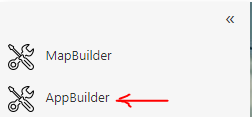
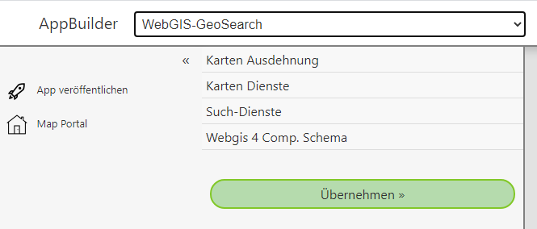

App Builder
===========

Mit dem *AppBuilder* können ähnlich wie mit dem *MapBuilder* WebGIS Anwendungen erstellt werden. Hier muss es sich allerdings nicht zwingenden um Karten handeln.
Vielmehr werden über den *AppBuilder* spezielle Vorlagen für Anwendungen angeboten. Diese Vorlagen können über den *AppBuilder* mit benutzerdefinierten 
Parametern angepasst werden (z.B. Kartendienste). Die angepassten Vorlagen können dann wie Karten im *MapBuilder* veröffentlicht werden und erscheinen dann
auf der Portalseite in einer beliebigen Kategorie.

Der *AppBuilder* wird über die *Sidebar* der Portalseite aufgerufen:

Nach dem Öffnen erscheint der *AppBuilder* in folgender Form:

In der Titelzeile kann die gewünschte Vorlage gewählt werden. Je nach Vorlage erscheinen in der *Sidebar* die entsprechenden Parameter die angepasst werden. 
Durch einen Klick auf einen Parameter klappt der entsprechende Bereich auf. Wenn alle notwendigen Parameter angegeben wurden, kann die App mit dem Button
``Übernehmen`` im Vorschaubereich erstellt werden.

Ist eine App erstellt und erscheint korrekt im Vorschaubereich, kann sie über den Button ``App Veröffentlichen`` als Kachel in die Portalseite übernommen werden.
Gleich wie beim *MapBuilder* muss auch hier ein Name und eine Kategorie vergeben werden.

In dieser Beschreibung werden einige dieser Vorlagen kurz vorgestellt und gezeigt, wie eine App veröffentlicht und aufgerufen werden kann.

.. toctree::
   :maxdepth: 1

   redirect/index
   service-side-by-side/index
   publish
   edit
   invoke